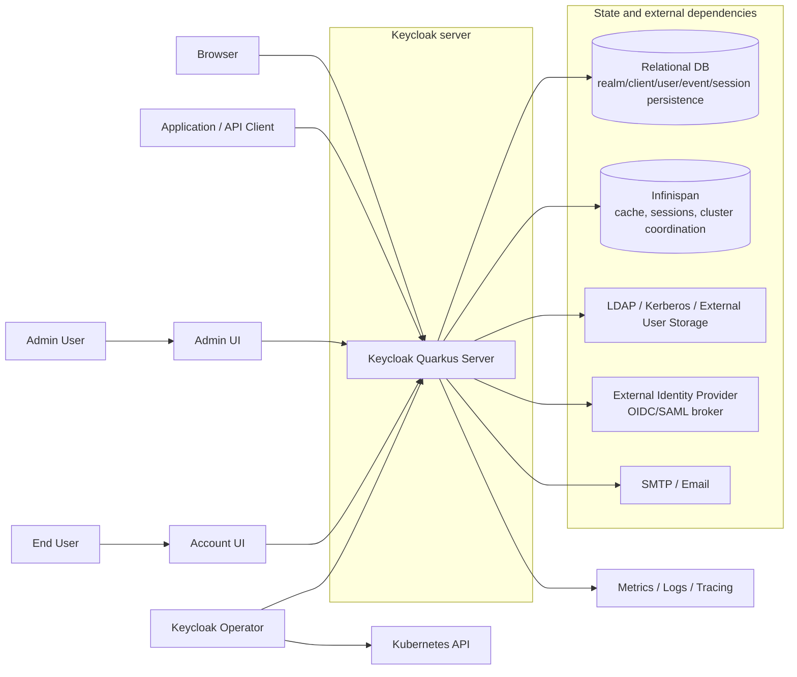
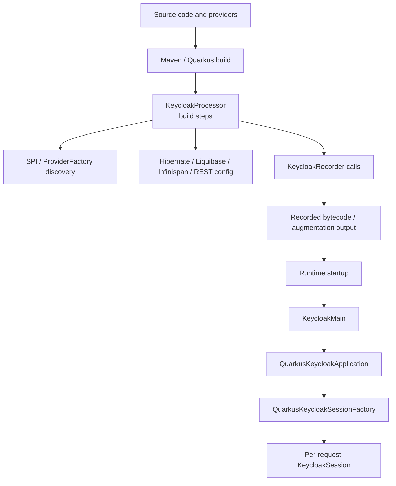

# 프로젝트 개요와 기준 아키텍처

> 네비게이션: [문서 색인](../README.md) | 이전: [문서 색인](../README.md) | 다음: [서버 런타임과 요청 생명주기](../10-architecture/10-server-runtime-and-request-lifecycle.md)
> 관련 문서: [Realm/Client/User 정책 모델](../20-policy/20-realm-client-user-policy-model.md), [개발/빌드/테스트 가이드](../40-implementation/40-development-build-test-guide.md), [운영, 보안, 관측성](../50-operations/50-operations-security-observability.md)

작성일: 2026-05-16

최신 소스 재검증: 2026-05-16, `/Users/dhsshin/Documents/LLMOps/keycloak` 현재 작업트리 기준

## 목적

이 문서는 Keycloak 저장소를 제품, 코드베이스, 빌드 산출물, 런타임 구성 요소 관점에서 한 번에 이해할 수 있도록 기준 아키텍처를 정리한다.

이 문서가 다루는 범위:

| 범위 | 설명 |
| --- | --- |
| 제품 목적 | Keycloak이 제공하는 IAM 기능과 주요 사용 사례 |
| repository 범위 | 최상위 디렉토리와 Maven module이 맡는 책임 |
| 기준 런타임 | Quarkus 기반 서버 distribution의 build-time/runtime 구조 |
| 핵심 경계 | client, realm endpoint, admin endpoint, session, provider, storage, DB/cache 경계 |
| 개발 관점 | 어떤 모듈을 먼저 봐야 하는지, 어떤 빌드 profile이 중요한지 |

이 문서가 다루지 않는 범위:

| 제외 범위 | 위임 문서 |
| --- | --- |
| OIDC authorization code/token endpoint 세부 흐름 | [10 서버 런타임과 요청 생명주기](../10-architecture/10-server-runtime-and-request-lifecycle.md) |
| realm/client/user/role/token 정책 설계 | [20 Realm/Client/User 정책 모델](../20-policy/20-realm-client-user-policy-model.md) |
| UI, Operator, 테스트 framework 세부 구조 | [30 UI, Operator, 테스트와 확장 지점](../30-integration/30-ui-operator-tests-and-extension-points.md) |
| 실제 빌드/테스트 명령과 변경 유형별 작업 흐름 | [40 개발/빌드/테스트 가이드](../40-implementation/40-development-build-test-guide.md) |
| 운영, 보안, 백업, 장애 대응 | [50 운영, 보안, 관측성](../50-operations/50-operations-security-observability.md) |

## 한 문장 정의

Keycloak은 application과 service에 인증/인가를 추가하기 위한 IAM 서버이며, 이 저장소는 Quarkus 기반 서버, Java SPI와 storage 구현, OIDC/SAML/Authorization Services, React 기반 Admin/Account UI, Operator, 테스트 framework, 배포 부가 산출물을 함께 포함하는 대형 multi-module repository다.

## 제품 기능 지도

| 기능 | 설명 | 대표 코드/문서 |
| --- | --- | --- |
| Authentication | browser login, direct grant, required action, reset credentials, WebAuthn, OTP 등 사용자 인증 flow | `services/src/main/java/org/keycloak/authentication/` |
| Authorization | Authorization Services, UMA, resource/scope/policy/permission 관리 | `services/src/main/java/org/keycloak/authorization/`, `authz/` |
| OIDC/OAuth2 | authorization endpoint, token endpoint, userinfo, introspection, revocation, JWKS | `services/src/main/java/org/keycloak/protocol/oidc/` |
| SAML | SAML protocol, SAML core, adapters, mappers | `saml-core-api/`, `saml-core/`, `services/src/main/java/org/keycloak/protocol/saml/` |
| User management | users, groups, roles, credentials, required actions, federation links | `server-spi/src/main/java/org/keycloak/models/`, `model/jpa/` |
| Realm management | realm settings, clients, flows, identity providers, events, localization | `services/src/main/java/org/keycloak/services/resources/admin/` |
| User federation | LDAP, Kerberos, external user storage provider model | `federation/`, `model/storage/`, `model/storage-private/` |
| Identity brokering | external IdP 연결과 broker login flow | `services/src/main/java/org/keycloak/services/resources/IdentityBrokerService.java` |
| Session management | authentication session, user session, client session, offline session, logout | `services/src/main/java/org/keycloak/services/managers/`, `model/infinispan/` |
| Events/Audit | user event, admin event, event listener, event store | `server-spi-private/src/main/java/org/keycloak/events/`, `model/jpa/src/main/java/org/keycloak/events/jpa/` |
| Admin UI/Account UI | React/Vite/PatternFly 기반 관리 UI와 계정 UI | `js/apps/admin-ui/`, `js/apps/account-ui/` |
| Operator | Kubernetes CRD/controller 기반 Keycloak 운영 자동화 | `operator/` |

## 기준 아키텍처

### 책임 분리

| 컴포넌트 | 책임 | 운영상 의미 |
| --- | --- | --- |
| Keycloak Quarkus Server | HTTP endpoint, protocol 처리, authentication flow, token 발급, Admin API, SPI 실행 | stateless하게 여러 pod를 둘 수 있지만 DB/cache/session 설정이 일관되어야 함 |
| Relational DB | realm/client/user/credential/event/persistent session 등 영속 상태 | schema migration, backup/restore, connection pool, HA가 중요 |
| Infinispan | realm/user cache, authentication/user session, single-use object, login failure, cluster event | cluster consistency, remote/local cache mode, eviction/expiration이 중요 |
| LDAP/User Storage | 외부 user lookup/query/credential validation/federated attribute storage | federation timeout, import/sync, local federated storage 정책이 중요 |
| External IdP | brokering, social login, enterprise IdP integration | redirect URI, trust, mapper, linking 정책이 중요 |
| Admin UI/Account UI | 사용자와 관리자용 browser UI | theme packaging과 REST API compatibility가 중요 |
| Operator | Kubernetes 리소스 생성, update, realm import, CR status 관리 | CRD version, reconciliation, image/update strategy가 중요 |

## Repository 빌드 단위

루트 `pom.xml`은 `org.keycloak:keycloak-parent:999.0.0-SNAPSHOT`이고 packaging은 `pom`이다. Java release는 17이며 Quarkus 버전은 `3.33.1.1`이다.

### 루트 Maven modules

| 모듈 | 역할 |
| --- | --- |
| `boms` | Keycloak BOM과 SPI BOM 관리 |
| `common` | 서버와 어댑터가 공유하는 공통 유틸리티 |
| `core` | 핵심 representation, protocol 공통 타입, JSON/model utility |
| `crypto` | default, FIPS 140-2, Elytron crypto provider parent |
| `dependencies` | `server-min`, `server-all` 의존성 묶음 |
| `server-spi` | 공개 server SPI와 model interface |
| `server-spi-private` | 내부/private SPI와 event/admin event 등 내부 계약 |
| `saml-core-api` | SAML public API |
| `saml-core` | SAML core 구현 |
| `federation` | Kerberos, LDAP, SSSD, IPA Tuura federation provider |
| `services` | REST services, authentication, protocol, manager, event 등 서버 핵심 구현 |
| `themes` | built-in themes와 JS UI/theme resource 묶음 |
| `misc/db-compatibility-verifier` | DB compatibility verifier |
| `misc/theme-verifier` | theme verifier Maven plugin/도구 |
| `model` | storage, storage-private, storage-services, JPA, Infinispan 구현 |
| `util` | embedded LDAP 등 보조 utility |
| `rest` | Admin v2 API와 Admin UI extension service |
| `integration` | admin client, client registration, client CLI |
| `authz` | Authorization Services policy/client 모듈 |
| `js` | TypeScript/React UI와 JS libraries |
| `test-framework` | 신규 JUnit 5 기반 test framework |
| `tests` | 신규 테스트 모듈과 custom providers |
| `quarkus` | 현재 서버 runtime/distribution 핵심 |
| `scim` | SCIM core/model/client/services/tests |
| `ssf` | Shared Signals Framework 관련 모듈 |
| `authzen` | AuthZen services/tests |

### Profile로 추가되는 주요 영역

| Profile/조건 | 추가되는 것 | 의미 |
| --- | --- | --- |
| `!skipTestsuite` | `testsuite` | 기존 Arquillian/model testsuite 포함 |
| `!skipAdapters` | `adapters` | adapters 빌드 포함 |
| `!skipDocs` | `docs` | 문서 빌드 모듈 포함 |
| `-Pdistribution` | `distribution` | SAML adapters, Galleon feature packs, license/downloads 관련 배포 부가 산출물 |
| `-Doperator` | `operator` | Keycloak Operator 포함 |
| `-Doperator-prod` | `operator` | production operator build 성격 |
| `-Dfips140-2` | FIPS crypto provider 선택 | FIPS 환경용 crypto artifact 사용 |

## Quarkus 기준 서버 구조

`quarkus/`는 현재 서버 배포물의 중심이다.

| 하위 모듈 | 책임 |
| --- | --- |
| `config-api` | REST services 등 non-Quarkus 모듈이 Quarkus에 직접 결합되지 않도록 하는 configuration API |
| `runtime` | 실제 서버 실행 시 동작하는 Quarkus extension runtime. CLI entrypoint와 runtime integration 포함 |
| `deployment` | Quarkus build-time augmentation 단계의 build step 구현 |
| `server` | `keycloak-quarkus-server` extension을 사용하는 Quarkus application |
| `dist` | Quarkus distribution ZIP/TAR.GZ packaging |
| `container` | Keycloak container image Dockerfile |
| `tests` | Quarkus distribution integration tests |

### Build-time과 runtime 경계

핵심 해석:

| 단계 | 설명 | 대표 파일 |
| --- | --- | --- |
| Build-time augmentation | SPI/provider 검색, JPA entity 구성, Liquibase, Infinispan, RESTEasy, theme provider 등을 구성 | `quarkus/deployment/src/main/java/org/keycloak/quarkus/deployment/KeycloakProcessor.java` |
| Recorded runtime 연결 | build step에서 runtime 초기화에 필요한 정보를 recorder method로 연결 | `quarkus/runtime/src/main/java/org/keycloak/quarkus/runtime/KeycloakRecorder.java` |
| Runtime entrypoint | CLI parse, Quarkus run, server/non-server command lifecycle 연결 | `quarkus/runtime/src/main/java/org/keycloak/quarkus/runtime/KeycloakMain.java` |
| Application startup | `KeycloakApplication` startup/shutdown을 Quarkus event와 연결 | `quarkus/runtime/src/main/java/org/keycloak/quarkus/runtime/integration/jaxrs/QuarkusKeycloakApplication.java` |
| Session factory | build-time에 확정된 provider factory 정보를 runtime session factory로 구성 | `quarkus/runtime/src/main/java/org/keycloak/quarkus/runtime/integration/QuarkusKeycloakSessionFactory.java` |

## 주요 HTTP 표면

| 경로 | 진입 resource | 역할 |
| --- | --- | --- |
| `/realms/{realm}` | `RealmsResource.getRealmResource` | realm public metadata, public realm endpoints |
| `/realms/{realm}/protocol/{protocol}` | `RealmsResource.getProtocol` | OIDC/SAML protocol endpoint 위임 |
| `/realms/{realm}/protocol/openid-connect/auth` | `OIDCLoginProtocolService.auth` → `AuthorizationEndpoint` | authorization request 처리 |
| `/realms/{realm}/protocol/openid-connect/token` | `OIDCLoginProtocolService.token` → `TokenEndpoint` | grant별 token 발급 |
| `/realms/{realm}/protocol/openid-connect/certs` | `OIDCLoginProtocolService.certs` | realm JWKS 제공 |
| `/realms/{realm}/login-actions` | `RealmsResource.getLoginActionsService` | login action, required action, reset credential 등 처리 |
| `/realms/{realm}/broker` | `RealmsResource.getBrokerService` | external IdP broker flow |
| `/realms/{realm}/account` | `RealmsResource.getAccountService` | account console/resource |
| `/admin` | `AdminRoot` | admin console와 Admin REST API root |
| `/admin/realms` | `AdminRoot.getRealmsAdmin` | bearer token 인증 후 realm admin resource 반환 |

## Trust boundary

| Boundary | 신뢰할 수 있는 것 | 주의할 것 |
| --- | --- | --- |
| Browser/App → Keycloak | TLS가 보호하는 HTTP request, OAuth/OIDC/SAML protocol parameter | redirect URI, origin, `state`, `nonce`, PKCE, cookie, user-controlled input 검증 필요 |
| Admin client → Admin API | 유효한 bearer token과 admin permission evaluator 결과 | token issuer realm, admin realm, CORS, fine-grained admin permission 경계 |
| Keycloak → DB | schema migration과 transaction으로 관리되는 영속 상태 | backup/restore, migration, connection pool exhaustion, long transaction |
| Keycloak → Infinispan | cache/session state와 invalidation event | cluster split-brain, remote cache latency, eviction/expiration mismatch |
| Keycloak → External User Storage | federation provider contract를 통과한 user data | timeout, stale imported users, credential validation 위치 |
| Keycloak → External IdP | configured trust와 mapper 결과 | brokered identity linking, token mapper, account takeover risk |
| Operator → Kubernetes API | CR spec/status와 generated resources | reconciliation loop, pause annotation, update strategy, secret handling |

## 기준 개발 관점

| 변경하려는 것 | 먼저 볼 위치 | 주의점 |
| --- | --- | --- |
| OIDC endpoint 동작 | `services/src/main/java/org/keycloak/protocol/oidc/` | client policy, event, CORS, grant provider와 연결됨 |
| 로그인 flow | `services/src/main/java/org/keycloak/authentication/` | flow execution, required action, brute force protector, authentication session 고려 |
| Admin API | `services/src/main/java/org/keycloak/services/resources/admin/` | bearer token 인증, `AdminPermissionEvaluator`, admin event 기록 필요 |
| Realm/client/user model | `server-spi/src/main/java/org/keycloak/models/`, `model/jpa/`, `model/storage-private/` | cache layer와 federation manager 경유 여부 확인 |
| Provider/SPI | `server-spi/`, `server-spi-private/`, `services/src/main/java/org/keycloak/provider/` | ProviderFactory lifecycle과 Quarkus build-time discovery 고려 |
| UI | `js/apps/admin-ui/`, `js/apps/account-ui/`, `js/libs/ui-shared/` | Maven build와 pnpm/wireit build가 함께 연결됨 |
| Theme | `themes/`, `js/themes-vendor/`, UI app `maven-resources/` | theme verifier와 content hash pattern 고려 |
| Operator | `operator/src/main/java/org/keycloak/operator/` | CRD version, dependent resource, reconciliation status 고려 |
| 테스트 | `test-framework/`, `tests/`, `testsuite/` | 신규 테스트는 test-framework 우선, testsuite는 deprecated |

## 문서화된 non-goals

이 문서 세트는 현재 source 분석 문서다.

| 하지 않는 것 | 이유 |
| --- | --- |
| Keycloak runtime 코드 수정 | 사용자 요청은 분석 문서 작성이다. |
| 운영용 Helm chart나 Kubernetes manifest 작성 | 이 저장소의 Operator와 운영 기준만 분석한다. |
| 특정 회사/서비스 realm 설계 확정 | 현재 문서는 upstream 코드베이스 분석이며 서비스 정책은 별도 요구사항이 필요하다. |
| 모든 class와 method를 완전 열거 | 핵심 흐름과 변경 지점 중심으로 문서화한다. 상세 class는 각 영역 파일 색인으로 추적한다. |

## 작업 범위 기록

이 문서는 분석과 문서화만 수행한다. Java, TypeScript, Maven 설정, Operator manifest, 테스트 코드는 수정하지 않는다.
