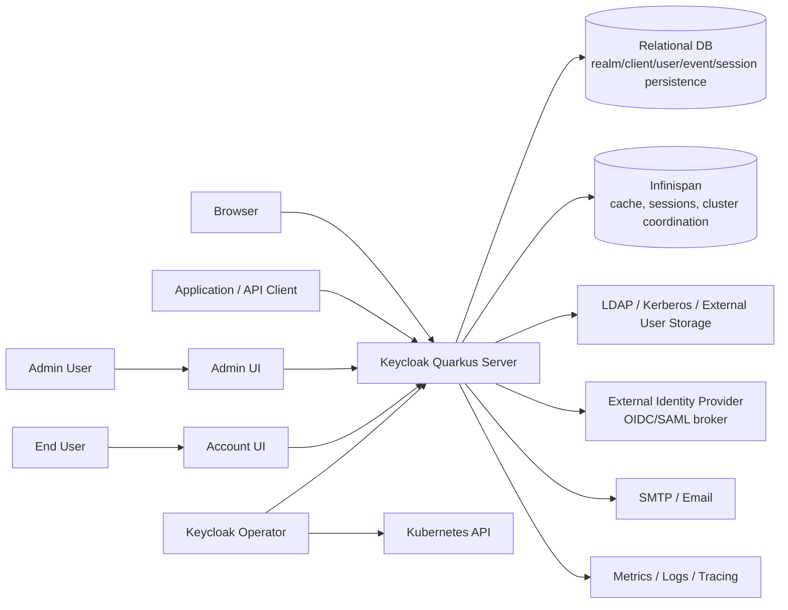

# 프로젝트 개요와 기준 아키텍처

## 1. 개요

이 문서는 Keycloak repository를 **제품 목적, 지원 범위, 기준 아키텍처, source layout, non-goals** 관점에서 이해하기 위한 foundation 문서입니다.

Keycloak은 단순 로그인 서버가 아니라 애플리케이션과 서비스에 인증, 인가, 사용자 관리, token 발급, federation, identity brokering을 제공하는 IAM 플랫폼입니다. 이 repository는 Quarkus 기반 서버, Java SPI, storage 구현, OIDC/SAML/Authorization Services, React 기반 Admin/Account UI, Operator, test framework, 배포 부가 산출물을 함께 포함합니다.

---

## 2. 설계 배경

서비스가 하나일 때는 애플리케이션 내부 로그인 구현으로도 버틸 수 있습니다. 하지만 서비스와 팀이 늘어나면 다음 문제가 반복됩니다.

| 문제 | 결과 |
| --- | --- |
| 앱마다 로그인과 session 구현이 다름 | MFA, password policy, logout 동작이 불일치합니다. |
| 권한이 앱 DB와 코드에 흩어짐 | “왜 허용되었는가”를 설명하기 어렵습니다. |
| 외부 LDAP/IdP 연동이 앱마다 다름 | deprovisioning과 account linking 위험이 커집니다. |
| token과 session 정책이 제각각임 | 탈취 token, stale permission, 긴 session 문제가 생깁니다. |
| audit가 분산됨 | 사고 대응 시 변경 이력과 로그인 이력을 추적하기 어렵습니다. |

Keycloak은 이 문제를 중앙 Identity Control Plane으로 모읍니다. 이 문서 세트는 그 구조를 repository 단위로 읽기 위한 기준을 제공합니다.

---

## 3. 문서 범위와 Non-Goals

| 포함 범위 | 설명 |
| --- | --- |
| 제품 목적 | Keycloak이 제공하는 IAM 기능과 주요 사용 사례 |
| repository 범위 | 최상위 디렉터리와 Maven module 책임 |
| 기준 런타임 | Quarkus 기반 서버 distribution의 build-time/runtime 구조 |
| 핵심 경계 | client, realm endpoint, admin endpoint, session, provider, storage, DB/cache 경계 |
| 개발 기준 | 어떤 모듈을 먼저 봐야 하는지, 어떤 build profile이 중요한지 |

| Non-Goal | 위임 문서 |
| --- | --- |
| OIDC authorization code/token endpoint 세부 흐름 | [10 서버 런타임과 요청 생명주기](../10-architecture/10-server-runtime-and-request-lifecycle.md) |
| realm/client/user/role/token 정책 설계 | [20 Realm/Client/User 정책 모델](../20-policy/20-realm-client-user-policy-model.md) |
| UI, Operator, test framework 세부 구조 | [30 UI, Operator, 테스트와 확장 지점](../30-integration/30-ui-operator-tests-and-extension-points.md) |
| 실제 빌드/테스트 명령과 변경 유형별 workflow | [40 개발/빌드/테스트 가이드](../40-implementation/40-development-build-test-guide.md) |
| 운영, 보안, 백업, 장애 대응 | [50 운영, 보안, 관측성](../50-operations/50-operations-security-observability.md) |

---

## 4. 제품 기능 지도

| 기능 | 책임 | 대표 위치 |
| --- | --- | --- |
| Authentication | browser login, direct grant, required action, reset credentials, WebAuthn, OTP | `services/src/main/java/org/keycloak/authentication/` |
| Authorization | Authorization Services, UMA, resource/scope/policy/permission | `authz/`, `services/src/main/java/org/keycloak/authorization/` |
| OIDC/OAuth2 | auth, token, userinfo, introspection, revocation, JWKS | `services/src/main/java/org/keycloak/protocol/oidc/` |
| SAML | SAML protocol, core, adapters, mappers | `saml-core-api/`, `saml-core/`, `services/src/main/java/org/keycloak/protocol/saml/` |
| User management | users, groups, roles, credentials, required actions, federation links | `server-spi/src/main/java/org/keycloak/models/`, `model/jpa/` |
| Realm management | realm settings, clients, flows, IdP, events, localization | `services/src/main/java/org/keycloak/services/resources/admin/` |
| Federation | LDAP, Kerberos, external user storage provider model | `federation/`, `model/storage/`, `model/storage-private/` |
| Identity brokering | external OIDC/SAML IdP login flow | `services/src/main/java/org/keycloak/services/resources/IdentityBrokerService.java` |
| Session management | authentication/user/client/offline session, logout | `model/infinispan/`, `services/src/main/java/org/keycloak/services/managers/` |
| Events/Audit | user event, admin event, listener, event store | `server-spi-private/src/main/java/org/keycloak/events/`, `model/jpa/src/main/java/org/keycloak/events/jpa/` |
| UI | Admin UI, Account UI, shared library, admin client | `js/apps/admin-ui/`, `js/apps/account-ui/`, `js/libs/` |
| Operator | Kubernetes CRD/controller 기반 운영 자동화 | `operator/` |

---

## 5. 기준 아키텍처

| 컴포넌트 | 책임 | 책임이 아닌 것 |
| --- | --- | --- |
| Keycloak Quarkus Server | HTTP endpoint, protocol 처리, authentication flow, token 발급, Admin API, SPI 실행 | 외부 DB/IdP/SMTP 자체의 HA 보장 |
| Relational DB | realm/client/user/credential/event/persistent session 영속 상태 | request hot path cache 역할 |
| Infinispan | realm/user cache, authentication/user session, single-use object, login failure, cluster event | 영구 audit ledger의 완전한 대체 |
| LDAP/User Storage | 외부 user lookup/query/credential validation | local authorization 정책 전체 결정 |
| External IdP | brokered login과 외부 인증 결과 제공 | Keycloak realm 내부 role 정책 자동 보장 |
| Admin UI/Account UI | 관리자와 사용자용 browser UI | 서버 정책의 source of truth |
| Operator | Kubernetes resource reconciliation, CR status, realm import, client CR | DB/cache/IdP/DNS/TLS/image build state 전체 소유 |

---

## 6. Source Layout 계약

루트 `pom.xml`은 `org.keycloak:keycloak-parent:999.0.0-SNAPSHOT`이며 packaging은 `pom`입니다. Java release는 17이고 Quarkus 버전은 `3.33.1.1`입니다.

| 모듈 | 책임 |
| --- | --- |
| `quarkus` | 현재 서버 runtime, deployment build step, distribution, container, tests |
| `services` | REST resources, authentication flow, protocol service, token/session/event manager |
| `server-spi` | 공개 server SPI와 model interface |
| `server-spi-private` | 내부/private SPI, event/admin event 등 내부 계약 |
| `model` | JPA, Infinispan, storage manager, datastore, cache/session provider |
| `core` | representation, protocol 공통 타입, JSON/model utility |
| `common` | 서버와 어댑터 공통 유틸리티 |
| `crypto` | default/FIPS/Elytron crypto provider |
| `federation` | LDAP, Kerberos, SSSD, IPA Tuura federation provider |
| `integration` | admin client, client registration, client CLI |
| `authz` | Authorization Services policy/client 모듈 |
| `js` | TypeScript/React UI, admin client, shared UI, theme vendor workspace |
| `themes` | built-in themes와 JS UI/theme resource |
| `operator` | Quarkus Operator SDK 기반 Keycloak Operator |
| `test-framework` | 신규 JUnit 5 기반 Keycloak test framework |
| `tests` | 신규 테스트 모듈과 custom providers |
| `testsuite` | 기존 Arquillian/model testsuite. 신규 테스트 기준은 아님 |
| `distribution` | SAML adapters, Galleon feature packs, licenses, downloads/API docs |
| `docs` | 공식 문서 소스와 문서 빌드 모듈 |

---

## 7. Profile 계약

| Profile/조건 | 추가되는 것 | 의미 |
| --- | --- | --- |
| `!skipTestsuite` | `testsuite` | 기존 Arquillian/model testsuite 포함 |
| `!skipAdapters` | `adapters` | adapter build 포함 |
| `!skipDocs` | `docs` | 문서 build 모듈 포함 |
| `-Pdistribution` | `distribution` | SAML adapters, Galleon, license/downloads 산출물 포함 |
| `-Doperator` | `operator` | Keycloak Operator 포함 |
| `-Doperator-prod` | `operator` | production operator build 성격 |
| `-Dfips140-2` | FIPS crypto provider | FIPS 환경용 crypto artifact 사용 |

---

## 8. Trust Boundary 계약

| Boundary | 신뢰할 수 있는 것 | 주의할 것 |
| --- | --- | --- |
| Browser/App -> Keycloak | TLS가 보호하는 protocol request | redirect URI, origin, `state`, `nonce`, PKCE, cookie, user input |
| Admin client -> Admin API | 유효한 bearer token과 admin permission evaluator 결과 | token issuer realm, admin realm, CORS, fine-grained permission |
| Keycloak -> DB | schema migration과 transaction으로 관리되는 영속 상태 | backup/restore, migration, connection pool, long transaction |
| Keycloak -> Infinispan | cache/session state와 invalidation event | split-brain, remote latency, eviction/expiration mismatch |
| Keycloak -> External User Storage | federation provider contract를 통과한 user data | timeout, stale imported users, credential validation 위치 |
| Keycloak -> External IdP | configured trust와 mapper 결과 | account linking, mapper claim, account takeover risk |
| Operator -> Kubernetes API | CR spec/status와 generated resources | reconciliation loop, pause annotation, update strategy, secret handling |

---

## 9. 기술 참조 보강

| 항목 | 계약 | 대표 파일 |
| --- | --- | --- |
| Quarkus build-time | SPI/provider, JPA, Liquibase, Infinispan, REST config를 build step에서 연결합니다. | `quarkus/deployment/src/main/java/org/keycloak/quarkus/deployment/KeycloakProcessor.java` |
| Runtime entrypoint | CLI parsing과 Quarkus run lifecycle을 연결합니다. | `quarkus/runtime/src/main/java/org/keycloak/quarkus/runtime/KeycloakMain.java` |
| Application startup | `KeycloakApplication` startup/shutdown을 Quarkus event와 연결합니다. | `quarkus/runtime/src/main/java/org/keycloak/quarkus/runtime/integration/jaxrs/QuarkusKeycloakApplication.java` |
| Session factory | build-time provider factory 정보를 runtime session factory로 구성합니다. | `quarkus/runtime/src/main/java/org/keycloak/quarkus/runtime/integration/QuarkusKeycloakSessionFactory.java` |
| Public realm root | realm public endpoint의 진입점입니다. | `services/src/main/java/org/keycloak/services/resources/RealmsResource.java` |
| Admin root | Admin REST API와 admin console root입니다. | `services/src/main/java/org/keycloak/services/resources/admin/AdminRoot.java` |
| Datastore facade | model/cache/storage provider를 조합합니다. | `model/storage-private/src/main/java/org/keycloak/storage/datastore/DefaultDatastoreProvider.java` |

---

## 10. 작업 범위 기록

이 문서는 분석과 문서화만 수행합니다. Keycloak runtime code, Maven 설정, Operator manifest, 테스트 코드는 수정하지 않습니다.
