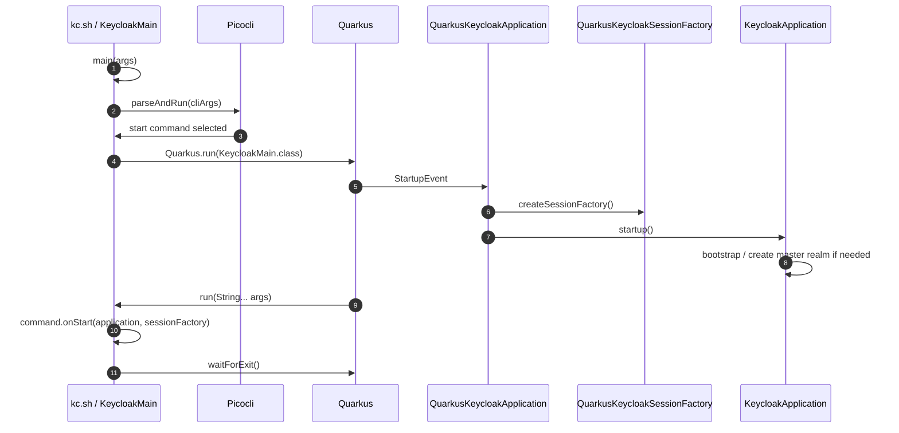
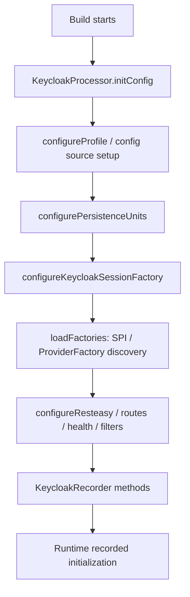
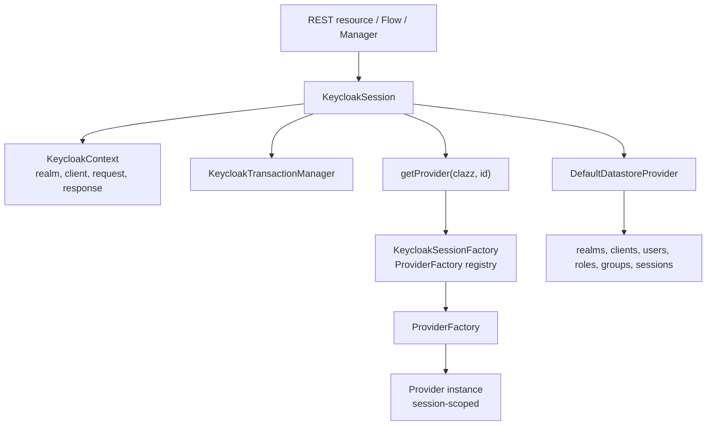
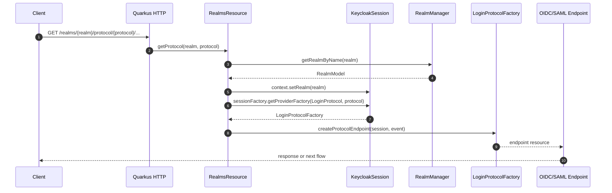
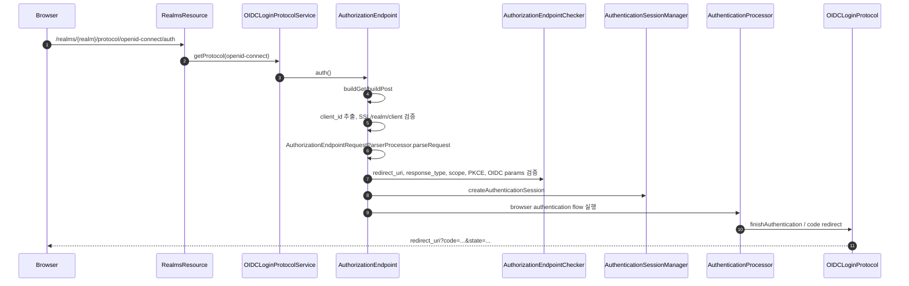
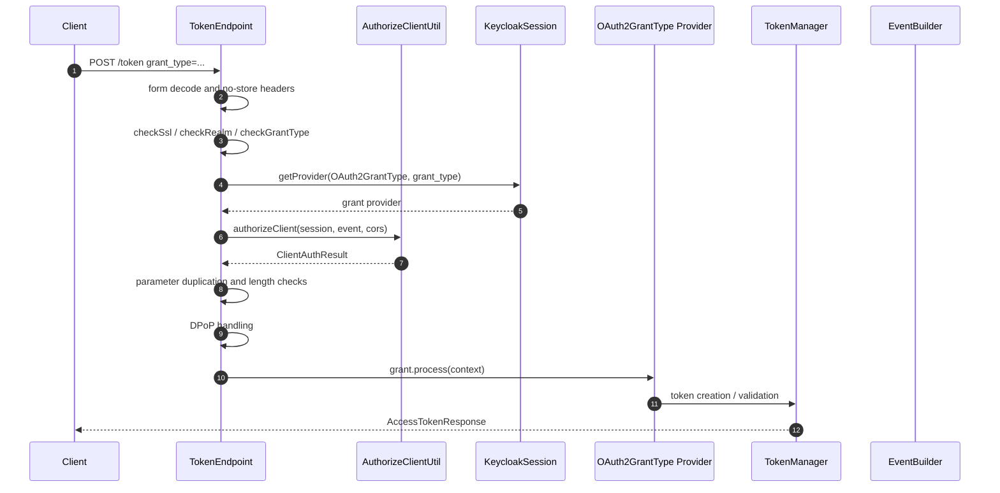
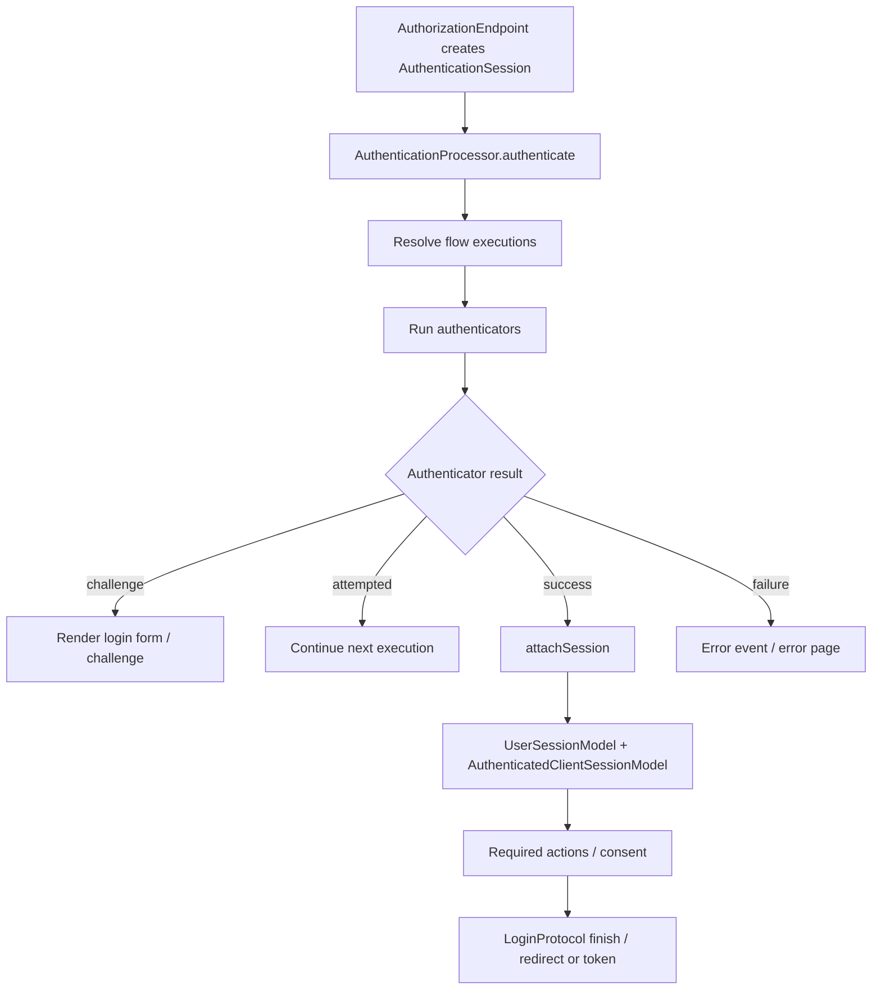
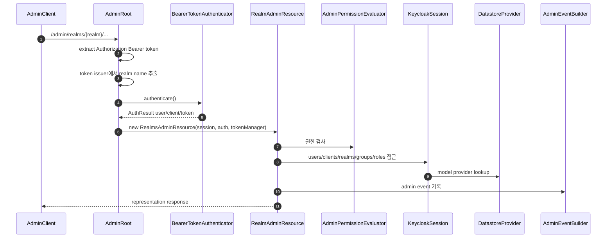
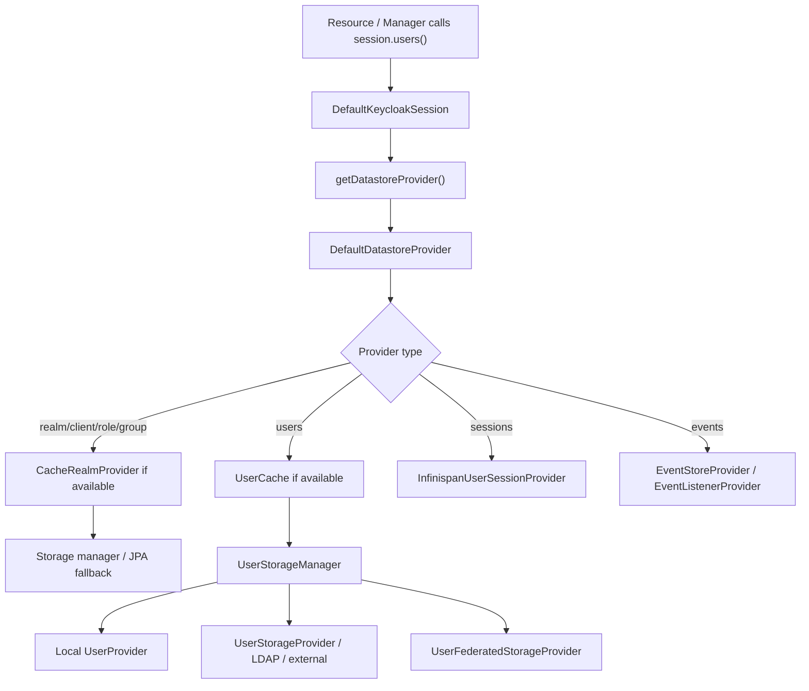
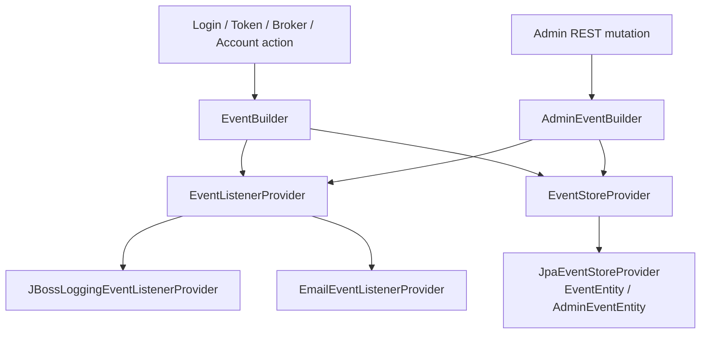

# 서버 런타임과 요청 생명주기

> 네비게이션: [문서 색인](../README.md) | 이전: [프로젝트 개요와 기준 아키텍처](../00-foundation/01-project-overview-and-reference-architecture.md) | 다음: [Realm/Client/User 정책 모델](../20-policy/20-realm-client-user-policy-model.md)
> 관련 문서: [개발/빌드/테스트 가이드](../40-implementation/40-development-build-test-guide.md), [운영, 보안, 관측성](../50-operations/50-operations-security-observability.md)

작성일: 2026-05-16

최신 소스 재검증: 2026-05-16, `/Users/dhsshin/Documents/LLMOps/keycloak` 현재 작업트리 기준

## 목적

이 문서는 Keycloak 서버가 어떻게 시작되고, HTTP request가 어떤 코드 경로를 거쳐 authentication, token 발급, Admin API, storage, event 처리로 이어지는지 lifecycle 중심으로 설명한다.

## 핵심 요약

| 항목 | 핵심 |
| --- | --- |
| 서버 시작 | `KeycloakMain`이 CLI와 Quarkus lifecycle을 연결한다. |
| Build-time | `KeycloakProcessor`가 Quarkus build step에서 SPI/provider, persistence, REST, Infinispan 구성을 확정한다. |
| Runtime | `QuarkusKeycloakApplication`이 `KeycloakApplication` startup/shutdown을 Quarkus event와 연결한다. |
| Request scope | 요청마다 `KeycloakSession`이 중심 context가 되고 provider instance를 session 단위로 생성/cache한다. |
| Provider model | `ProviderFactory`는 서버 단위 lifecycle, `Provider`는 session 단위 lifecycle이다. |
| Public realm endpoint | `/realms/{realm}`은 `RealmsResource`가 realm을 resolve하고 session context에 설정한다. |
| OIDC endpoint | `OIDCLoginProtocolService`가 `AuthorizationEndpoint`, `TokenEndpoint`, `UserInfoEndpoint`, `LogoutEndpoint`로 분기한다. |
| Admin endpoint | `AdminRoot`가 bearer token을 인증하고 `RealmsAdminResource`로 위임한다. |
| Storage access | `DefaultKeycloakSession` → `DefaultDatastoreProvider` → cache/storage manager/JPA/federation으로 접근한다. |
| Event | authentication/token/admin flow는 `EventBuilder`와 `AdminEventBuilder`를 통해 event listener/store와 연결된다. |

## 서버 시작 흐름

### 핵심 파일

| 파일 | 역할 |
| --- | --- |
| `quarkus/runtime/src/main/java/org/keycloak/quarkus/runtime/KeycloakMain.java` | CLI parsing, `Quarkus.run`, server/non-server command lifecycle 연결 |
| `quarkus/runtime/src/main/java/org/keycloak/quarkus/runtime/integration/jaxrs/QuarkusKeycloakApplication.java` | Quarkus event와 `KeycloakApplication` startup/shutdown 연결 |
| `services/src/main/java/org/keycloak/services/resources/KeycloakApplication.java` | server bootstrap, session factory, shutdown lifecycle |
| `quarkus/runtime/src/main/java/org/keycloak/quarkus/runtime/integration/QuarkusKeycloakSessionFactory.java` | Quarkus build step 결과 기반 session factory 구성 |

## Build-time augmentation

Keycloak on Quarkus는 Quarkus extension으로 구성된다. `deployment` module은 runtime 전에 가능한 정보를 build-time에 계산해 recorded bytecode와 runtime config로 넘긴다.

| Build step 영역 | 의미 | 파일/메서드 |
| --- | --- | --- |
| Feature 등록 | Quarkus feature name을 `keycloak`으로 등록 | `KeycloakProcessor.getFeature` |
| Config 초기화 | MicroProfile config provider와 Keycloak config source 구성 | `KeycloakProcessor.initConfig` |
| Persistence unit | JPA persistence unit, DB vendor, Hibernate property, Liquibase 경계 설정 | `KeycloakProcessor.configurePersistenceUnits` |
| SPI/provider discovery | SPI별 ProviderFactory class를 찾고 default provider/preconfigured provider를 결정 | `KeycloakProcessor.configureKeycloakSessionFactory`, `loadFactories` |
| REST 구성 | RESTEasy Reactive handler, root path, management route, filters 구성 | `KeycloakProcessor.configureResteasy`, route/filter build items |
| Crypto/FIPS | crypto provider와 FIPS mode 관련 설정 | `KeycloakProcessor.setCryptoProvider` |
| ProtoStream/Infinispan | serialization schema와 cache 관련 runtime 구성을 연결 | `KeycloakProcessor.configureProtoStreamSchemas` |

## `KeycloakSession`과 Provider lifecycle

`KeycloakSession`은 request/transaction 단위 중심 객체다. REST resource, authentication flow, token 발급, storage 접근은 session을 통해 provider를 가져온다.

### Provider lifecycle 원칙

| 개념 | lifecycle | 설명 |
| --- | --- | --- |
| `Spi` | 서버 전체 | provider type과 extension point를 정의한다. |
| `ProviderFactory<T>` | 서버 전체 | `init`, `postInit`, `create(session)`, `close`, `getId`를 가진다. |
| `Provider` | session/request 단위 | `ProviderFactory.create(KeycloakSession)`로 생성되고 session close 시 닫힌다. |
| `KeycloakSessionFactory` | 서버 전체 | SPI별 ProviderFactory registry, default provider, provider dependency lifecycle을 관리한다. |
| `KeycloakSession` | request/transaction 단위 | provider instance cache, context, transaction, datastore 접근을 관리한다. |

### 관련 파일

| 항목 | 파일 |
| --- | --- |
| `Provider` | `server-spi/src/main/java/org/keycloak/provider/Provider.java` |
| `ProviderFactory` | `server-spi/src/main/java/org/keycloak/provider/ProviderFactory.java` |
| `KeycloakSession` | `server-spi/src/main/java/org/keycloak/models/KeycloakSession.java` |
| `DefaultKeycloakSession` | `services/src/main/java/org/keycloak/services/DefaultKeycloakSession.java` |
| `DefaultKeycloakSessionFactory` | `services/src/main/java/org/keycloak/services/DefaultKeycloakSessionFactory.java` |
| `QuarkusKeycloakSessionFactory` | `quarkus/runtime/src/main/java/org/keycloak/quarkus/runtime/integration/QuarkusKeycloakSessionFactory.java` |

## Public realm request lifecycle

`RealmsResource`의 핵심 책임:

| 책임 | 설명 |
| --- | --- |
| realm resolve | `RealmManager.getRealmByName`으로 path의 realm을 `RealmModel`로 찾는다. |
| context 설정 | `session.getContext().setRealm(realm)`로 이후 하위 resource가 realm을 사용할 수 있게 한다. |
| protocol 위임 | `LoginProtocolFactory`를 조회해 OIDC/SAML protocol endpoint를 생성한다. |
| login action 위임 | `/login-actions`를 `LoginActionsService`로 보낸다. |
| account 위임 | `/account`를 `AccountLoader`로 보낸다. |
| broker 위임 | `/broker`를 `IdentityBrokerService`로 보낸다. |
| well-known | `WellKnownProvider`를 통해 `.well-known/{alias}` 응답을 만든다. |

## OIDC authorization code lifecycle

### `AuthorizationEndpoint` 핵심 단계

| 단계 | 설명 | 실패 시 |
| --- | --- | --- |
| client id 추출 | request parameter에서 `client_id` 확인 | error page 또는 client redirect error |
| SSL/realm/client 검사 | HTTPS 요구, realm enabled, client 존재/상태 확인 | `invalid_request`, `access_denied` |
| request parse | response type, response mode, scope, prompt, acr, request uri 등 parse | invalid request 처리 |
| redirect URI 검사 | client에 등록된 redirect URI와 request를 비교 | redirect 불가 시 error page |
| scope/PKCE/OIDC param 검사 | `AuthorizationEndpointChecker`가 정책 검증 | redirect error |
| authentication session 생성 | browser flow state를 `AuthenticationSessionModel`에 저장 | session 생성 실패 시 error |
| flow 분기 | register, forgot credentials, authorization code flow | action별 resource로 이동 |

## Token endpoint lifecycle

### Grant provider 경계

| 요소 | 의미 |
| --- | --- |
| `OAuth2GrantType` | grant별 token 처리 provider SPI다. |
| `session.getProvider(OAuth2GrantType.class, grantType)` | grant type string을 provider id로 사용해 grant handler를 찾는다. |
| `OAuth2GrantType.Context` | session, client config, form params, event, CORS, token manager를 grant handler에 전달한다. |
| `TokenManager` | access token, refresh token, ID token, logout token 생성/검증과 mapper 적용의 중심이다. |

## Browser authentication flow lifecycle

`AuthenticationProcessor`가 관리하는 주요 객체:

| 객체 | 의미 |
| --- | --- |
| `RealmModel` | flow가 실행되는 realm |
| `ClientModel` | authorization request의 client |
| `AuthenticationSessionModel` | login flow 중간 상태, notes, tab id, code 등 |
| `UserSessionModel` | 인증 완료 후 생성/연결되는 user session |
| `EventBuilder` | LOGIN, LOGIN_ERROR 등 user event 기록 |
| `BruteForceProtector` | login failure/lockout 정책과 연계 |
| `LoginProtocol` | 인증 완료 후 OIDC/SAML response 생성 |

대표 authenticator 위치:

| 유형 | 예시 파일 |
| --- | --- |
| Browser form | `services/src/main/java/org/keycloak/authentication/authenticators/browser/UsernamePasswordForm.java` |
| Password | `services/src/main/java/org/keycloak/authentication/authenticators/browser/PasswordForm.java` |
| OTP | `services/src/main/java/org/keycloak/authentication/authenticators/browser/OTPFormAuthenticator.java` |
| Cookie | `services/src/main/java/org/keycloak/authentication/authenticators/browser/CookieAuthenticator.java` |
| Identity provider | `services/src/main/java/org/keycloak/authentication/authenticators/browser/IdentityProviderAuthenticator.java` |
| Direct grant username/password/OTP | `services/src/main/java/org/keycloak/authentication/authenticators/directgrant/` |
| Required actions | `services/src/main/java/org/keycloak/authentication/requiredactions/` |

## Admin API lifecycle

`AdminRoot.authenticateRealmAdminRequest`의 핵심:

| 단계 | 설명 |
| --- | --- |
| Bearer token 추출 | `Authorization` header에서 token string을 읽는다. |
| token JSON 파싱 | `JWSInput`으로 `AccessToken` content를 읽는다. |
| issuer realm resolve | token issuer URL의 마지막 path segment를 realm name으로 해석한다. |
| realm context 설정 | admin token의 issuer realm을 `session.getContext().setRealm(realm)`에 설정한다. |
| bearer token 인증 | `AppAuthManager.BearerTokenAuthenticator`로 token/user/client를 검증한다. |
| `AdminAuth` 생성 | `RealmModel`, token, user, client를 묶어 Admin resource로 전달한다. |

## Storage access lifecycle

### Storage layer 해석

| 계층 | 역할 | 대표 파일 |
| --- | --- | --- |
| `DefaultKeycloakSession` | session API와 datastore facade 연결 | `services/src/main/java/org/keycloak/services/DefaultKeycloakSession.java` |
| `DefaultDatastoreProvider` | realm/client/user/session provider 선택의 중앙 facade | `model/storage-private/src/main/java/org/keycloak/storage/datastore/DefaultDatastoreProvider.java` |
| Cache provider | realm/client/role/group/user cache 조회와 invalidation | `model/infinispan/src/main/java/org/keycloak/models/cache/infinispan/` |
| Storage manager | local storage와 external provider/federation provider 통합 | `model/storage-private/src/main/java/org/keycloak/storage/` |
| JPA provider | relational DB entity와 model adapter 구현 | `model/jpa/src/main/java/org/keycloak/models/jpa/` |
| Infinispan session provider | user/authentication session, single-use object, login failure 관리 | `model/infinispan/src/main/java/org/keycloak/models/sessions/infinispan/` |
| User federation | LDAP/external user storage capability 통합 | `federation/ldap/`, `model/storage/src/main/java/org/keycloak/storage/` |

## Event lifecycle

| Event 영역 | 파일 |
| --- | --- |
| Event model/SPI | `server-spi-private/src/main/java/org/keycloak/events/` |
| Admin event builder | `services/src/main/java/org/keycloak/services/resources/admin/AdminEventBuilder.java` |
| JBoss logging listener | `services/src/main/java/org/keycloak/events/log/` |
| Email listener | `services/src/main/java/org/keycloak/events/email/` |
| JPA event store | `model/jpa/src/main/java/org/keycloak/events/jpa/` |

## 주요 실패 경로

| 실패 | 위치 | 사용자 결과 | 내부 관측 포인트 |
| --- | --- | --- | --- |
| realm not found | `RealmsResource.resolveRealmAndUpdateSession` | 404 | requested realm name |
| HTTPS required | `AuthorizationEndpoint`, `TokenEndpoint` SSL check | 403 또는 OAuth error | realm SSL policy, client connection |
| invalid redirect URI | `AuthorizationEndpointChecker` | error page 또는 redirect error | client id, requested redirect URI |
| invalid client auth | `AuthorizeClientUtil.authorizeClient` | OAuth `invalid_client` | auth method, client id, event error |
| unsupported grant | `TokenEndpoint.checkGrantType` | OAuth `unsupported_grant_type` | grant type, provider registry |
| authentication failure | `AuthenticationProcessor`/authenticator | login error page | authenticator id, event type, brute force state |
| admin token invalid | `AdminRoot.authenticateRealmAdminRequest` | 401 Bearer | token issuer, realm, auth result |
| storage provider timeout | `UserStorageManager`/external provider | login/search/admin 실패 가능 | provider id, timeout, user lookup |
| cache inconsistency | Infinispan cache/session provider | stale data/session issue | invalidation event, cluster health |
| DB unavailable | JPA provider/transaction | 5xx/startup failure | datasource health, connection pool |

## 확장 지점 요약

| 확장 지점 | 사용 시점 | 대표 SPI/파일 |
| --- | --- | --- |
| Authenticator | browser/direct grant flow에 인증 단계 추가 | `AuthenticatorSpi`, `services/src/main/java/org/keycloak/authentication/` |
| Required Action | 로그인 후 사용자에게 조치 요구 | `RequiredActionProvider`, `services/src/main/java/org/keycloak/authentication/requiredactions/` |
| Protocol Mapper | token claim/SAML assertion 변환 | `ProtocolMapperSpi`, `services/src/main/java/org/keycloak/protocol/oidc/mappers/` |
| OAuth2 Grant Type | token endpoint grant 추가 | `OAuth2GrantType`, `services/src/main/java/org/keycloak/protocol/oidc/grants/` |
| User Storage Provider | 외부 사용자 저장소 연동 | `model/storage/src/main/java/org/keycloak/storage/UserStorageProvider.java` |
| Event Listener | user/admin event side-effect 처리 | `EventListenerProvider` |
| Theme | login/account/admin/email UI 변경 | `themes/`, `js/apps/*/maven-resources/` |
| Admin REST extension | Admin UI extension/realm resource 추가 | `rest/admin-ui-ext/`, `RealmResourceProvider` |
| Operator dependent resource | Kubernetes resource reconciliation 확장 | `operator/src/main/java/org/keycloak/operator/controllers/` |

## 코드 참조 색인

| 항목 | 위치 |
| --- | --- |
| CLI/runtime entrypoint | `quarkus/runtime/src/main/java/org/keycloak/quarkus/runtime/KeycloakMain.java` |
| Build-time processor | `quarkus/deployment/src/main/java/org/keycloak/quarkus/deployment/KeycloakProcessor.java` |
| Recorder | `quarkus/runtime/src/main/java/org/keycloak/quarkus/runtime/KeycloakRecorder.java` |
| Application startup | `services/src/main/java/org/keycloak/services/resources/KeycloakApplication.java` |
| Quarkus app integration | `quarkus/runtime/src/main/java/org/keycloak/quarkus/runtime/integration/jaxrs/QuarkusKeycloakApplication.java` |
| Session interface | `server-spi/src/main/java/org/keycloak/models/KeycloakSession.java` |
| Session implementation | `services/src/main/java/org/keycloak/services/DefaultKeycloakSession.java` |
| Session factory | `services/src/main/java/org/keycloak/services/DefaultKeycloakSessionFactory.java` |
| Public realm root | `services/src/main/java/org/keycloak/services/resources/RealmsResource.java` |
| Login actions | `services/src/main/java/org/keycloak/services/resources/LoginActionsService.java` |
| OIDC service | `services/src/main/java/org/keycloak/protocol/oidc/OIDCLoginProtocolService.java` |
| Authorization endpoint | `services/src/main/java/org/keycloak/protocol/oidc/endpoints/AuthorizationEndpoint.java` |
| Token endpoint | `services/src/main/java/org/keycloak/protocol/oidc/endpoints/TokenEndpoint.java` |
| Token manager | `services/src/main/java/org/keycloak/protocol/oidc/TokenManager.java` |
| Authentication processor | `services/src/main/java/org/keycloak/authentication/AuthenticationProcessor.java` |
| Admin root | `services/src/main/java/org/keycloak/services/resources/admin/AdminRoot.java` |
| Realm admin resource | `services/src/main/java/org/keycloak/services/resources/admin/RealmAdminResource.java` |
| Datastore provider | `model/storage-private/src/main/java/org/keycloak/storage/datastore/DefaultDatastoreProvider.java` |
| User storage manager | `model/storage-private/src/main/java/org/keycloak/storage/UserStorageManager.java` |
| LDAP provider | `federation/ldap/src/main/java/org/keycloak/storage/ldap/LDAPStorageProvider.java` |
| Infinispan user session | `model/infinispan/src/main/java/org/keycloak/models/sessions/infinispan/InfinispanUserSessionProvider.java` |

## 작업 범위 기록

이 문서는 분석과 문서화만 수행한다. 서버 runtime Java 코드, tests, Maven 설정은 수정하지 않는다.
