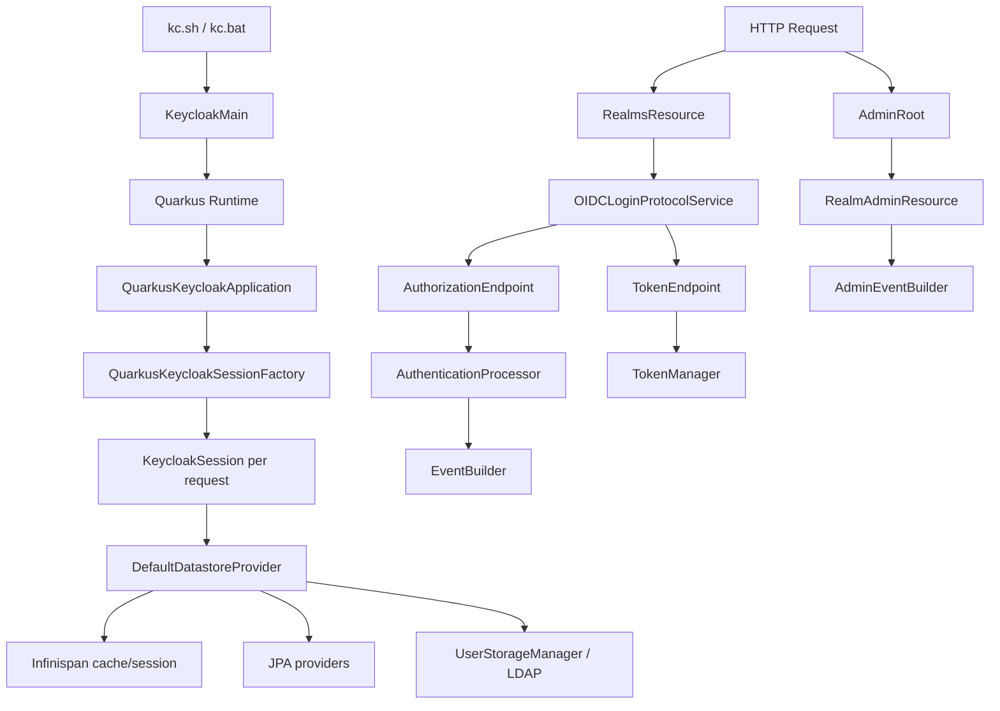
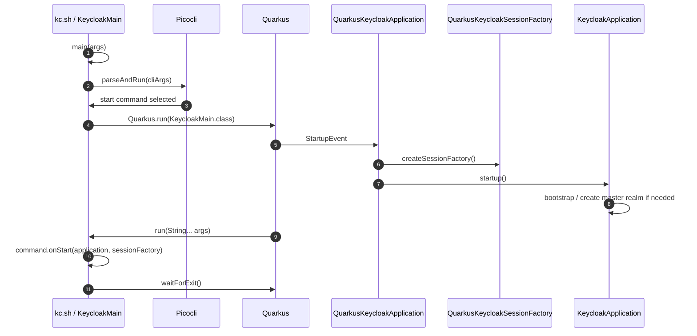
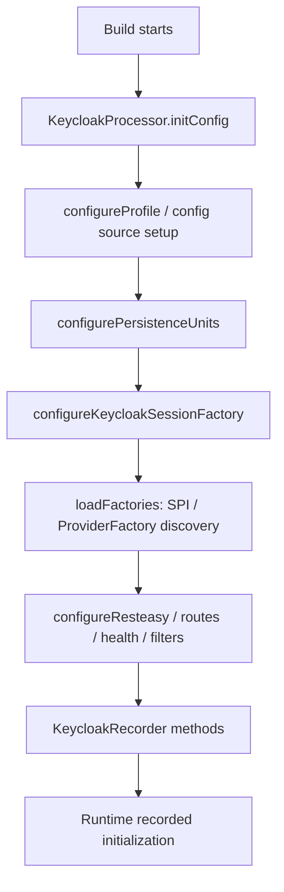
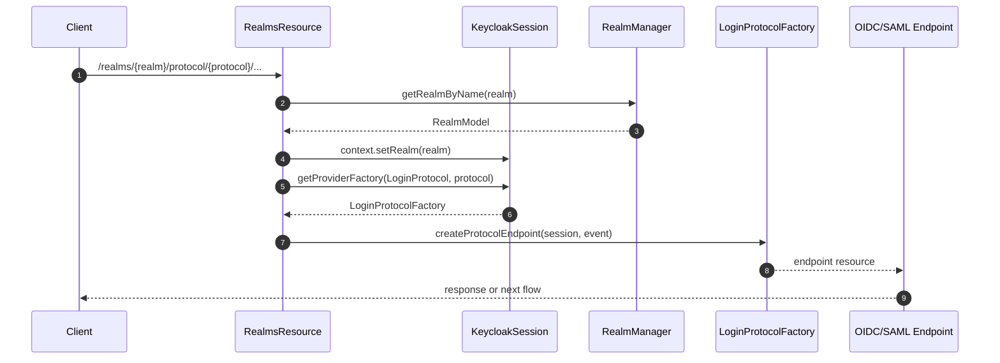
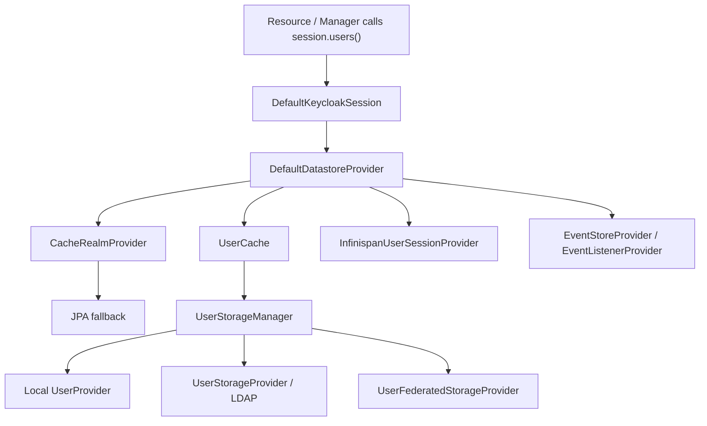

# 서버 런타임과 요청 생명주기

## 1. 개요

이 문서는 Keycloak 서버가 어떻게 시작되고, HTTP request가 어떤 코드 경로를 거쳐 authentication, token 발급, Admin API, storage, event 처리로 이어지는지 정의하는 architecture contract입니다.

핵심 전제는 다음과 같습니다.

| 항목 | 계약 |
| --- | --- |
| 서버 시작 | `KeycloakMain`이 CLI와 Quarkus lifecycle을 연결합니다. |
| Build-time | `KeycloakProcessor`가 SPI/provider, persistence, REST, Infinispan 구성을 build-time에 연결합니다. |
| Runtime | `QuarkusKeycloakApplication`이 `KeycloakApplication` startup/shutdown을 Quarkus event와 연결합니다. |
| Request scope | 요청마다 `KeycloakSession`이 중심 context가 됩니다. |
| Provider model | `ProviderFactory`는 서버 단위 lifecycle, `Provider`는 session 단위 lifecycle입니다. |
| Storage access | `DefaultKeycloakSession` -> `DefaultDatastoreProvider` -> cache/storage manager/JPA/federation으로 접근합니다. |

---

## 2. Runtime Topology

| 컴포넌트 | 책임 | 책임이 아닌 것 |
| --- | --- | --- |
| `KeycloakMain` | CLI parse, command lifecycle, Quarkus 실행 | HTTP request 처리 |
| `QuarkusKeycloakApplication` | Quarkus startup/shutdown event와 Keycloak application 연결 | provider business logic |
| `KeycloakSessionFactory` | provider factory registry와 session 생성 | request별 user 상태 보관 |
| `KeycloakSession` | request context, transaction, provider lookup, datastore facade | server-wide singleton state 저장 |
| `RealmsResource` | realm resolve와 protocol/account/broker/login-actions 위임 | token 자체 생성 |
| `AdminRoot` | admin bearer token 인증과 admin resource 생성 | realm mutation 전체 로직 구현 |

---

## 3. Bootstrap Sequence

| 단계 | 계약 | 대표 파일 |
| --- | --- | --- |
| CLI entrypoint | command parsing과 Quarkus run을 연결합니다. | `quarkus/runtime/src/main/java/org/keycloak/quarkus/runtime/KeycloakMain.java` |
| Application startup | `KeycloakApplication` startup/shutdown을 Quarkus event와 연결합니다. | `quarkus/runtime/src/main/java/org/keycloak/quarkus/runtime/integration/jaxrs/QuarkusKeycloakApplication.java` |
| Server bootstrap | session factory와 master realm bootstrap을 수행합니다. | `services/src/main/java/org/keycloak/services/resources/KeycloakApplication.java` |
| Session factory | build step 결과 기반 provider factory registry를 구성합니다. | `quarkus/runtime/src/main/java/org/keycloak/quarkus/runtime/integration/QuarkusKeycloakSessionFactory.java` |

---

## 4. Build-time Augmentation

Keycloak on Quarkus는 가능한 많은 runtime 결정을 build-time에 정리합니다. 이 구조는 startup predictability를 높이지만 provider/theme/build-time option 변경을 build pipeline과 연결합니다.

| Build step 영역 | 계약 |
| --- | --- |
| Feature 등록 | Quarkus feature name을 `keycloak`으로 등록합니다. |
| Config 초기화 | MicroProfile config provider와 Keycloak config source를 구성합니다. |
| Persistence unit | JPA persistence unit, DB vendor, Hibernate property, Liquibase 경계를 설정합니다. |
| SPI/provider discovery | SPI별 `ProviderFactory` class를 찾고 default/preconfigured provider를 결정합니다. |
| REST 구성 | RESTEasy Reactive handler, root path, management route, filters를 구성합니다. |
| Crypto/FIPS | crypto provider와 FIPS mode 관련 설정을 연결합니다. |
| ProtoStream/Infinispan | serialization schema와 cache runtime 구성을 연결합니다. |

---

## 5. Request Lifecycle 계약

### 5.1 Public realm request

| 책임 | 계약 |
| --- | --- |
| realm resolve | path의 realm name을 `RealmModel`로 찾습니다. |
| context 설정 | `session.getContext().setRealm(realm)`로 하위 resource의 기준 realm을 고정합니다. |
| protocol 위임 | OIDC/SAML protocol endpoint를 `LoginProtocolFactory`로 생성합니다. |
| 하위 resource | login action, account, broker, well-known resource로 분기합니다. |

### 5.2 OIDC authorization/token lifecycle

| 단계 | 중심 class | 계약 |
| --- | --- | --- |
| Authorization request | `AuthorizationEndpoint` | client, redirect URI, response type, scope, PKCE, OIDC parameter를 검증합니다. |
| Authentication flow | `AuthenticationProcessor` | browser/direct flow execution, authenticator 실행, user session attach를 처리합니다. |
| Token request | `TokenEndpoint` | grant type, client auth, duplicated parameter, length, DPoP, CORS를 검증합니다. |
| Grant processing | `OAuth2GrantType` provider | grant별 token 처리 로직을 수행합니다. |
| Token creation | `TokenManager` | access/refresh/ID token 생성, mapper 적용, refresh validation을 담당합니다. |

### 5.3 Admin API lifecycle

| 단계 | 계약 |
| --- | --- |
| Bearer token 추출 | `Authorization` header에서 token string을 읽습니다. |
| token JSON 파싱 | `JWSInput`으로 `AccessToken` content를 읽습니다. |
| issuer realm resolve | token issuer URL에서 admin token의 realm을 해석합니다. |
| bearer token 인증 | `AppAuthManager.BearerTokenAuthenticator`로 token/user/client를 검증합니다. |
| admin resource 생성 | `AdminAuth`, `RealmModel`, token manager를 admin resource에 전달합니다. |
| 권한 검사와 event | `AdminPermissionEvaluator`와 `AdminEventBuilder`가 mutation 경계를 형성합니다. |

---

## 6. Storage와 Event Lifecycle

| 계층 | 책임 | 대표 위치 |
| --- | --- | --- |
| `DefaultKeycloakSession` | session API와 datastore facade 연결 | `services/src/main/java/org/keycloak/services/DefaultKeycloakSession.java` |
| `DefaultDatastoreProvider` | realm/client/user/session provider 선택의 중앙 facade | `model/storage-private/src/main/java/org/keycloak/storage/datastore/DefaultDatastoreProvider.java` |
| Cache provider | realm/client/role/group/user cache 조회와 invalidation | `model/infinispan/src/main/java/org/keycloak/models/cache/infinispan/` |
| Storage manager | local storage와 external provider/federation provider 통합 | `model/storage-private/src/main/java/org/keycloak/storage/` |
| JPA provider | relational DB entity와 model adapter 구현 | `model/jpa/src/main/java/org/keycloak/models/jpa/` |
| Infinispan session provider | user/authentication session, single-use object, login failure 관리 | `model/infinispan/src/main/java/org/keycloak/models/sessions/infinispan/` |

Event lifecycle은 user event와 admin event를 분리하지만, 둘 다 listener/store로 이어집니다.

| Event 영역 | 대표 위치 |
| --- | --- |
| Event model/SPI | `server-spi-private/src/main/java/org/keycloak/events/` |
| Admin event builder | `services/src/main/java/org/keycloak/services/resources/admin/AdminEventBuilder.java` |
| Logging listener | `services/src/main/java/org/keycloak/events/log/` |
| Email listener | `services/src/main/java/org/keycloak/events/email/` |
| JPA event store | `model/jpa/src/main/java/org/keycloak/events/jpa/` |

---

## 7. Failure Boundary

| 실패 | 위치 | 사용자 결과 | 관측 포인트 |
| --- | --- | --- | --- |
| realm not found | `RealmsResource` | 404 | requested realm name |
| HTTPS required | `AuthorizationEndpoint`, `TokenEndpoint` | 403 또는 OAuth error | realm SSL policy, client connection |
| invalid redirect URI | `AuthorizationEndpointChecker` | error page 또는 redirect error | client id, requested redirect URI |
| invalid client auth | `AuthorizeClientUtil` | OAuth `invalid_client` | auth method, client id, event error |
| unsupported grant | `TokenEndpoint` | OAuth `unsupported_grant_type` | grant type, provider registry |
| authentication failure | `AuthenticationProcessor` | login error page | authenticator id, event type, brute force state |
| admin token invalid | `AdminRoot` | 401 Bearer | token issuer, realm, auth result |
| storage provider timeout | `UserStorageManager` | login/search/admin 실패 가능 | provider id, timeout, user lookup |
| cache inconsistency | Infinispan provider | stale data/session issue | invalidation event, cluster health |
| DB unavailable | JPA provider/transaction | 5xx/startup failure | datasource health, connection pool |

---

## 8. Extension Point 계약

| 확장 지점 | 사용 시점 | 대표 SPI/위치 |
| --- | --- | --- |
| Authenticator | browser/direct grant flow에 인증 단계 추가 | `AuthenticatorSpi`, `services/src/main/java/org/keycloak/authentication/` |
| Required Action | 로그인 후 사용자 조치 요구 | `RequiredActionProvider`, `services/src/main/java/org/keycloak/authentication/requiredactions/` |
| Protocol Mapper | token claim/SAML assertion 변환 | `ProtocolMapperSpi`, `services/src/main/java/org/keycloak/protocol/oidc/mappers/` |
| OAuth2 Grant Type | token endpoint grant 추가 | `OAuth2GrantType`, `services/src/main/java/org/keycloak/protocol/oidc/grants/` |
| User Storage Provider | 외부 사용자 저장소 연동 | `model/storage/src/main/java/org/keycloak/storage/UserStorageProvider.java` |
| Event Listener | user/admin event side effect 처리 | `EventListenerProvider` |
| Theme | login/account/admin/email UI 변경 | `themes/`, `js/apps/*/maven-resources/` |
| Admin REST extension | Admin UI extension/realm resource 추가 | `rest/admin-ui-ext/`, `RealmResourceProvider` |
| Operator dependent resource | Kubernetes resource reconciliation 확장 | `operator/src/main/java/org/keycloak/operator/controllers/` |

---

## 9. 기술 참조 보강

| 항목 | 위치 |
| --- | --- |
| CLI/runtime entrypoint | `quarkus/runtime/src/main/java/org/keycloak/quarkus/runtime/KeycloakMain.java` |
| Build-time processor | `quarkus/deployment/src/main/java/org/keycloak/quarkus/deployment/KeycloakProcessor.java` |
| Recorder | `quarkus/runtime/src/main/java/org/keycloak/quarkus/runtime/KeycloakRecorder.java` |
| Application startup | `services/src/main/java/org/keycloak/services/resources/KeycloakApplication.java` |
| Quarkus app integration | `quarkus/runtime/src/main/java/org/keycloak/quarkus/runtime/integration/jaxrs/QuarkusKeycloakApplication.java` |
| Session interface | `server-spi/src/main/java/org/keycloak/models/KeycloakSession.java` |
| Session implementation | `services/src/main/java/org/keycloak/services/DefaultKeycloakSession.java` |
| Public realm root | `services/src/main/java/org/keycloak/services/resources/RealmsResource.java` |
| OIDC service | `services/src/main/java/org/keycloak/protocol/oidc/OIDCLoginProtocolService.java` |
| Authorization endpoint | `services/src/main/java/org/keycloak/protocol/oidc/endpoints/AuthorizationEndpoint.java` |
| Token endpoint | `services/src/main/java/org/keycloak/protocol/oidc/endpoints/TokenEndpoint.java` |
| Token manager | `services/src/main/java/org/keycloak/protocol/oidc/TokenManager.java` |
| Authentication processor | `services/src/main/java/org/keycloak/authentication/AuthenticationProcessor.java` |
| Admin root | `services/src/main/java/org/keycloak/services/resources/admin/AdminRoot.java` |
| Datastore provider | `model/storage-private/src/main/java/org/keycloak/storage/datastore/DefaultDatastoreProvider.java` |
| User storage manager | `model/storage-private/src/main/java/org/keycloak/storage/UserStorageManager.java` |
| Infinispan user session | `model/infinispan/src/main/java/org/keycloak/models/sessions/infinispan/InfinispanUserSessionProvider.java` |

---

## 10. 작업 범위 기록

이 문서는 분석과 문서화만 수행합니다. 서버 runtime Java code, tests, Maven 설정은 수정하지 않습니다.

---

## 11. 관련 문서

| 목적 | 문서 |
| --- | --- |
| 백서 흐름 | [백서 Ch.4 인증, Token, Session 생명주기](../whitepaper/ch04-authentication-session-token-lifecycle.md) |
| SPI와 Quarkus 확장 | [백서 Ch.6 SPI, Provider, Quarkus 런타임](../whitepaper/ch06-extension-runtime-model.md) |
| 기준 아키텍처 | [프로젝트 개요와 기준 아키텍처](../00-foundation/01-project-overview-and-reference-architecture.md) |
| 정책 모델 | [Realm, Client, User 정책 모델](../20-policy/20-realm-client-user-policy-model.md) |
| 개발 검증 | [개발, 빌드, 테스트 실행 계약](../40-implementation/40-development-build-test-guide.md) |

## 12. 문서 이동

| 이전 | 다음 | 상위 |
| --- | --- | --- |
| [프로젝트 개요와 기준 아키텍처](../00-foundation/01-project-overview-and-reference-architecture.md) | [Realm, Client, User 정책 모델](../20-policy/20-realm-client-user-policy-model.md) | [문서 색인](../README.md) |
