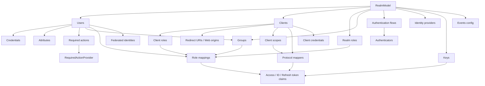
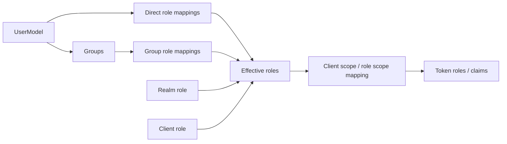
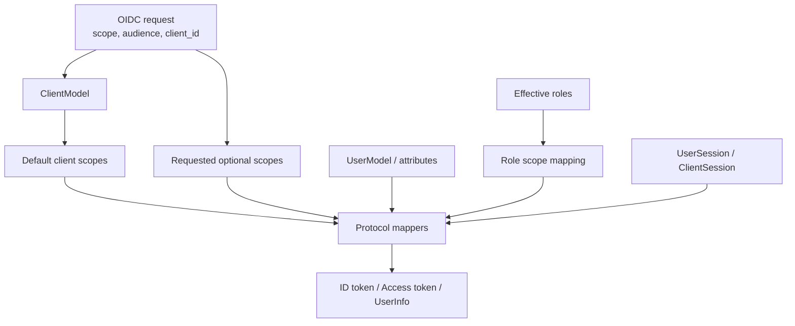

# Realm, Client, User 정책 모델

> 네비게이션: [문서 색인](../README.md) | 이전: [서버 런타임과 요청 생명주기](../10-architecture/10-server-runtime-and-request-lifecycle.md) | 다음: [UI, Operator, 테스트와 확장 지점](../30-integration/30-ui-operator-tests-and-extension-points.md)
> 관련 문서: [프로젝트 개요와 기준 아키텍처](../00-foundation/01-project-overview-and-reference-architecture.md), [운영, 보안, 관측성](../50-operations/50-operations-security-observability.md)

작성일: 2026-05-16

최신 소스 재검증: 2026-05-16, `/Users/dhsshin/Documents/LLMOps/keycloak` 현재 작업트리 기준

## 목적

이 문서는 Keycloak의 핵심 domain model과 정책 모델을 설명한다. `Realm`, `Client`, `User`, `Role`, `Group`, `Client Scope`, `Protocol Mapper`, `Authentication Flow`, `Session`, `Token`이 어떤 관계로 움직이는지 정리한다.

## 핵심 결론

| 개념 | 핵심 |
| --- | --- |
| Realm | tenant/security domain에 해당하는 최상위 격리 단위다. users, clients, roles, flows, IdP, events, keys, themes 설정을 포함한다. |
| Client | Keycloak에 등록된 application/service다. OIDC/SAML protocol, redirect URI, credentials, scopes, mappers, roles를 가진다. |
| User | 로그인 주체다. credentials, attributes, required actions, groups, role mappings, federated identity를 가진다. |
| Role | 권한의 이름 있는 단위다. realm role과 client role로 나뉘며 composite role을 만들 수 있다. |
| Group | user를 묶고 role/attribute를 상속하는 조직화 단위다. |
| Client Scope | 여러 client가 공유할 수 있는 scope/mappers/role scope mapping 묶음이다. |
| Protocol Mapper | user/client/session 정보를 token claim 또는 SAML assertion으로 변환한다. |
| Authentication Flow | browser/direct grant/registration/reset credentials 같은 인증 단계 그래프다. |
| Required Action | 인증 후 사용자에게 password update, email verification, TOTP/WebAuthn 등록 등을 요구한다. |
| Session | authentication session은 로그인 중간 상태, user session은 인증 완료 후 지속 상태다. |
| Token | realm key, client config, user session, protocol mapper, scope, role mapping 결과로 발급된다. |

## 전체 관계도

## 핵심 model interface

| Interface | 역할 | 대표 파일 |
| --- | --- | --- |
| `RealmModel` | realm 설정, clients, roles, flows, required actions, localization, IdP, events 등 최상위 상태 | `server-spi/src/main/java/org/keycloak/models/RealmModel.java` |
| `ClientModel` | OIDC/SAML client 설정, redirect URI, scopes, mappers, roles, credentials | `server-spi/src/main/java/org/keycloak/models/ClientModel.java` |
| `UserModel` | username, email, attributes, credentials, required actions, federation link, role mappings | `server-spi/src/main/java/org/keycloak/models/UserModel.java` |
| `RoleModel` | realm/client role과 composite role | `server-spi/src/main/java/org/keycloak/models/RoleModel.java` |
| `GroupModel` | group hierarchy, attributes, role mappings | `server-spi/src/main/java/org/keycloak/models/GroupModel.java` |
| `ClientScopeModel` | shared scope와 protocol mapper 묶음 | `server-spi/src/main/java/org/keycloak/models/ClientScopeModel.java` |
| `UserSessionModel` | 인증 완료 후 user login session | `server-spi/src/main/java/org/keycloak/models/UserSessionModel.java` |
| `AuthenticationSessionModel` | browser/direct flow 중간 상태 | `server-spi/src/main/java/org/keycloak/sessions/AuthenticationSessionModel.java` |

## Realm 정책 모델

Realm은 Keycloak에서 가장 중요한 격리 단위다.

| 정책 영역 | Realm에서 관리하는 것 | 주의점 |
| --- | --- | --- |
| 로그인 정책 | login with email, registration, remember me, reset password, brute force, required actions | 인증 UX와 보안 정책을 동시에 바꾼다. |
| SSL 정책 | realm SSL required 설정 | production에서는 TLS 종료 위치와 proxy header 정책을 함께 검토해야 한다. |
| Token 정책 | access token lifespan, refresh token lifespan, offline session, SSO session | session/cache/DB persistence와 연결된다. |
| Key 정책 | active key, signing algorithm, JWKS | key rotation과 client JWKS cache 영향을 고려해야 한다. |
| Theme 정책 | login/account/admin/email theme | theme JAR, `providers`, build/re-augmentation 영향이 있다. |
| Event 정책 | user event/admin event 저장, listener, expiration | audit 요구사항과 DB growth를 함께 고려해야 한다. |
| Identity Provider | broker 설정, mapper, first broker login flow | account linking과 takeover risk를 검토해야 한다. |

### Realm 관련 resource

| 영역 | 파일 |
| --- | --- |
| Public realm resource | `services/src/main/java/org/keycloak/services/resources/PublicRealmResource.java` |
| Realm admin resource | `services/src/main/java/org/keycloak/services/resources/admin/RealmAdminResource.java` |
| Realm model JPA | `model/jpa/src/main/java/org/keycloak/models/jpa/RealmAdapter.java` |
| Realm entity | `model/jpa/src/main/java/org/keycloak/models/jpa/entities/RealmEntity.java` |
| Realm cache | `model/infinispan/src/main/java/org/keycloak/models/cache/infinispan/entities/CachedRealm.java` |

## Client 정책 모델

Client는 application 또는 service를 Keycloak에 등록한 단위다.

| Client 설정 | 의미 | 보안 기준 |
| --- | --- | --- |
| `clientId` | protocol request에서 client를 식별 | public 값이므로 secret처럼 취급하지 않는다. |
| redirect URI | authorization code flow 후 돌아갈 URI allowlist | wildcard를 최소화하고 exact match를 선호한다. |
| web origins | CORS 허용 origin | browser app에 필요한 origin만 허용한다. |
| client authentication | confidential client secret, private key JWT 등 | public client와 confidential client를 명확히 구분한다. |
| standard/direct/implicit flow | OIDC grant/flow enablement | legacy/implicit 사용은 제한적으로 검토한다. |
| service account | client credentials grant 주체 | M2M 권한은 client role과 scope로 최소화한다. |
| protocol mappers | token claim 변환 | token size와 PII 노출을 관리한다. |
| client scopes | default/optional scope 연결 | optional scope로 claim surface를 줄일 수 있다. |
| client policies | OAuth/OIDC request 제약 | PKCE, redirect, signature, DPoP 등 강제에 사용한다. |

### Client 관련 코드

| 영역 | 파일 |
| --- | --- |
| Client model | `server-spi/src/main/java/org/keycloak/models/ClientModel.java` |
| Client admin resource | `services/src/main/java/org/keycloak/services/resources/admin/ClientsResource.java`, `ClientResource.java` |
| Client JPA adapter | `model/jpa/src/main/java/org/keycloak/models/jpa/ClientAdapter.java` |
| Client entity | `model/jpa/src/main/java/org/keycloak/models/jpa/entities/ClientEntity.java` |
| Client policy | `services/src/main/java/org/keycloak/services/clientpolicy/` |
| OIDC client auth | `services/src/main/java/org/keycloak/protocol/oidc/utils/AuthorizeClientUtil.java` |

## User, Group, Role 정책 모델

| 개념 | 설명 | 설계 기준 |
| --- | --- | --- |
| Realm role | realm 전체에 적용되는 권한 | organization-wide 권한 표현에 적합하다. |
| Client role | 특정 client/resource server에 종속된 권한 | application-specific 권한 표현에 적합하다. |
| Composite role | 여러 role을 포함하는 role | 관리 편의성과 과도한 권한 확산을 함께 검토한다. |
| Group | user 집합과 role/attribute 상속 단위 | 조직 구조와 권한 구조를 동일시하지 않도록 주의한다. |
| Effective roles | direct/group/composite를 합산한 최종 권한 | token mapper와 client scope mapping에 의해 token 노출 여부가 달라진다. |

### User storage와 federation

| 경로 | 의미 |
| --- | --- |
| local user storage | Keycloak DB에 user와 credential을 저장한다. |
| user federation | LDAP/external provider에서 user lookup/query/credential validation을 수행한다. |
| federated storage | 외부 user에 대한 local attributes, role mappings, groups, consents, broker links 등을 보조 저장한다. |
| imported user | 외부 provider user를 local DB에 import/cache하는 형태다. |

관련 파일:

| 영역 | 파일 |
| --- | --- |
| User model | `server-spi/src/main/java/org/keycloak/models/UserModel.java` |
| User admin resource | `services/src/main/java/org/keycloak/services/resources/admin/UsersResource.java`, `UserResource.java` |
| User JPA provider | `model/jpa/src/main/java/org/keycloak/models/jpa/JpaUserProvider.java` |
| User JPA adapter/entity | `model/jpa/src/main/java/org/keycloak/models/jpa/UserAdapter.java`, `model/jpa/src/main/java/org/keycloak/models/jpa/entities/UserEntity.java` |
| User storage manager | `model/storage-private/src/main/java/org/keycloak/storage/UserStorageManager.java` |
| User storage SPI | `model/storage/src/main/java/org/keycloak/storage/UserStorageProvider.java` |
| LDAP provider | `federation/ldap/src/main/java/org/keycloak/storage/ldap/LDAPStorageProvider.java` |
| Federated storage | `model/storage/src/main/java/org/keycloak/storage/federated/` |

## Authentication flow 정책 모델

Authentication flow는 인증 단계를 구성하는 graph다.

| Flow | 용도 | 대표 구성 요소 |
| --- | --- | --- |
| Browser flow | authorization endpoint에서 browser login 처리 | cookie, identity provider redirector, username/password, OTP, WebAuthn |
| Direct grant flow | resource owner password credentials 등 direct token grant | validate username, password, OTP |
| Registration flow | self-registration | profile, password, terms, recaptcha 등 |
| Reset credentials flow | forgot password/reset credentials | email, password update, OTP reset |
| First broker login flow | external IdP 첫 로그인 | account linking, profile review, user creation |
| Post broker login flow | broker login 이후 추가 검증 | 추가 인증, required action |

### Required action

| Required action | 의미 | 예시 파일 |
| --- | --- | --- |
| Update password | 사용자 password 변경 요구 | `services/src/main/java/org/keycloak/authentication/requiredactions/UpdatePassword.java` |
| Verify email | email 검증 요구 | `services/src/main/java/org/keycloak/authentication/requiredactions/VerifyEmail.java` |
| Update profile | profile attribute 보완 | `services/src/main/java/org/keycloak/authentication/requiredactions/UpdateProfile.java` |
| Configure TOTP | TOTP 등록 | `services/src/main/java/org/keycloak/authentication/requiredactions/UpdateTotp.java` |
| WebAuthn register | WebAuthn credential 등록 | `services/src/main/java/org/keycloak/authentication/requiredactions/WebAuthnRegister.java` |

## Token, scope, mapper 정책 모델

| Mapper/Scope 영역 | 설명 | 주의점 |
| --- | --- | --- |
| User attribute mapper | user attribute를 claim으로 노출 | PII 노출과 token size를 관리한다. |
| Role mapper | realm/client role을 token에 포함 | client별 최소 권한과 audience를 확인한다. |
| Group membership mapper | group path/name을 claim으로 노출 | 조직 구조 노출 위험이 있다. |
| Audience mapper | access token audience 제어 | resource server 검증 모델과 맞춰야 한다. |
| Client scope | mapper와 role scope mapping의 재사용 단위 | default scope와 optional scope를 명확히 분리한다. |
| Token lifespan | access/refresh/offline token 유효시간 | 보안과 UX, session cache 운영을 함께 고려한다. |

대표 mapper 파일:

| Mapper | 파일 |
| --- | --- |
| base mapper | `services/src/main/java/org/keycloak/protocol/oidc/mappers/AbstractOIDCProtocolMapper.java` |
| user attribute | `services/src/main/java/org/keycloak/protocol/oidc/mappers/UserAttributeMapper.java` |
| realm role | `services/src/main/java/org/keycloak/protocol/oidc/mappers/UserRealmRoleMappingMapper.java` |
| client role | `services/src/main/java/org/keycloak/protocol/oidc/mappers/UserClientRoleMappingMapper.java` |
| audience | `services/src/main/java/org/keycloak/protocol/oidc/mappers/AudienceProtocolMapper.java` |
| group membership | `services/src/main/java/org/keycloak/protocol/oidc/mappers/GroupMembershipMapper.java` |

## Session 정책 모델

| Session | 의미 | 저장소 |
| --- | --- | --- |
| Root authentication session | browser flow의 root login attempt | Infinispan authentication session provider |
| Authentication session | tab/client 단위 login 중간 상태 | Infinispan authentication session provider |
| User session | 인증 완료 후 user의 SSO session | Infinispan user session provider, persistent session JPA 옵션 |
| Authenticated client session | user session에 연결된 client별 session | Infinispan/JPA session model |
| Offline session | offline token을 위한 장기 session | persistent storage 성격이 강함 |
| Single-use object | action token, code 등 재사용 방지 객체 | Infinispan single-use object provider |
| Login failure | brute force protection 상태 | Infinispan login failure provider |

관련 파일:

| 영역 | 파일 |
| --- | --- |
| Authentication manager | `services/src/main/java/org/keycloak/services/managers/AuthenticationManager.java` |
| Authentication session manager | `services/src/main/java/org/keycloak/services/managers/AuthenticationSessionManager.java` |
| User session manager | `services/src/main/java/org/keycloak/services/managers/UserSessionManager.java` |
| Client session code | `services/src/main/java/org/keycloak/services/managers/ClientSessionCode.java` |
| Infinispan user session | `model/infinispan/src/main/java/org/keycloak/models/sessions/infinispan/InfinispanUserSessionProvider.java` |
| Persistent session JPA | `model/jpa/src/main/java/org/keycloak/models/jpa/session/` |

## Security policy checklist

| 항목 | 기준 |
| --- | --- |
| Realm isolation | 서비스/tenant 경계를 realm으로 나눌지 client/role/group으로 나눌지 명확히 정한다. |
| Redirect URI | wildcard를 최소화하고 production URL을 명확히 등록한다. |
| PKCE | public client와 browser/mobile client에는 PKCE를 강제한다. |
| Client secret | confidential client secret은 Secret manager 또는 Kubernetes Secret으로 관리한다. |
| Token claim | 필요한 claim만 mapper로 노출하고 PII/token size를 제한한다. |
| Role mapping | composite role과 group role 상속으로 과도한 권한이 생기지 않는지 검토한다. |
| Federation | LDAP/external provider timeout, imported user lifecycle, credential validation 위치를 결정한다. |
| Broker | 외부 IdP trust, account linking, email verified 처리, mapper를 검토한다. |
| Session lifespan | access/refresh/offline/session idle/max 정책을 서비스 위험도에 맞춘다. |
| Events | admin event와 user event 저장, retention, listener side effect를 audit 요구사항과 맞춘다. |

## 작업 범위 기록

이 문서는 분석과 문서화만 수행한다. Realm 설정, client 설정, protocol mapper, authentication flow, Java provider 코드는 수정하지 않는다.
