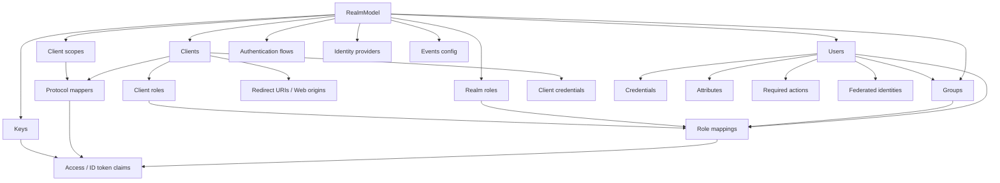
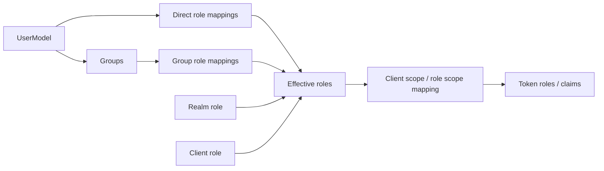
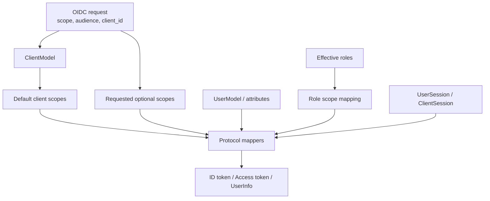

# Realm, Client, User 정책 모델

## 1. 개요

이 문서는 Keycloak의 핵심 정책 객체를 **운영 의미론과 token/session 효과** 관점에서 정리합니다. 대상 객체는 `Realm`, `Client`, `User`, `Role`, `Group`, `Client Scope`, `Protocol Mapper`, `Authentication Flow`, `Session`, `Token`입니다.

정책 모델의 핵심 원칙은 다음과 같습니다.

| 원칙 | 설명 |
| --- | --- |
| Realm은 보안 구역입니다. | users, clients, roles, flows, IdP, keys, events, session policy를 격리합니다. |
| Client는 신뢰 계약입니다. | redirect URI, grant, credential, scope, mapper, role이 애플리케이션 계약을 만듭니다. |
| Role은 권한 주장입니다. | token에 실릴 수 있지만, resource server의 최종 domain authorization을 대체하지 않습니다. |
| Mapper는 외부 노출입니다. | user/session/client 정보를 token claim 또는 SAML assertion으로 변환합니다. |
| Session과 Token은 함께 설계합니다. | access/refresh/offline token lifespan은 SSO session/cache/DB 정책과 연결됩니다. |

---

## 2. 전체 모델 관계

| Interface | 책임 | 대표 파일 |
| --- | --- | --- |
| `RealmModel` | realm 설정, clients, roles, flows, required actions, IdP, events | `server-spi/src/main/java/org/keycloak/models/RealmModel.java` |
| `ClientModel` | OIDC/SAML client 설정, redirect URI, scopes, mappers, roles, credentials | `server-spi/src/main/java/org/keycloak/models/ClientModel.java` |
| `UserModel` | username, email, attributes, credentials, required actions, federation link, role mappings | `server-spi/src/main/java/org/keycloak/models/UserModel.java` |
| `RoleModel` | realm/client role과 composite role | `server-spi/src/main/java/org/keycloak/models/RoleModel.java` |
| `GroupModel` | group hierarchy, attributes, role mappings | `server-spi/src/main/java/org/keycloak/models/GroupModel.java` |
| `ClientScopeModel` | shared scope와 protocol mapper 묶음 | `server-spi/src/main/java/org/keycloak/models/ClientScopeModel.java` |
| `UserSessionModel` | 인증 완료 후 user login session | `server-spi/src/main/java/org/keycloak/models/UserSessionModel.java` |
| `AuthenticationSessionModel` | browser/direct flow 중간 상태 | `server-spi/src/main/java/org/keycloak/sessions/AuthenticationSessionModel.java` |

---

## 3. Realm 정책 계약

Realm은 Keycloak의 최상위 격리 단위입니다.

| 정책 영역 | Realm에서 관리하는 것 | 운영 기준 |
| --- | --- | --- |
| 로그인 정책 | login with email, registration, remember me, reset password, brute force, required actions | UX와 보안 정책을 함께 바꿉니다. |
| SSL 정책 | realm SSL required 설정 | production TLS topology, proxy header와 함께 검토합니다. |
| Token 정책 | access/refresh/offline token lifespan, SSO session idle/max | session/cache/DB persistence와 연결합니다. |
| Key 정책 | active key, signing algorithm, JWKS | key rotation과 client JWKS cache를 고려합니다. |
| Theme 정책 | login/account/admin/email theme | theme JAR, `providers`, build/re-augmentation 영향을 검토합니다. |
| Event 정책 | user/admin event 저장, listener, expiration | audit 요구사항과 DB growth를 함께 봅니다. |
| Identity Provider | broker 설정, mapper, first broker login flow | account linking과 takeover risk를 검토합니다. |

| Realm 관련 영역 | 파일 |
| --- | --- |
| Public realm resource | `services/src/main/java/org/keycloak/services/resources/PublicRealmResource.java` |
| Realm admin resource | `services/src/main/java/org/keycloak/services/resources/admin/RealmAdminResource.java` |
| Realm model JPA | `model/jpa/src/main/java/org/keycloak/models/jpa/RealmAdapter.java` |
| Realm entity | `model/jpa/src/main/java/org/keycloak/models/jpa/entities/RealmEntity.java` |
| Realm cache | `model/infinispan/src/main/java/org/keycloak/models/cache/infinispan/entities/CachedRealm.java` |

---

## 4. Client 정책 계약

Client는 애플리케이션 또는 service와 Keycloak 사이의 신뢰 계약입니다.

| Client 설정 | 의미 | 보안 계약 |
| --- | --- | --- |
| `clientId` | protocol request에서 client 식별 | public 값이며 secret이 아닙니다. |
| redirect URI | authorization code flow 후 돌아갈 URI allowlist | wildcard를 최소화하고 exact match를 선호합니다. |
| web origins | CORS 허용 origin | browser app에 필요한 origin만 허용합니다. |
| client authentication | confidential client secret, private key JWT 등 | public/confidential client를 명확히 구분합니다. |
| standard/direct/implicit flow | OIDC grant/flow enablement | implicit/legacy flow는 제한적으로 검토합니다. |
| service account | client credentials grant 주체 | M2M 권한은 client role과 scope로 최소화합니다. |
| protocol mappers | token claim 변환 | token size와 PII 노출을 관리합니다. |
| client scopes | default/optional scope 연결 | optional scope로 claim surface를 줄입니다. |
| client policies | OAuth/OIDC request 제약 | PKCE, redirect, signature, DPoP 강제에 사용합니다. |

| Client 관련 영역 | 파일 |
| --- | --- |
| Client model | `server-spi/src/main/java/org/keycloak/models/ClientModel.java` |
| Client admin resource | `services/src/main/java/org/keycloak/services/resources/admin/ClientsResource.java`, `services/src/main/java/org/keycloak/services/resources/admin/ClientResource.java` |
| Client JPA adapter | `model/jpa/src/main/java/org/keycloak/models/jpa/ClientAdapter.java` |
| Client entity | `model/jpa/src/main/java/org/keycloak/models/jpa/entities/ClientEntity.java` |
| Client policy | `services/src/main/java/org/keycloak/services/clientpolicy/` |
| OIDC client auth | `services/src/main/java/org/keycloak/protocol/oidc/utils/AuthorizeClientUtil.java` |

---

## 5. User, Group, Role 의미론

| 개념 | 권장 용도 | 피해야 할 사용 |
| --- | --- | --- |
| Realm role | organization-wide/platform 권한 | 앱 내부 세부 permission 전체 표현 |
| Client role | 특정 client/resource server 권한 | 전사 공통 권한 표현 |
| Composite role | 제한적인 권한 묶음 | 깊은 중첩으로 effective permission 불투명화 |
| Group | user 집합과 role/attribute assignment | 조직도와 권한 구조를 무조건 동일시 |
| Effective roles | direct/group/composite 합산 결과 | token 노출 여부를 검토하지 않은 채 그대로 사용 |

---

## 6. Federation 정책 계약

| 경로 | 의미 | 주의점 |
| --- | --- | --- |
| local user storage | Keycloak DB에 user와 credential 저장 | 기존 HR/LDAP source와 중복 가능 |
| user federation | LDAP/external provider에서 lookup/query/credential validation | timeout, availability, import/sync 정책 필요 |
| federated storage | 외부 user에 대한 local attributes, role mappings, groups, consents, broker links 저장 | source of truth와 drift 관리 필요 |
| imported user | external provider user를 local DB에 import/cache | deprovisioning SLA와 stale copy 관리 필요 |

| 영역 | 파일 |
| --- | --- |
| User model | `server-spi/src/main/java/org/keycloak/models/UserModel.java` |
| User admin resource | `services/src/main/java/org/keycloak/services/resources/admin/UsersResource.java`, `services/src/main/java/org/keycloak/services/resources/admin/UserResource.java` |
| User JPA provider | `model/jpa/src/main/java/org/keycloak/models/jpa/JpaUserProvider.java` |
| User storage manager | `model/storage-private/src/main/java/org/keycloak/storage/UserStorageManager.java` |
| User storage SPI | `model/storage/src/main/java/org/keycloak/storage/UserStorageProvider.java` |
| LDAP provider | `federation/ldap/src/main/java/org/keycloak/storage/ldap/LDAPStorageProvider.java` |
| Federated storage | `model/storage/src/main/java/org/keycloak/storage/federated/` |

---

## 7. Authentication Flow 계약

Authentication flow는 인증 단계를 구성하는 graph입니다.

| Flow | 용도 | 대표 구성 요소 |
| --- | --- | --- |
| Browser flow | authorization endpoint에서 browser login 처리 | cookie, identity provider redirector, username/password, OTP, WebAuthn |
| Direct grant flow | resource owner password credentials 등 direct token grant | validate username, password, OTP |
| Registration flow | self-registration | profile, password, terms, recaptcha |
| Reset credentials flow | forgot password/reset credentials | email, password update, OTP reset |
| First broker login flow | external IdP 첫 로그인 | account linking, profile review, user creation |
| Post broker login flow | broker login 이후 추가 검증 | 추가 인증, required action |

| Required action | 의미 | 예시 파일 |
| --- | --- | --- |
| Update password | 사용자 password 변경 요구 | `services/src/main/java/org/keycloak/authentication/requiredactions/UpdatePassword.java` |
| Verify email | email 검증 요구 | `services/src/main/java/org/keycloak/authentication/requiredactions/VerifyEmail.java` |
| Update profile | profile attribute 보완 | `services/src/main/java/org/keycloak/authentication/requiredactions/UpdateProfile.java` |
| Configure TOTP | TOTP 등록 | `services/src/main/java/org/keycloak/authentication/requiredactions/UpdateTotp.java` |
| WebAuthn register | WebAuthn credential 등록 | `services/src/main/java/org/keycloak/authentication/requiredactions/WebAuthnRegister.java` |

---

## 8. Token, Scope, Mapper 의미론

| Mapper/Scope 영역 | 계약 | 위험 |
| --- | --- | --- |
| User attribute mapper | 필요한 user attribute만 claim으로 노출합니다. | PII 노출, token size 증가 |
| Role mapper | realm/client role을 token에 포함합니다. | audience와 resource server 검증 누락 |
| Group membership mapper | group path/name을 claim으로 노출합니다. | 조직 구조 노출 |
| Audience mapper | access token audience를 제어합니다. | resource server 검증 모델과 불일치 |
| Client scope | mapper와 role scope mapping의 재사용 단위입니다. | default scope 과다 노출 |
| Token lifespan | access/refresh/offline token 유효시간입니다. | UX와 탈취 피해의 tradeoff |

| Mapper | 파일 |
| --- | --- |
| base mapper | `services/src/main/java/org/keycloak/protocol/oidc/mappers/AbstractOIDCProtocolMapper.java` |
| user attribute | `services/src/main/java/org/keycloak/protocol/oidc/mappers/UserAttributeMapper.java` |
| realm role | `services/src/main/java/org/keycloak/protocol/oidc/mappers/UserRealmRoleMappingMapper.java` |
| client role | `services/src/main/java/org/keycloak/protocol/oidc/mappers/UserClientRoleMappingMapper.java` |
| audience | `services/src/main/java/org/keycloak/protocol/oidc/mappers/AudienceProtocolMapper.java` |
| group membership | `services/src/main/java/org/keycloak/protocol/oidc/mappers/GroupMembershipMapper.java` |

---

## 9. Session 정책 계약

| Session | 의미 | 저장소/구현 |
| --- | --- | --- |
| Root authentication session | browser flow의 root login attempt | Infinispan authentication session provider |
| Authentication session | tab/client 단위 login 중간 상태 | Infinispan authentication session provider |
| User session | 인증 완료 후 user의 SSO session | Infinispan user session provider, persistent session JPA 옵션 |
| Authenticated client session | user session에 연결된 client별 session | Infinispan/JPA session model |
| Offline session | offline token을 위한 장기 session | persistent storage 성격이 강함 |
| Single-use object | action token, code 등 재사용 방지 객체 | Infinispan single-use object provider |
| Login failure | brute force protection 상태 | Infinispan login failure provider |

| 영역 | 파일 |
| --- | --- |
| Authentication manager | `services/src/main/java/org/keycloak/services/managers/AuthenticationManager.java` |
| Authentication session manager | `services/src/main/java/org/keycloak/services/managers/AuthenticationSessionManager.java` |
| User session manager | `services/src/main/java/org/keycloak/services/managers/UserSessionManager.java` |
| Client session code | `services/src/main/java/org/keycloak/services/managers/ClientSessionCode.java` |
| Infinispan user session | `model/infinispan/src/main/java/org/keycloak/models/sessions/infinispan/InfinispanUserSessionProvider.java` |
| Persistent session JPA | `model/jpa/src/main/java/org/keycloak/models/jpa/session/` |

---

## 10. Validation Rules

| 항목 | 기준 |
| --- | --- |
| Realm isolation | 서비스/tenant 경계를 realm, client, role, group 중 어디로 둘지 명확히 정합니다. |
| Redirect URI | wildcard를 최소화하고 production URL을 명확히 등록합니다. |
| PKCE | public client와 browser/mobile client에는 PKCE를 강제합니다. |
| Client secret | confidential client secret은 Secret manager 또는 Kubernetes Secret으로 관리합니다. |
| Token claim | 필요한 claim만 mapper로 노출하고 PII/token size를 제한합니다. |
| Role mapping | composite role과 group role 상속으로 과도한 권한이 생기지 않는지 검토합니다. |
| Federation | LDAP/external provider timeout, imported user lifecycle, credential validation 위치를 결정합니다. |
| Broker | 외부 IdP trust, account linking, email verified 처리, mapper를 검토합니다. |
| Session lifespan | access/refresh/offline/session idle/max 정책을 서비스 위험도에 맞춥니다. |
| Events | admin event와 user event 저장, retention, listener side effect를 audit 요구사항과 맞춥니다. |

---

## 11. Non-Goals

| 제외 항목 | 이유 |
| --- | --- |
| 실제 realm/client 설정값 확정 | 서비스별 보안 요구사항과 운영 모델이 필요합니다. |
| token claim 표준 강제 | 애플리케이션 onboarding 정책에서 별도로 확정해야 합니다. |
| LDAP/IdP source of truth 결정 | 조직의 HR/Directory 정책과 연결된 운영 결정입니다. |
| custom authenticator/provider 구현 | 본 문서는 정책 모델 분석이며 구현은 별도 작업입니다. |

---

## 12. 기술 참조 보강

| 주제 | 참조 |
| --- | --- |
| 모델 interface | `server-spi/src/main/java/org/keycloak/models/` |
| OIDC mapper | `services/src/main/java/org/keycloak/protocol/oidc/mappers/` |
| Admin resources | `services/src/main/java/org/keycloak/services/resources/admin/` |
| Storage manager | `model/storage-private/src/main/java/org/keycloak/storage/` |
| JPA model | `model/jpa/src/main/java/org/keycloak/models/jpa/` |
| Infinispan sessions/cache | `model/infinispan/src/main/java/org/keycloak/models/sessions/infinispan/`, `model/infinispan/src/main/java/org/keycloak/models/cache/infinispan/` |
| LDAP federation | `federation/ldap/src/main/java/org/keycloak/storage/ldap/` |

---

## 13. 작업 범위 기록

이 문서는 분석과 문서화만 수행합니다. Realm 설정, client 설정, protocol mapper, authentication flow, Java provider code는 수정하지 않습니다.
