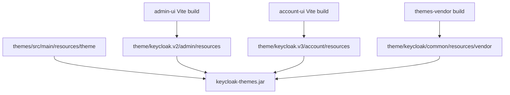
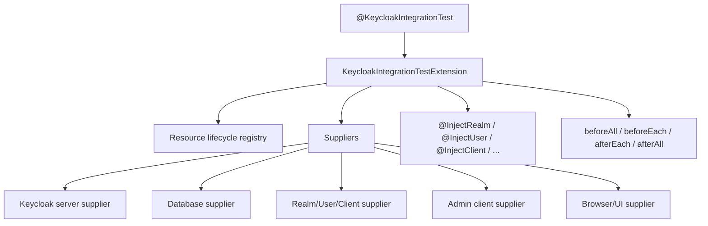

# UI, Operator, 테스트와 확장 지점

> 네비게이션: [문서 색인](../README.md) | 이전: [Realm/Client/User 정책 모델](../20-policy/20-realm-client-user-policy-model.md) | 다음: [개발/빌드/테스트 가이드](../40-implementation/40-development-build-test-guide.md)
> 관련 문서: [프로젝트 개요와 기준 아키텍처](../00-foundation/01-project-overview-and-reference-architecture.md), [서버 런타임과 요청 생명주기](../10-architecture/10-server-runtime-and-request-lifecycle.md)

작성일: 2026-05-16

최신 소스 재검증: 2026-05-16, `/Users/dhsshin/Documents/LLMOps/keycloak` 현재 작업트리 기준

## 목적

이 문서는 서버 core 외부의 주요 통합 영역을 설명한다. JS UI, themes, Operator, 테스트 framework, 확장 지점을 한 곳에서 찾을 수 있게 정리한다.

## 한 장 요약

| 영역 | 위치 | 핵심 |
| --- | --- | --- |
| Admin UI | `js/apps/admin-ui` | React 18, Vite, PatternFly 5 기반 관리자 UI |
| Account UI | `js/apps/account-ui` | React 18, Vite, PatternFly 기반 사용자 계정 UI |
| UI shared | `js/libs/ui-shared` | admin/account UI 공용 component/util library |
| Admin client | `js/libs/keycloak-admin-client` | Keycloak Admin REST API TypeScript client |
| Theme vendor | `js/themes-vendor` | React, React DOM, PatternFly assets를 theme resource로 bundle |
| Built-in themes | `themes/` | login/account/email/admin theme resource와 verifier |
| Local UI server | `js/apps/keycloak-server` | UI 개발용 Keycloak server starter |
| Operator | `operator/` | Quarkus Operator SDK 기반 Kubernetes Operator |
| Test framework | `test-framework/` | 신규 JUnit 5 extension 기반 테스트 framework |
| Legacy testsuite | `testsuite/` | 기존 Arquillian/model testsuite. deprecated 문서 존재 |

## JS workspace 구조

```text
js/
  apps/
    account-ui/
    admin-ui/
    keycloak-server/
    create-keycloak-theme/
  libs/
    keycloak-admin-client/
    ui-shared/
  themes-vendor/
  package.json
  pnpm-workspace.yaml
  pnpm-lock.yaml
  pom.xml
```

### Build 도구

| 도구 | 사용 위치 | 역할 |
| --- | --- | --- |
| pnpm | `js/package.json`, `pnpm-workspace.yaml` | workspace package install/build |
| Wireit | `js/package.json` | package build dependency orchestration |
| Vite | `admin-ui`, `account-ui`, `ui-shared` | app/library build와 dev server |
| TypeScript | JS workspace 전체 | strict type 기반 UI/client build |
| PatternFly | UI apps | Keycloak UI component 기반 |
| frontend-maven-plugin | `js/pom.xml` | Maven build 중 Node `v24.9.0`, pnpm `10.14.0` 설치와 `pnpm build` 실행 |
| theme-verifier-maven-plugin | `js/pom.xml`, `themes/pom.xml` | theme resource 검증 |

## Admin UI

| 항목 | 내용 |
| --- | --- |
| 경로 | `js/apps/admin-ui` |
| package | `@keycloak/keycloak-admin-ui` |
| Maven artifact | `keycloak-admin-ui` |
| entrypoint | `js/apps/admin-ui/src/main.tsx` |
| routes | `js/apps/admin-ui/src/routes.tsx` |
| Vite config | `js/apps/admin-ui/vite.config.ts` |
| theme resource output | `target/classes/theme/keycloak.v2/admin/resources` |
| library output | `lib/keycloak-admin-ui.js`, `lib/keycloak-admin-ui.d.ts` |
| dev server port | `5174` |

주요 기능 디렉토리:

| 디렉토리 | 역할 |
| --- | --- |
| `src/authentication` | authentication flow 관리 UI |
| `src/clients` | client 목록/상세/설정 UI |
| `src/client-scopes` | client scope 관리 |
| `src/groups` | group 관리 |
| `src/identity-providers` | external IdP/broker 설정 |
| `src/realm` | realm 선택/공통 영역 |
| `src/realm-settings` | realm setting tabs |
| `src/realm-roles` | realm role 관리 |
| `src/user` | user 관리 |
| `src/user-federation` | federation provider 관리 |
| `src/events` | events/admin events 설정/조회 |
| `src/workflows` | workflow feature UI |

## Account UI

| 항목 | 내용 |
| --- | --- |
| 경로 | `js/apps/account-ui` |
| package | `@keycloak/keycloak-account-ui` |
| Maven artifact | `keycloak-account-ui` |
| entrypoint | `js/apps/account-ui/src/main.tsx` |
| routes | `js/apps/account-ui/src/routes.tsx` |
| Vite config | `js/apps/account-ui/vite.config.ts` |
| theme resource output | `target/classes/theme/keycloak.v3/account/resources` |
| library output | `lib/keycloak-account-ui.js`, `lib/keycloak-account-ui.d.ts` |
| dev server port | `5173` |

주요 기능 디렉토리:

| 디렉토리 | 역할 |
| --- | --- |
| `src/account-security` | credential, session, signing in 보안 영역 |
| `src/applications` | 사용자 application 접근/permission UI |
| `src/groups` | 사용자 group 표시 |
| `src/organizations` | organization 관련 account 영역 |
| `src/personal-info` | profile/personal info |
| `src/verifiable-credentials` | OID4VC/credential 관련 UI |

## Admin client library

| 항목 | 내용 |
| --- | --- |
| 경로 | `js/libs/keycloak-admin-client` |
| package | `@keycloak/keycloak-admin-client` |
| Maven artifact | `keycloak-js-admin-client` |
| 핵심 class | `KeycloakAdminClient` in `src/client.ts` |
| build | `tsc --pretty` |
| OpenAPI generation | `kiota generate ... -d openapi.yaml` |

`KeycloakAdminClient`가 제공하는 대표 resource field:

| Field | 의미 |
| --- | --- |
| `users` | user Admin API client |
| `groups` | group Admin API client |
| `roles` | realm/client role client |
| `organizations` | organization client |
| `clients` | clients API client |
| `realms` | realm API client |
| `clientScopes` | client scope API client |
| `identityProviders` | IdP API client |
| `components` | component/provider config API client |
| `serverInfo` | server info API client |
| `attackDetection` | brute force/attack detection API client |
| `authenticationManagement` | authentication flow API client |
| `cache` | cache admin API client |

## Theme packaging



| Theme 영역 | 파일/경로 | 설명 |
| --- | --- | --- |
| built-in themes | `themes/src/main/resources/theme` | base, keycloak, keycloak.v2 등 기본 theme |
| admin UI theme descriptor | `js/apps/admin-ui/maven-resources/META-INF/keycloak-themes.json` | `keycloak.v2` admin theme 등록 |
| account UI theme descriptor | `js/apps/account-ui/maven-resources/META-INF/keycloak-themes.json` | `keycloak.v3` account theme 등록 |
| vendor assets | `js/themes-vendor` | React/PatternFly 등 vendor assets bundle |
| custom theme 안내 | `quarkus/dist/src/main/content/themes/README.md` | custom theme JAR 배포와 build 필요 조건 설명 |

## Operator 구조

```mermaid
flowchart TD
  CR["Keycloak CR"] --> Controller["KeycloakController"]
  ImportCR["KeycloakRealmImport CR"] --> ImportController["KeycloakRealmImportController"]
  OIDCClient["KeycloakOIDCClient CR"] --> ClientController["KeycloakOIDCClientController"]
  SAMLClient["KeycloakSAMLClient CR"] --> ClientController2["KeycloakSAMLClientController"]

  Controller --> Deployment["KeycloakDeploymentDependentResource"]
  Controller --> Service["KeycloakServiceDependentResource"]
  Controller --> Discovery["KeycloakDiscoveryServiceDependentResource"]
  Controller --> Ingress["KeycloakIngressDependentResource"]
  Controller --> Secret["KeycloakAdminSecretDependentResource"]
  Controller --> NetworkPolicy["KeycloakNetworkPolicyDependentResource"]
  Controller --> ServiceMonitor["KeycloakServiceMonitorDependentResource"]
  Controller --> Status["KeycloakStatusAggregator"]

  ImportController --> ImportSecret["RealmImportSecretDependentResource"]
  ImportController --> ImportJob["RealmImportJobDependentResource"]
```



### Operator 핵심 파일

| 영역 | 파일 |
| --- | --- |
| Operator README | `operator/README.md` |
| Maven config | `operator/pom.xml` |
| runtime config | `operator/src/main/resources/application.properties` |
| constants | `operator/src/main/java/org/keycloak/operator/Constants.java` |
| Keycloak CR | `operator/src/main/java/org/keycloak/operator/crds/v2beta1/deployment/Keycloak.java` |
| Keycloak spec | `operator/src/main/java/org/keycloak/operator/crds/v2beta1/deployment/KeycloakSpec.java` |
| Realm import CR | `operator/src/main/java/org/keycloak/operator/crds/v2beta1/realmimport/KeycloakRealmImport.java` |
| OIDC client CR | `operator/src/main/java/org/keycloak/operator/crds/v2alpha1/client/KeycloakOIDCClient.java` |
| SAML client CR | `operator/src/main/java/org/keycloak/operator/crds/v2alpha1/client/KeycloakSAMLClient.java` |
| Main controller | `operator/src/main/java/org/keycloak/operator/controllers/KeycloakController.java` |
| Realm import controller | `operator/src/main/java/org/keycloak/operator/controllers/KeycloakRealmImportController.java` |
| Client base controller | `operator/src/main/java/org/keycloak/operator/controllers/KeycloakClientBaseController.java` |
| Update logic | `operator/src/main/java/org/keycloak/operator/update/` |

### Keycloak CR 주요 spec

| Spec | 의미 |
| --- | --- |
| `instances` | desired replica count |
| `image` | Keycloak image |
| `startOptimized` | optimized start 사용 여부 |
| `imagePullSecrets` | image pull secret |
| `additionalOptions` | extra server options |
| `env` | environment variables |
| `http` | HTTP/TLS 설정 |
| `ingress` | ingress 설정 |
| `features` | Keycloak feature flags |
| `transaction` | transaction 설정 |
| `db` | database 설정 |
| `hostname` | hostname/proxy 관련 설정 |
| `truststores` | truststore 설정 |
| `cache` | cache/cluster 설정 |
| `resources` | Kubernetes resource request/limit |
| `proxy` | proxy 관련 설정 |
| `telemetry` | metrics/tracing 등 telemetry 설정 |
| `update` | update strategy |

## Test framework 구조

신규 test framework는 JUnit 5 extension 기반이다.



### Test framework modules

| 모듈 | 역할 |
| --- | --- |
| `bom` | test framework BOM |
| `builders` | realm/user/client builder patterns |
| `core` | JUnit extension, supplier/injection, core lifecycle |
| `junit5-config` | JUnit platform config |
| `test-containers` | Testcontainers support |
| `db-*` | DB별 test framework extension |
| `email-server` | test email server |
| `test-providers` | 테스트용 provider |
| `infinispan-server` | Infinispan server test support |
| `oauth` | OAuth test support |
| `remote` | remote server test support |
| `ui` | browser/UI test support |
| `clustering` | clustering test support |

### 핵심 annotation

| Annotation | 의미 |
| --- | --- |
| `@KeycloakIntegrationTest` | test framework JUnit extension 활성화 |
| `@InjectRealm` | test realm 생성/주입 |
| `@InjectUser` | test user 생성/주입 |
| `@InjectClient` | test client 생성/주입 |
| `@InjectAdminClient` | admin client 주입 |
| `@InjectTestDatabase` | test database 정보 주입 |
| `@InjectKeycloakUrls` | Keycloak URL 주입 |
| `@InjectEvents` | user event testing support |
| `@InjectAdminEvents` | admin event testing support |
| `@InjectHttpClient` | HTTP client 주입 |

### Test framework 설정 축

| 축 | 옵션 |
| --- | --- |
| Server | `distribution`, `embedded`, `remote` |
| Database | `dev-mem`, `dev-file`, `mariadb`, `mssql`, `mysql`, `oracle`, `postgres`, `tidb`, `remote` |
| Browser | `htmlunit`, `chrome`, `chrome-headless`, `firefox`, `firefox-headless` |
| 설정 우선순위 | system properties → environment variables → `.env.test` → classpath `keycloak-test.properties` → `KC_TEST_CONFIG` |

## Legacy testsuite

| 영역 | 상태 | 문서 |
| --- | --- | --- |
| `testsuite/` | deprecated | `testsuite/DEPRECATED.md` |
| integration-arquillian | 기존 대형 integration testsuite | `testsuite/integration-arquillian/HOW-TO-RUN.md` |
| model testsuite | 기존 model testsuite | `testsuite/model/README.md` |

운영 기준:

| 기준 | 설명 |
| --- | --- |
| 신규 테스트 | 가능하면 `test-framework/` 기반으로 작성한다. |
| 기존 테스트 수정 | 기존 영역의 테스트를 유지보수할 때는 `testsuite/` 문서를 따른다. |
| migration | deprecated testsuite에서 신규 test framework로 이전하는 방향을 우선한다. |

## 주요 확장 지점

| 확장 대상 | 경로 | 검증 포인트 |
| --- | --- | --- |
| Custom Authenticator | `services/src/main/java/org/keycloak/authentication/` 또는 provider module | flow execution, challenge/success/failure, event, tests |
| Required Action | `services/src/main/java/org/keycloak/authentication/requiredactions/` | required action lifecycle, form, action token, tests |
| Protocol Mapper | `services/src/main/java/org/keycloak/protocol/oidc/mappers/` | token claim, mapper config, token size, tests |
| User Storage Provider | `model/storage/`, `federation/` | lookup/query/credential validation, timeout, sync |
| Event Listener | `server-spi-private/src/main/java/org/keycloak/events/` | transaction boundary, failure policy, audit |
| Theme | `themes/`, `js/apps/*/maven-resources/` | packaging, content hash, theme verifier |
| Admin UI page | `js/apps/admin-ui/src` | route, admin client, i18n, tests |
| Account UI page | `js/apps/account-ui/src` | route, keycloak-js, user context, tests |
| Operator resource | `operator/src/main/java/org/keycloak/operator/controllers/` | reconcile idempotency, status, watched resources |

## 작업 범위 기록

이 문서는 분석과 문서화만 수행한다. JS, theme, Operator, 테스트 코드는 수정하지 않는다.
