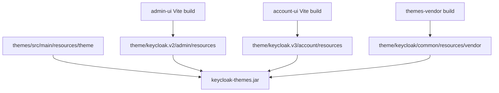
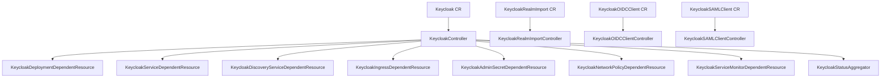
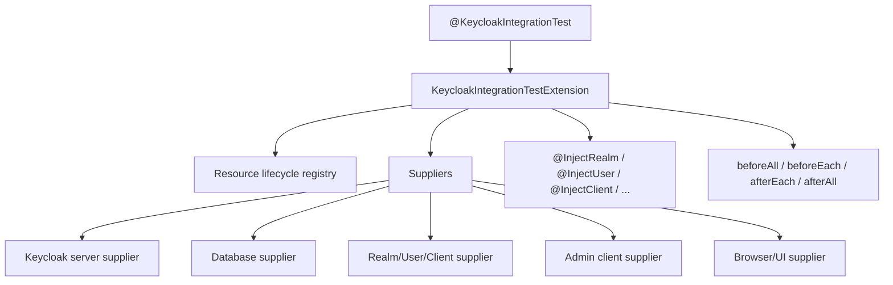

# UI, Operator, 테스트와 확장 지점

## 1. 개요

이 문서는 Keycloak server core 바깥의 통합 표면을 정리합니다. 대상은 JS UI, theme packaging, Admin client, Operator, test framework, extension points입니다.

각 영역은 다음 기준으로 읽습니다.

| 기준 | 설명 |
| --- | --- |
| 책임 | 해당 영역이 실제로 담당하는 일 |
| 책임이 아닌 것 | 해당 영역에 기대하면 안 되는 일 |
| 검증 기준 | 변경 후 확인해야 하는 build/test/운영 계약 |
| 대표 위치 | source path와 핵심 파일 |

---

## 2. 통합 표면 요약

| 영역 | 위치 | 책임 | 책임이 아닌 것 |
| --- | --- | --- | --- |
| Admin UI | `js/apps/admin-ui` | realm/client/user/role/flow/admin 설정 UI | server-side 권한 판정의 source of truth |
| Account UI | `js/apps/account-ui` | end user account/security/session/application UI | admin 정책 관리 |
| UI shared | `js/libs/ui-shared` | admin/account 공용 component/util | 개별 feature policy 결정 |
| Admin client | `js/libs/keycloak-admin-client` | Admin REST API TypeScript client | REST API 서버 구현 |
| Theme vendor | `js/themes-vendor` | React/PatternFly vendor assets bundle | custom theme 정책 결정 |
| Built-in themes | `themes/` | login/account/email/admin theme resources | UI application business logic |
| Operator | `operator/` | Kubernetes CRD/controller reconciliation | DB/cache/IdP/DNS/TLS 전체 운영 |
| Test framework | `test-framework/` | JUnit 5 기반 test resource lifecycle | 모든 legacy testsuite 즉시 대체 |
| Legacy testsuite | `testsuite/` | 기존 Arquillian/model tests | 신규 테스트의 기본 위치 |

---

## 3. JS Workspace 계약

```text
js/
  apps/
    account-ui/
    admin-ui/
    keycloak-server/
    create-keycloak-theme/
  libs/
    keycloak-admin-client/
    ui-shared/
  themes-vendor/
  package.json
  pnpm-workspace.yaml
  pnpm-lock.yaml
  pom.xml
```

| 도구 | 사용 위치 | 계약 |
| --- | --- | --- |
| pnpm | `js/package.json`, `pnpm-workspace.yaml` | workspace package install/build |
| Wireit | `js/package.json` | package build dependency orchestration |
| Vite | `admin-ui`, `account-ui`, `ui-shared` | app/library build와 dev server |
| TypeScript | JS workspace 전체 | strict type 기반 UI/client build |
| PatternFly | UI apps | Keycloak UI component 기반 |
| frontend-maven-plugin | `js/pom.xml` | Maven build 중 Node `v24.9.0`, pnpm `10.14.0` 설치와 `pnpm build` 실행 |
| theme verifier | `js/pom.xml`, `themes/pom.xml` | theme resource 검증 |

---

## 4. Admin UI와 Account UI

| 항목 | Admin UI | Account UI |
| --- | --- | --- |
| 경로 | `js/apps/admin-ui` | `js/apps/account-ui` |
| package | `@keycloak/keycloak-admin-ui` | `@keycloak/keycloak-account-ui` |
| Maven artifact | `keycloak-admin-ui` | `keycloak-account-ui` |
| entrypoint | `src/main.tsx` | `src/main.tsx` |
| routes | `src/routes.tsx` | `src/routes.tsx` |
| dev server port | `5174` | `5173` |
| theme output | `target/classes/theme/keycloak.v2/admin/resources` | `target/classes/theme/keycloak.v3/account/resources` |

| Admin UI feature directory | 책임 |
| --- | --- |
| `src/authentication` | authentication flow 관리 UI |
| `src/clients` | client 목록/상세/설정 UI |
| `src/client-scopes` | client scope 관리 |
| `src/groups` | group 관리 |
| `src/identity-providers` | external IdP/broker 설정 |
| `src/realm-settings` | realm setting tabs |
| `src/realm-roles` | realm role 관리 |
| `src/user` | user 관리 |
| `src/user-federation` | federation provider 관리 |
| `src/events` | events/admin events 설정/조회 |

| Account UI feature directory | 책임 |
| --- | --- |
| `src/account-security` | credential, session, signing in 보안 영역 |
| `src/applications` | 사용자 application 접근/permission UI |
| `src/groups` | 사용자 group 표시 |
| `src/organizations` | organization 관련 account 영역 |
| `src/personal-info` | profile/personal info |
| `src/verifiable-credentials` | OID4VC/credential 관련 UI |

---

## 5. Admin Client 계약

| 항목 | 내용 |
| --- | --- |
| 경로 | `js/libs/keycloak-admin-client` |
| package | `@keycloak/keycloak-admin-client` |
| Maven artifact | `keycloak-js-admin-client` |
| 핵심 class | `KeycloakAdminClient` in `src/client.ts` |
| build | `tsc --pretty` |
| OpenAPI generation | `kiota generate ... -d openapi.yaml` |

| Resource field | 의미 |
| --- | --- |
| `users` | user Admin API client |
| `groups` | group Admin API client |
| `roles` | realm/client role client |
| `organizations` | organization client |
| `clients` | clients API client |
| `realms` | realm API client |
| `clientScopes` | client scope API client |
| `identityProviders` | IdP API client |
| `components` | component/provider config API client |
| `serverInfo` | server info API client |
| `attackDetection` | brute force/attack detection API client |
| `authenticationManagement` | authentication flow API client |
| `cache` | cache admin API client |

---

## 6. Theme Packaging 계약



| Theme 영역 | 파일/경로 | 계약 |
| --- | --- | --- |
| built-in themes | `themes/src/main/resources/theme` | base, keycloak, keycloak.v2 등 기본 theme |
| admin descriptor | `js/apps/admin-ui/maven-resources/META-INF/keycloak-themes.json` | `keycloak.v2` admin theme 등록 |
| account descriptor | `js/apps/account-ui/maven-resources/META-INF/keycloak-themes.json` | `keycloak.v3` account theme 등록 |
| vendor assets | `js/themes-vendor` | React/PatternFly 등 vendor assets bundle |
| custom theme guide | `quarkus/dist/src/main/content/themes/README.md` | custom theme JAR 배포와 build 조건 |

---

## 7. Operator 계약



| Operator surface | 책임 | 검증 기준 |
| --- | --- | --- |
| `Keycloak` CR | server image, instances, db/cache/http/hostname/telemetry spec | generated StatefulSet/Service/status condition 확인 |
| `KeycloakRealmImport` CR | realm import job 생성 | import job idempotency와 existing realm overwrite 정책 확인 |
| `KeycloakOIDCClient` CR | OIDC client desired state | secret rotation, redirect URI, app rollout coordination |
| `KeycloakSAMLClient` CR | SAML client desired state | metadata/certificate/ACS URL lifecycle 확인 |
| Dependent resources | Kubernetes resources 생성 | reconciliation idempotency와 drift 확인 |
| Update logic | image/config update 전략 | rolling/recreate/update job 영향 확인 |

| 영역 | 파일 |
| --- | --- |
| Operator README | `operator/README.md` |
| Maven config | `operator/pom.xml` |
| runtime config | `operator/src/main/resources/application.properties` |
| constants | `operator/src/main/java/org/keycloak/operator/Constants.java` |
| Keycloak CR/spec | `operator/src/main/java/org/keycloak/operator/crds/v2beta1/deployment/Keycloak.java`, `KeycloakSpec.java` |
| Realm import CR | `operator/src/main/java/org/keycloak/operator/crds/v2beta1/realmimport/KeycloakRealmImport.java` |
| Client CR | `operator/src/main/java/org/keycloak/operator/crds/v2alpha1/client/` |
| Main controller | `operator/src/main/java/org/keycloak/operator/controllers/KeycloakController.java` |
| Update logic | `operator/src/main/java/org/keycloak/operator/update/` |

---

## 8. Test Framework 계약



| 축 | 옵션 |
| --- | --- |
| Server | `distribution`, `embedded`, `remote` |
| Database | `dev-mem`, `dev-file`, `mariadb`, `mssql`, `mysql`, `oracle`, `postgres`, `tidb`, `remote` |
| Browser | `htmlunit`, `chrome`, `chrome-headless`, `firefox`, `firefox-headless` |
| 설정 우선순위 | system properties -> environment variables -> `.env.test` -> classpath `keycloak-test.properties` -> `KC_TEST_CONFIG` |

| Annotation | 의미 |
| --- | --- |
| `@KeycloakIntegrationTest` | JUnit extension 활성화 |
| `@InjectRealm` | test realm 생성/주입 |
| `@InjectUser` | test user 생성/주입 |
| `@InjectClient` | test client 생성/주입 |
| `@InjectAdminClient` | admin client 주입 |
| `@InjectTestDatabase` | test database 정보 주입 |
| `@InjectKeycloakUrls` | Keycloak URL 주입 |
| `@InjectEvents` | user event testing support |
| `@InjectAdminEvents` | admin event testing support |

Legacy `testsuite/`는 `testsuite/DEPRECATED.md` 기준으로 신규 테스트의 기본 위치가 아닙니다. 기존 영역 유지보수 시에만 해당 문서를 따릅니다.

---

## 9. Extension Point 계약

| 확장 대상 | 경로 | 검증 포인트 |
| --- | --- | --- |
| Custom Authenticator | `services/src/main/java/org/keycloak/authentication/` 또는 provider module | flow execution, challenge/success/failure, event, tests |
| Required Action | `services/src/main/java/org/keycloak/authentication/requiredactions/` | required action lifecycle, form, action token, tests |
| Protocol Mapper | `services/src/main/java/org/keycloak/protocol/oidc/mappers/` | token claim, mapper config, token size, tests |
| User Storage Provider | `model/storage/`, `federation/` | lookup/query/credential validation, timeout, sync |
| Event Listener | `server-spi-private/src/main/java/org/keycloak/events/` | transaction boundary, failure policy, audit |
| Theme | `themes/`, `js/apps/*/maven-resources/` | packaging, content hash, theme verifier |
| Admin UI page | `js/apps/admin-ui/src` | route, admin client, i18n, tests |
| Account UI page | `js/apps/account-ui/src` | route, keycloak-js, user context, tests |
| Operator resource | `operator/src/main/java/org/keycloak/operator/controllers/` | reconcile idempotency, status, watched resources |

---

## 10. Validation Matrix

| 변경 영역 | 최소 검증 |
| --- | --- |
| Admin UI | pnpm build, route/i18n/admin-client 영향 확인 |
| Account UI | pnpm build, account context/session 영향 확인 |
| Theme | theme verifier, resource path/content hash 확인 |
| Admin client | TypeScript build, generated API drift 확인 |
| Operator | unit/local_apiserver test, generated manifest/status 확인 |
| Test framework | target supplier/server/db/browser 조합 확인 |
| SPI/provider | provider lifecycle, timeout, event, token/session 영향 테스트 |

---

## 11. 기술 참조 보강

| 주제 | 참조 |
| --- | --- |
| JS workspace | `js/README.md`, `js/package.json`, `js/pnpm-workspace.yaml`, `js/pom.xml` |
| Admin UI | `js/apps/admin-ui/` |
| Account UI | `js/apps/account-ui/` |
| Admin client | `js/libs/keycloak-admin-client/` |
| Themes | `themes/`, `js/themes-vendor/` |
| Operator | `operator/README.md`, `operator/src/main/java/org/keycloak/operator/` |
| Test framework | `test-framework/docs/README.md`, `test-framework/core/src/main/java/org/keycloak/testframework/` |
| Legacy testsuite | `testsuite/DEPRECATED.md`, `testsuite/integration-arquillian/HOW-TO-RUN.md` |

---

## 12. 작업 범위 기록

이 문서는 분석과 문서화만 수행합니다. JS, theme, Operator, 테스트 code는 수정하지 않습니다.
