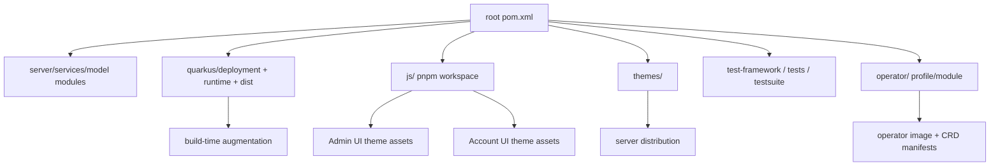
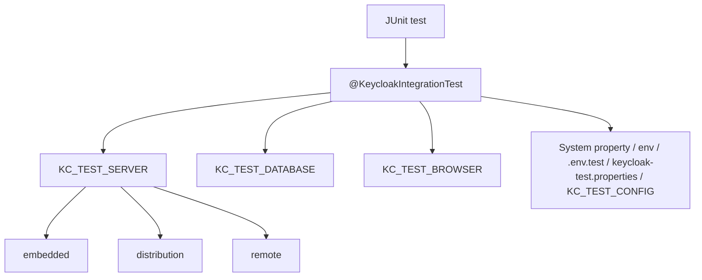

# 개발, 빌드, 테스트 실행 계약

## 1. 개요

이 문서는 Keycloak repository에서 변경을 만들고 검증할 때 따르는 implementation contract입니다. 목표는 모든 변경을 같은 질문으로 분류하는 것입니다.

| 질문 | 판단 기준 |
| --- | --- |
| 무엇을 바꾸는가 | 서버 runtime, SPI/provider, storage, UI, Operator, 테스트, 문서 중 어느 표면인가 |
| 언제 반영되는가 | compile-time, Quarkus build-time augmentation, startup, request runtime 중 어느 단계인가 |
| 어디까지 검증하는가 | 변경 표면의 최소 test와 release gate가 무엇인가 |
| 무엇을 건드리지 않는가 | docs-only, UI-only, Operator-only 변경처럼 runtime 영향이 없는 경계를 분리하는가 |

Docs-only 변경은 runtime build/test를 기본 요구하지 않습니다. 대신 링크, stale file name, source path, Markdown placeholder를 검증합니다.

---

## 2. 핵심 계약

| 계약 | 내용 |
| --- | --- |
| Maven wrapper 우선 | repository root의 `./mvnw`를 기준으로 build/test를 실행합니다. |
| JDK release 기준 | source/target release는 root `pom.xml`의 `maven.compiler.release` 기준으로 판단합니다. |
| JS build는 Maven에 포함 | root Maven build는 `js/pom.xml`의 frontend-maven-plugin 경로를 통해 Node/pnpm을 준비합니다. |
| Quarkus build-time 변경 주의 | provider, theme, build-time option, persistence/cache 설정 변경은 re-augmentation 영향을 확인합니다. |
| 신규 테스트 위치 | 신규 integration test는 가능한 `test-framework/`를 우선하고, legacy 유지보수는 `testsuite/` 문서를 따릅니다. |
| Operator는 별도 배포물 | Operator 변경은 server dist build와 별도로 image, CRD, dependent resource, reconcile test를 검증합니다. |
| 검증은 변경 범위 기반 | 전체 build보다 먼저 변경한 module과 인접 contract를 검증합니다. |

---

## 3. Toolchain 기준

| 항목 | 기준 | 대표 근거 |
| --- | --- | --- |
| JDK | JDK 17, 21, 25 범위 | `docs/building.md` |
| Maven | root `./mvnw` | `docs/building.md`, `pom.xml` |
| Maven version | root Maven wrapper/property 기준 | `pom.xml`, `.mvn/` |
| Java release | `17` | `pom.xml` |
| Node | Maven JS build가 관리 | `js/pom.xml` |
| pnpm | Maven JS build와 `pnpm-workspace.yaml` 기준 | `js/pom.xml`, `js/pnpm-workspace.yaml` |
| Docker/Podman | DB, browser, container, Operator, remote test에 필요 | `test-framework/docs/RUNNING_TESTS.md`, `operator/README.md` |
| Kubernetes tooling | Operator local/remote test와 manifest 검증에 필요 | `operator/README.md` |

---

## 4. Build Surface Map

| Build surface | 책임 | 검증 포인트 |
| --- | --- | --- |
| Server core | SPI, services, storage, protocol, authentication | unit/integration test, request lifecycle 영향 |
| Quarkus | runtime entrypoint, build steps, dist packaging | build-time option, provider discovery, startup |
| JS workspace | Admin/Account UI, admin client, shared UI | TypeScript/Vite/pnpm build, i18n, route |
| Themes | login/account/admin/email resources | theme verifier, resource path, content hash |
| Test framework | JUnit 5 resource lifecycle | target server/db/browser supplier |
| Legacy testsuite | existing Arquillian/model tests | 유지보수 범위의 profile과 browser/db setting |
| Operator | CRD/controller/dependent resource | generated manifest, status, idempotency, image |

---

## 5. Maven Command 계약

| 목적 | 명령 | 사용 시점 |
| --- | --- | --- |
| 빠른 전체 compile/package | `./mvnw clean install -DskipTests` | 넓은 Java/Maven 변경 후 |
| 테스트 포함 전체 build | `./mvnw clean install` | release gate 또는 큰 변경 후 |
| distribution 포함 | `./mvnw clean install -DskipTests -Pdistribution` | server distribution packaging 확인 |
| Quarkus dist 중심 | `./mvnw -pl quarkus/deployment,quarkus/dist -am -DskipTests clean install` | Quarkus server 배포물 영향 확인 |
| JS build 제외 | `./mvnw clean install -DskipTests -Dskip.npm` | Java-only 확인이 목적일 때 |
| Operator 포함 | `./mvnw clean install -Poperator -DskipTests` | Operator module/profile까지 IDE/build 인식 필요 시 |
| proto lock 회피 | `-DskipProtoLock=true` | proxy/환경 문제로 proto compatibility check가 build를 막을 때만 |

| Profile/조건 | 효과 | 주의점 |
| --- | --- | --- |
| `!skipTestsuite` | `testsuite` aggregation 포함 | 테스트 skip이어도 build graph가 커질 수 있습니다. |
| `!skipAdapters` | adapters module 포함 | adapter 변경이 없으면 skip flag를 검토합니다. |
| `!skipDocs` | docs module 포함 | docs build가 목적이 아니면 skip flag를 검토합니다. |
| `-Pdistribution` | distribution 산출물 포함 | SAML adapters, Galleon, license/download 성격까지 커집니다. |
| `-Poperator` | Operator module/profile 포함 | image/CRD 검증은 별도 명령이 필요합니다. |
| `-Dfips140-2` | FIPS crypto artifact 선택 | 운영 JDK와 security provider 조건까지 같이 검토합니다. |

---

## 6. Quarkus 개발 서버 계약

| 목적 | 위치 | 명령 |
| --- | --- | --- |
| 최초 local cache 준비 | `quarkus/` | `../mvnw -f ../pom.xml clean install -DskipTestsuite -DskipExamples -DskipTests` |
| Quarkus dist build | `quarkus/` | `../mvnw clean install -DskipTests` |
| dist packaging만 | `quarkus/` | `../mvnw -f dist/pom.xml clean install` |
| dev mode | `quarkus/` | `../mvnw -f server/pom.xml compile quarkus:dev -Dkc.config.built=true -Dquarkus.args="start-dev"` |
| dev mode debug | `quarkus/` | `../mvnw -f server/pom.xml -Dsuspend=true compile quarkus:dev -Dkc.config.built=true -Dquarkus.args="start-dev"` |
| dist debug | built dist | `bin/kc.sh --debug start-dev` |

| 경계 | 계약 |
| --- | --- |
| 기본 URL | dev mode의 기본 접속 지점은 `http://localhost:8080`입니다. |
| debug port | Quarkus dev mode는 `5005`, dist `--debug`는 기본 `8787`을 사용합니다. |
| Hot reload | Quarkus module/resource 변경 중심입니다. `keycloak-services` 등은 JVM Hot Swap 한계를 따릅니다. |
| Build-time option | `quarkus.args`만으로 build-time option 변경이 반영된다고 가정하지 않습니다. |
| Production 금지 | `start-dev`, remote debug, `DEBUG_SUSPEND=y`는 production 운영 방식이 아닙니다. |

---

## 7. Test Framework 계약

| 축 | 대표 값 | 사용 시점 |
| --- | --- | --- |
| Server | `embedded`, `distribution`, `remote` | 변경이 embedded로 충분한지 실제 dist/remote가 필요한지 결정합니다. |
| Database | `dev-mem`, `dev-file`, `postgres`, `mysql`, `mariadb`, `mssql`, `oracle`, `tidb`, `remote` | storage/schema/transaction 영향에 맞춰 선택합니다. |
| Browser | `htmlunit`, `chrome`, `chrome-headless`, `firefox`, `firefox-headless` | browser/authentication/UI flow 검증에 사용합니다. |
| Reuse | `KC_TEST_SERVER_REUSE=true` | 반복 개발 속도를 높일 때 사용하되 상태 오염을 관리합니다. |
| Hot deploy | `KC_TEST_SERVER_HOT_DEPLOY=true` | provider/theme 개발 중 빠른 피드백에 사용합니다. |

| 설정 우선순위 |
| --- |
| System properties |
| Environment variables |
| `.env.test` |
| classpath `keycloak-test.properties` |
| `KC_TEST_CONFIG`로 지정한 properties file |

Legacy `testsuite/`는 신규 테스트의 기본 위치가 아닙니다. 기존 Arquillian 기반 영역을 수정할 때만 `testsuite/integration-arquillian/HOW-TO-RUN.md`와 profile별 실행 문서를 따릅니다.

---

## 8. UI와 Operator 실행 계약

| 영역 | 명령/위치 | 검증 기준 |
| --- | --- | --- |
| JS workspace | `js/`에서 pnpm command | package graph, lockfile, generated assets |
| Admin UI dev server | `js/apps/admin-ui`, Vite port `5174` | route, admin client, i18n, auth context |
| Account UI dev server | `js/apps/account-ui`, Vite port `5173` | account context, session, linked resource |
| UI dev용 server | `js/apps/keycloak-server` | `pnpm start --admin-dev`, `--account-dev`, `--local` mode |
| Maven JS skip | `-Dskip.npm` | Java-only build에서만 사용합니다. |
| Operator package | `operator/`에서 `mvn clean package -Dquarkus.container-image.build=true` | image, generated manifests |
| Operator remote test | `-Dtest.operator.deployment=remote` | cluster 내부 배포와 reconcile 검증 |

| Operator test mode | 계약 |
| --- | --- |
| `local_apiserver` | 기본값입니다. envtest controlled API server와 local operator로 빠르게 검증합니다. |
| `local` | local cluster에 resource를 배포하고 operator는 cluster 밖에서 실행합니다. |
| `remote` | operator image를 만들고 cluster 내부에 배포합니다. image/tag/pull policy가 release gate가 됩니다. |

---

## 9. 변경 유형별 Workflow

| 변경 유형 | 먼저 볼 것 | 최소 검증 |
| --- | --- | --- |
| OIDC/token endpoint | `AuthorizationEndpoint`, `TokenEndpoint`, `TokenManager`, grant provider | protocol test, client policy/CORS/event/token mapper 영향 |
| Authentication flow | `AuthenticationProcessor`, authenticator, required action | browser/direct grant flow, event, brute force, session 영향 |
| Storage/model | `server-spi`, `model/storage-private`, `model/jpa`, cache provider | provider tests, schema/cache invalidation, DB matrix 필요성 판단 |
| Quarkus config/build | `KeycloakProcessor`, runtime mappers, `KeycloakMain` | augmentation, startup, dist build |
| SPI/provider | SPI interface, `ProviderFactory`, provider lifecycle | factory registration, session lifecycle, timeout/failure policy |
| Admin REST | `AdminRoot`, admin resource, permission evaluator | bearer auth, admin event, permission regression |
| Admin/Account UI | route, admin client/keycloak-js, i18n | pnpm build/test, manual flow or browser test |
| Theme | theme resource, descriptor, verifier | resource path, content hash, dist packaging |
| Operator | CRD/spec/status, controller, dependent resource | generated CRD/manifest, idempotent reconcile, status condition |
| Docs only | link/path/source citation | stale link, placeholder, Markdown hygiene |

---

## 10. Release Gate Matrix

| 변경 영역 | 최소 gate | 추가 gate |
| --- | --- | --- |
| Docs only | stale link/path/placeholder check | Markdown lint 또는 doc build가 있는 경우 실행 |
| Java service/protocol | affected Maven module tests | root `./mvnw clean install -DskipTests`, targeted integration test |
| Quarkus dist/runtime | Quarkus module build | distribution build, `kc.sh start-dev` smoke |
| Storage/JPA | provider/model tests | vendor DB matrix, migration/rollback 검증 |
| Infinispan/session | session/cache tests | cluster/remote cache, sticky session smoke |
| Admin API | Admin REST tests | Admin UI regression |
| JS UI/admin client | pnpm build/typecheck | browser/e2e, Maven build with JS enabled |
| Theme | theme verifier | dist packaging and browser smoke |
| Operator | unit/local_apiserver | local/remote cluster, image/tag/pull policy |
| Test framework | target supplier test | server/db/browser matrix |

---

## 11. IDE와 Generated Code 주의점

| 주의점 | 계약 |
| --- | --- |
| Maven build 선행 | 일부 source/resource는 Maven plugin이 생성하므로 IDE build만으로 판단하지 않습니다. |
| IntelliJ rebuild | 전체 rebuild가 generated class/resource를 지울 수 있으므로 Maven build 결과를 확인합니다. |
| Operator profile | IDE에서 Operator type/generated resource를 인식하려면 `-Poperator` build가 필요할 수 있습니다. |
| JS lockfile | `pnpm install --frozen-lockfile` 실패는 dependency drift 신호입니다. lockfile을 임의 갱신하지 않습니다. |
| Proto lock | `-DskipProtoLock=true`는 환경 문제 회피용입니다. compatibility 검증 자체를 없애는 결정으로 쓰지 않습니다. |

---

## 12. 기술 참조 보강

| 주제 | 참조 |
| --- | --- |
| Source build | `docs/building.md`, `pom.xml`, `.mvn/` |
| Quarkus build/dev | `quarkus/README.md`, `quarkus/pom.xml`, `quarkus/server/pom.xml`, `quarkus/dist/pom.xml` |
| Runtime entrypoint | `quarkus/runtime/src/main/java/org/keycloak/quarkus/runtime/KeycloakMain.java` |
| Build-time processor | `quarkus/deployment/src/main/java/org/keycloak/quarkus/deployment/KeycloakProcessor.java` |
| Test framework | `test-framework/docs/README.md`, `test-framework/docs/RUNNING_TESTS.md`, `test-framework/docs/CONFIG.md` |
| Legacy testsuite | `testsuite/DEPRECATED.md`, `testsuite/integration-arquillian/HOW-TO-RUN.md` |
| JS workspace | `js/README.md`, `js/package.json`, `js/pnpm-workspace.yaml`, `js/pom.xml` |
| Themes | `themes/pom.xml`, `themes/src/main/resources/theme/`, `quarkus/dist/src/main/content/themes/README.md` |
| Operator | `operator/README.md`, `operator/pom.xml`, `operator/src/main/resources/application.properties` |

---

## 13. 작업 범위 기록

이 문서는 분석과 문서화만 수행합니다. Maven 설정, Java/TypeScript source, generated artifact, test runtime, Operator manifest는 수정하지 않습니다.
