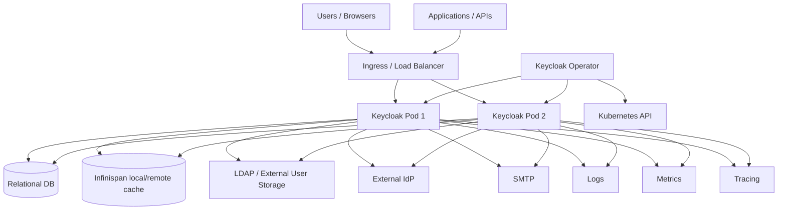

# 운영, 보안, 관측성

> 네비게이션: [문서 색인](../README.md) | 이전: [개발/빌드/테스트 가이드](../40-implementation/40-development-build-test-guide.md) | 다음: [열린 결정 기록](../90-decisions/90-open-decision-register.md)
> 관련 문서: [프로젝트 개요와 기준 아키텍처](../00-foundation/01-project-overview-and-reference-architecture.md), [서버 런타임과 요청 생명주기](../10-architecture/10-server-runtime-and-request-lifecycle.md), [Realm/Client/User 정책 모델](../20-policy/20-realm-client-user-policy-model.md)

작성일: 2026-05-16

최신 소스 재검증: 2026-05-16, `/Users/dhsshin/Documents/LLMOps/keycloak` 현재 작업트리 기준

## 목적

이 문서는 Keycloak을 production 관점에서 운영할 때 필요한 구성 요소와 위험 지점을 정리한다. DB/cache, Kubernetes/Operator, TLS/proxy, backup/restore, observability, 장애 모드, 보안 hardening을 다룬다.

## 운영 아키텍처

## 운영 구성요소별 책임

| 구성요소 | 책임 | 장애 영향 |
| --- | --- | --- |
| Ingress/Load Balancer | TLS termination, routing, proxy headers, sticky 여부 | 잘못된 hostname/proxy header는 redirect/token issuer 문제 유발 |
| Keycloak Pod | HTTP endpoint, authentication, token 발급, Admin API | pod 장애 시 replica로 우회 가능해야 함 |
| Relational DB | realm/client/user/credential/event/persistent state | DB 장애는 대부분의 request 실패 또는 startup 실패로 이어짐 |
| Infinispan | cache/session/single-use/login failure/cluster state | session loss, stale cache, login flow 실패 가능 |
| External User Storage | LDAP/user federation | login/search/admin user operation 지연 또는 실패 |
| External IdP | brokering/social/enterprise login | broker login 실패 |
| SMTP | email verification/reset credentials | email 기반 required action 실패 |
| Metrics/Logs/Tracing | 운영 관측 | 장애 원인 분석 능력 저하 |
| Operator | Kubernetes resource reconciliation | rollout/update/realm import 자동화 실패 가능 |

## Database 운영

| 영역 | 운영 기준 |
| --- | --- |
| DB vendor | 지원 DB와 드라이버 버전은 root `pom.xml`과 공식 문서 기준으로 관리한다. |
| Schema migration | DB schema 변경 시 `docs/updating-database-schema.md`를 확인한다. |
| Backup | realm/client/user/credential/event/session persistence 요구에 맞춰 정기 backup을 구성한다. |
| Restore | restore 후 key rotation, session validity, external IdP/client secret consistency를 검증한다. |
| Connection pool | traffic과 Admin API batch operation을 고려해 pool exhaustion을 모니터링한다. |
| Event retention | event/admin event 저장을 켠 경우 DB growth와 retention을 관리한다. |
| Persistent sessions | offline/persistent session 사용 여부에 따라 DB 용량과 cleanup 정책을 검토한다. |

DB 관련 코드:

| 영역 | 파일 |
| --- | --- |
| Quarkus JPA config | `quarkus/deployment/src/main/java/org/keycloak/quarkus/deployment/KeycloakProcessor.java` |
| Quarkus JPA provider | `quarkus/runtime/src/main/java/org/keycloak/quarkus/runtime/storage/database/jpa/QuarkusJpaConnectionProviderFactory.java` |
| Default JPA provider | `model/jpa/src/main/java/org/keycloak/connections/jpa/DefaultJpaConnectionProviderFactory.java` |
| JPA model providers | `model/jpa/src/main/java/org/keycloak/models/jpa/` |
| JPA event store | `model/jpa/src/main/java/org/keycloak/events/jpa/` |
| Persistent sessions | `model/jpa/src/main/java/org/keycloak/models/jpa/session/` |

## Cache/Infinispan 운영

| 영역 | 운영 기준 |
| --- | --- |
| Realm/user cache | realm/client/role/group/user 변경 후 invalidation 전파가 정상이어야 한다. |
| User session | multi-pod 환경에서 session state consistency를 보장해야 한다. |
| Authentication session | browser login 중간 상태가 pod 간 이동에도 유지되어야 한다. |
| Single-use object | action token/code 재사용 방지가 cluster-wide로 동작해야 한다. |
| Login failure | brute force protection 상태가 pod-local로 갈라지지 않도록 확인한다. |
| Remote cache | remote Infinispan 사용 시 latency, auth, TLS, topology를 점검한다. |
| Expiration/eviction | token/session lifespan과 cache expiration mismatch가 없어야 한다. |

관련 파일:

| 영역 | 파일 |
| --- | --- |
| Infinispan connection | `model/infinispan/src/main/java/org/keycloak/connections/infinispan/` |
| Realm/user cache | `model/infinispan/src/main/java/org/keycloak/models/cache/infinispan/` |
| Session provider | `model/infinispan/src/main/java/org/keycloak/models/sessions/infinispan/` |
| Remote session provider | `model/infinispan/src/main/java/org/keycloak/models/sessions/infinispan/remote/` |
| Cluster provider | `model/infinispan/src/main/java/org/keycloak/cluster/infinispan/` |

## TLS, hostname, proxy boundary

| 항목 | 운영 기준 |
| --- | --- |
| External URL | issuer, redirect URI, admin URL, account URL이 외부 공개 hostname과 일치해야 한다. |
| TLS termination | Ingress에서 TLS 종료 시 Keycloak proxy/hostname 설정과 header trust를 맞춘다. |
| `X-Forwarded-*` | 신뢰할 수 있는 proxy에서만 주입되도록 네트워크 경계를 구성한다. |
| Admin URL | frontend URL과 admin URL 분리 시 redirect 정보 누출/접근 경계를 검토한다. |
| HTTPS required | realm SSL policy와 production TLS topology가 충돌하지 않아야 한다. |
| Debug port | `--debug 0.0.0.0:*` 같은 설정은 production에서 금지한다. |

## Kubernetes/Operator 운영

| 영역 | 운영 기준 |
| --- | --- |
| CRD version | `v2beta1` Keycloak/RealmImport와 `v2alpha1` client CR의 maturity 차이를 이해한다. |
| Reconciliation | controller/dependent resource가 idempotent하게 동작해야 한다. |
| Pause annotation | `operator.keycloak.org/pause` 사용 시 status와 drift를 수동 관리한다. |
| Keycloak image | `kc.operator.keycloak.image` 또는 CR spec image를 명확히 관리한다. |
| Update strategy | image/config 변경 시 recreate/rolling/update job 전략을 사전에 검토한다. |
| Secrets | admin secret, DB secret, TLS secret, client secret을 Kubernetes Secret으로 관리한다. |
| NetworkPolicy | DB/cache/LDAP/IdP/SMTP/metrics endpoint 접근을 최소화한다. |
| ServiceMonitor | metrics 수집을 켜는 경우 Prometheus operator와 label/namespace를 맞춘다. |

Operator 관련 파일:

| 영역 | 파일 |
| --- | --- |
| Operator config | `operator/src/main/resources/application.properties` |
| Keycloak controller | `operator/src/main/java/org/keycloak/operator/controllers/KeycloakController.java` |
| Realm import controller | `operator/src/main/java/org/keycloak/operator/controllers/KeycloakRealmImportController.java` |
| Dependent resources | `operator/src/main/java/org/keycloak/operator/controllers/*DependentResource.java` |
| Update logic | `operator/src/main/java/org/keycloak/operator/update/` |
| Kustomize manifests | `operator/src/main/kubernetes/` |

## Observability

### Logs

| 관측 대상 | 남겨야 하는 정보 |
| --- | --- |
| Startup | profile, features, DB/cache config, provider loading, migration status |
| Login failure | realm, client, event type, error, user hint, brute force state |
| Token failure | grant type, client id, error, CORS/origin, DPoP/PKCE 관련 reason |
| Admin mutation | realm, resource type, operation type, admin user/client, status |
| Federation | provider id, operation, timeout/error, imported user handling |
| Cache/cluster | topology, invalidation, remote cache connectivity |
| Operator | reconcile request, dependent resource result, status condition, requeue reason |

### Metrics

| Metric 영역 | 목적 |
| --- | --- |
| HTTP request latency/error | endpoint별 성능/오류 감지 |
| DB connection pool | pool saturation과 DB 장애 감지 |
| Cache/cluster health | Infinispan 장애와 session/cache 이상 감지 |
| Login/token rate | 인증 부하와 abuse 감지 |
| Failed login/brute force | 공격 시도와 lockout 정책 확인 |
| JVM memory/GC/thread | pod sizing과 leak 감지 |
| Operator reconcile | reconciliation 실패/지연 감지 |

### Events/Audit

| Event | 활용 |
| --- | --- |
| User event | LOGIN, LOGIN_ERROR, REGISTER, LOGOUT, CODE_TO_TOKEN 등 사용자 활동 audit |
| Admin event | realm/client/user/role/group/config 변경 audit |
| Event listener | log/email/custom sink 전송 |
| Event store | DB 기반 조회와 retention 관리 |

관련 파일:

| 영역 | 파일 |
| --- | --- |
| Event SPI | `server-spi-private/src/main/java/org/keycloak/events/` |
| Logging listener | `services/src/main/java/org/keycloak/events/log/` |
| Email listener | `services/src/main/java/org/keycloak/events/email/` |
| JPA event store | `model/jpa/src/main/java/org/keycloak/events/jpa/` |
| Admin event builder | `services/src/main/java/org/keycloak/services/resources/admin/AdminEventBuilder.java` |

## 보안 hardening checklist

| 영역 | 체크 |
| --- | --- |
| Admin account | bootstrap/admin credential을 임시로만 사용하고 production secret rotation을 적용한다. |
| Client redirect | wildcard redirect URI를 최소화한다. |
| Public clients | PKCE를 강제하고 implicit flow 사용을 제한한다. |
| Confidential clients | secret/private key를 안전하게 저장하고 rotation 절차를 둔다. |
| Token mapper | 민감 attribute와 group/role 과다 노출을 제한한다. |
| Token lifespan | access/refresh/offline token lifespan을 위험도에 맞춘다. |
| Session | idle/max session 정책과 SSO/offline session 정책을 검토한다. |
| Brute force | brute force detection과 lockout 정책을 활성화한다. |
| Email | SMTP TLS/auth와 sender spoofing 방지 정책을 적용한다. |
| LDAP | LDAPS, bind credential secret, search filter, timeout을 관리한다. |
| External IdP | issuer, signature, mapper, account linking 정책을 검증한다. |
| Operator RBAC | Operator service account 권한을 필요한 namespace/resource로 제한한다. |
| Debug | remote debug와 dev mode는 production에서 금지한다. |
| Logs | token, password, client secret, session cookie가 로그에 남지 않게 한다. |

## 장애 모드와 대응

| 장애 | 증상 | 대응 |
| --- | --- | --- |
| DB down | startup 실패, login/admin/token 5xx | DB HA/failover, readiness, connection pool alert, backup restore 절차 |
| DB migration failure | startup 중 schema update 실패 | migration log 확인, schema backup, rollback plan |
| Infinispan cluster split | session loss, stale cache, inconsistent login | cluster topology 확인, cache mode/remote cache health 점검 |
| LDAP timeout | login/search/admin user operation 지연 | provider timeout, circuit breaker 성격 운영, user import policy 검토 |
| External IdP down | broker login 실패 | IdP health, fallback login path, error UX |
| SMTP down | email verify/reset 실패 | retry/alert, required action 운영 공지 |
| Wrong hostname/proxy | redirect URI/issuer mismatch, cookie issue | hostname/proxy/TLS header 재검증 |
| Token key rotation issue | client token validation 실패 | JWKS cache, active/passive keys, rotation 절차 점검 |
| Operator reconcile failure | CR status degraded, resource drift | operator logs/status condition, dependent resource diff 확인 |
| JS/theme packaging issue | Admin/Account UI resource 404 | theme JAR, content hash, `providers` build/re-augmentation 확인 |

## Backup/restore 기준

| 대상 | 필요성 | 주의점 |
| --- | --- | --- |
| Relational DB | realm/client/user/credential/event/session 영속 데이터 | 가장 중요한 backup 대상 |
| Key material | realm signing/encryption keys | token validation과 federation trust에 영향 |
| Kubernetes Secrets | DB credentials, client secrets, TLS certs | secret rotation과 restore 순서 필요 |
| Realm export | migration/검증/부분 복구 보조 | DB backup 대체가 아니라 보조 수단으로 봐야 함 |
| Operator CR | desired state 복원 | CR과 Secret/DB 상태 consistency 필요 |
| Custom providers/themes | `/providers` 배포 artifact | version compatibility와 build/re-augmentation 필요 |

## 운영 체크리스트

| 단계 | 체크 |
| --- | --- |
| 배포 전 | DB/cache/hostname/TLS/proxy/secret/token lifespan/redirect URI 검증 |
| 배포 중 | readiness, startup log, migration log, provider loading log 확인 |
| 배포 후 | login, token, admin API, account UI, JWKS, metrics, events smoke test |
| 변경 전 | realm/client/theme/provider/Operator 변경 영향 범위와 rollback 준비 |
| 변경 후 | event/admin event, cache invalidation, user session 영향 확인 |
| 정기 운영 | DB backup restore drill, key rotation drill, secret rotation, dependency/security update |

## 작업 범위 기록

이 문서는 분석과 문서화만 수행한다. Kubernetes manifest, Operator code, server config, 운영 스크립트는 수정하지 않는다.
