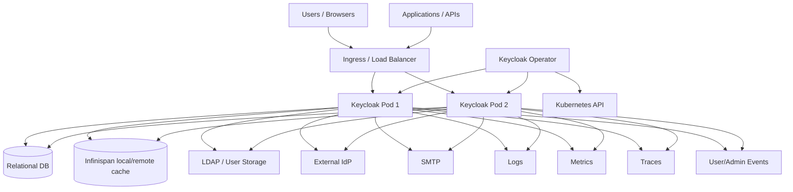
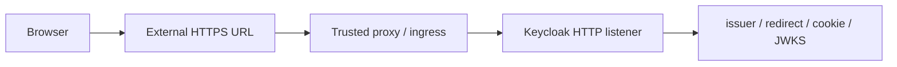

# 운영, 보안, 관측성 계약

## 1. 개요

이 문서는 Keycloak을 production Identity Control Plane으로 운영할 때 지켜야 하는 운영 계약을 정리합니다. 대상은 database, cache/session, TLS/hostname/proxy, Kubernetes/Operator, observability, backup/restore, security hardening, failure response입니다.

운영자가 먼저 기억해야 할 사실은 다음과 같습니다.

| 사실 | 운영 의미 |
| --- | --- |
| Keycloak은 critical dependency입니다. | login, token refresh, Admin API, account flow 장애가 application 전체 장애로 번집니다. |
| DB는 장부입니다. | realm/client/user/credential/key/event/session persistence의 source of truth입니다. |
| Cache는 UX와 consistency입니다. | session continuity, cache invalidation, brute force state, login 중간 상태에 영향을 줍니다. |
| Hostname은 보안 계약입니다. | issuer, redirect URI, JWKS URI, cookie domain, CORS 판단과 연결됩니다. |
| Operator는 전부를 소유하지 않습니다. | Kubernetes resource reconciliation은 담당하지만 DB/cache/IdP/DNS/TLS/backup 전략은 별도 운영 계약입니다. |

---

## 2. 핵심 운영 계약

| 영역 | 계약 | 실패 시 결과 |
| --- | --- | --- |
| Database | HA, backup, restore drill, migration guard를 갖춥니다. | startup/login/admin/token 5xx, 데이터 손실 |
| Cache/session | multi-pod topology와 expiration policy를 token/session lifespan과 맞춥니다. | session loss, stale policy, login flow 실패 |
| Hostname/proxy | 외부 URL, proxy header trust, TLS termination 경계를 명확히 합니다. | issuer mismatch, redirect loop, invalid cookie |
| Secrets/key | DB secret, client secret, TLS cert, realm key material을 rotation 가능한 형태로 관리합니다. | token 검증 실패, secret exposure, 복구 불가 |
| Federation/IdP | timeout, retry, degraded UX, account linking policy를 정합니다. | login/search 지연, broker login 실패 |
| Observability | logs, metrics, traces, events/admin events를 장애 조사 가능 수준으로 켭니다. | 원인 분석 지연, audit gap |
| Change control | realm/client/theme/provider/Operator 변경은 rollback과 smoke test를 동반합니다. | 정책 drift, 배포 후 인증 장애 |

---

## 3. Production Topology

| 구성요소 | 책임 | 책임이 아닌 것 |
| --- | --- | --- |
| Ingress/LB | TLS termination, routing, proxy header 주입, optional sticky session | realm/client policy 결정 |
| Keycloak Pod | HTTP endpoint, authentication, token 발급, Admin API, event 생성 | DB/cache HA 자체 구현 |
| Relational DB | 영속 policy/state 저장 | request latency 흡수용 cache |
| Infinispan | cache, session, single-use object, login failure state | realm/client/user 영속 장부 |
| External User Storage | LDAP/custom federation user lookup/credential validation | Keycloak local user storage 대체의 무조건적 fallback |
| External IdP | broker/social/enterprise login trust source | Keycloak session/token lifecycle 소유 |
| SMTP | email verification/reset credentials | authentication policy 결정 |
| Operator | desired Kubernetes resource reconciliation | DNS/TLS/DB/cache/backup 전체 소유 |

---

## 4. State와 Dependency 계약

| 상태/의존성 | 운영 기준 | 검증 포인트 |
| --- | --- | --- |
| Realm/client/user | DB backup과 migration guard의 핵심 대상 | restore 후 admin API와 login smoke |
| Credential | password hash, WebAuthn, OTP, federation credential 경계 관리 | secret/key compatibility, login smoke |
| Realm keys | signing/encryption key rotation과 active/passive key 관리 | JWKS, token validation, old token grace |
| User session | SSO/offline/persistent session 정책과 cache/DB 저장 경계 확인 | refresh, logout, idle/max timeout |
| Authentication session | login 중간 상태의 pod 이동/expiration 확인 | browser flow, redirect, sticky session |
| Events/admin events | audit retention과 DB growth 관리 | event query, retention cleanup |
| LDAP/user federation | timeout, import policy, cache, search filter 관리 | login/search latency, degraded mode |
| External IdP | issuer, signature, metadata, mapper, account linking 검증 | broker login, token mapper, logout |
| SMTP | TLS/auth/sender policy와 retry/alert 구성 | verify email, reset credentials |

---

## 5. Database 운영 계약

| 영역 | 운영 기준 |
| --- | --- |
| Vendor support | 지원 DB와 driver version은 repository와 공식 문서 기준으로 관리합니다. |
| Schema migration | upgrade 전 `docs/updating-database-schema.md`와 release note를 확인합니다. |
| Backup | DB snapshot/logical backup을 realm key, secrets, provider artifact와 같은 복구 단위로 묶습니다. |
| Restore | restore 후 issuer/key/session/client secret/external IdP consistency를 검증합니다. |
| Connection pool | Admin API batch, login burst, token refresh burst를 고려해 pool saturation을 alert합니다. |
| Event retention | user/admin event 저장을 켠 경우 retention과 table growth를 운영 지표로 둡니다. |
| Persistent sessions | offline/persistent session 사용 시 DB size와 cleanup 정책을 별도 계산합니다. |

| DB 관련 구현 위치 | 목적 |
| --- | --- |
| `quarkus/deployment/src/main/java/org/keycloak/quarkus/deployment/KeycloakProcessor.java` | persistence unit build-time 구성 |
| `quarkus/runtime/src/main/java/org/keycloak/quarkus/runtime/storage/database/jpa/QuarkusJpaConnectionProviderFactory.java` | Quarkus JPA connection provider |
| `model/jpa/src/main/java/org/keycloak/connections/jpa/DefaultJpaConnectionProviderFactory.java` | default JPA provider factory |
| `model/jpa/src/main/java/org/keycloak/models/jpa/` | realm/client/user/role 등 JPA model adapter |
| `model/jpa/src/main/java/org/keycloak/events/jpa/` | JPA event store |
| `model/jpa/src/main/java/org/keycloak/models/jpa/session/` | persistent session 영역 |

---

## 6. Cache와 Session 운영 계약

| Cache 영역 | 운영 기준 | 실패 신호 |
| --- | --- | --- |
| Realm/user cache | admin 변경 후 invalidation이 pod 전체에 전파되어야 합니다. | stale realm/client/user 설정 |
| User session | multi-pod 환경에서 refresh/logout/session lookup이 일관되어야 합니다. | refresh 실패, logout 미전파 |
| Authentication session | browser login 중간 상태가 redirect와 pod 이동을 견뎌야 합니다. | login restart, invalid code |
| Single-use object | action token/code 재사용 방지가 cluster-wide로 동작해야 합니다. | token/code replay 가능성 |
| Login failure | brute force protection 상태가 pod-local로 갈라지지 않아야 합니다. | lockout 불일치, abuse 탐지 누락 |
| Remote cache | auth/TLS/latency/topology/owner 설정을 운영 지표로 둡니다. | cache timeout, topology warning |
| Expiration | access/refresh/offline/session lifespan과 cache expiration을 맞춥니다. | 예상보다 빠른 session loss |

| Cache 관련 구현 위치 | 목적 |
| --- | --- |
| `model/infinispan/src/main/java/org/keycloak/connections/infinispan/` | Infinispan connection/provider |
| `model/infinispan/src/main/java/org/keycloak/models/cache/infinispan/` | realm/user cache |
| `model/infinispan/src/main/java/org/keycloak/models/sessions/infinispan/` | user/authentication session provider |
| `model/infinispan/src/main/java/org/keycloak/models/sessions/infinispan/remote/` | remote session provider |
| `model/infinispan/src/main/java/org/keycloak/cluster/infinispan/` | cluster provider |

---

## 7. Hostname, TLS, Proxy Boundary

| 항목 | 운영 기준 |
| --- | --- |
| External URL | discovery issuer, token `iss`, redirect URI, admin/account URL이 외부 공개 hostname과 일치해야 합니다. |
| TLS termination | Ingress/LB에서 TLS를 종료하면 Keycloak hostname/proxy 설정과 trusted header 경계를 맞춥니다. |
| Proxy headers | `X-Forwarded-*` 또는 forwarding header는 신뢰 가능한 proxy에서만 들어오게 합니다. |
| Admin URL | frontend URL과 admin URL을 분리하면 접근 제어와 URL 노출을 함께 검토합니다. |
| HTTPS policy | realm SSL policy와 production TLS topology가 충돌하지 않아야 합니다. |
| Debug/dev mode | `start-dev`, remote debug, `--debug 0.0.0.0:*`는 production에서 금지합니다. |

최소 smoke test는 discovery endpoint의 `issuer`와 실제 token의 `iss`가 같은 외부 URL을 가리키는지 확인하는 것입니다.

---

## 8. Kubernetes와 Operator 운영 계약

| 영역 | 운영 기준 |
| --- | --- |
| CRD maturity | `v2beta1` Keycloak/RealmImport와 `v2alpha1` client CR의 maturity 차이를 구분합니다. |
| Reconciliation | controller와 dependent resource는 idempotent해야 합니다. |
| Pause | `operator.keycloak.org/pause` 사용 시 drift와 status를 수동 관리합니다. |
| Image | `kc.operator.keycloak.image` 또는 CR spec image를 release artifact와 연결합니다. |
| Update strategy | image/config/provider/theme 변경 시 rolling/recreate/update job 전략을 사전에 정합니다. |
| Secrets | admin, DB, TLS, client secret은 Kubernetes Secret lifecycle과 rotation 절차에 묶습니다. |
| NetworkPolicy | DB/cache/LDAP/IdP/SMTP/metrics endpoint 접근을 최소 권한으로 제한합니다. |
| ServiceMonitor | metrics 수집은 Prometheus operator label/namespace 정책과 일치시킵니다. |

| Operator 관련 구현 위치 | 목적 |
| --- | --- |
| `operator/src/main/resources/application.properties` | Operator runtime config |
| `operator/src/main/java/org/keycloak/operator/controllers/KeycloakController.java` | Keycloak CR reconcile 중심 |
| `operator/src/main/java/org/keycloak/operator/controllers/KeycloakRealmImportController.java` | realm import reconcile |
| `operator/src/main/java/org/keycloak/operator/controllers/*DependentResource.java` | Kubernetes dependent resource 생성/갱신 |
| `operator/src/main/java/org/keycloak/operator/update/` | update strategy |
| `operator/src/main/kubernetes/` | generated/kustomize manifest |

---

## 9. Observability 계약

### 9.1 Logs

| 관측 대상 | 필요한 정보 |
| --- | --- |
| Startup | profile, features, DB/cache config, provider loading, migration status |
| Login failure | realm, client, event type, error, user hint, brute force state |
| Token failure | grant type, client id, error, origin/CORS, DPoP/PKCE reason |
| Admin mutation | realm, resource type, operation, admin user/client, status |
| Federation | provider id, operation, timeout/error, imported user handling |
| Cache/cluster | topology, invalidation, remote cache connectivity |
| Operator | reconcile request, dependent resource result, status condition, requeue reason |

### 9.2 Metrics

| Metric 영역 | 목적 |
| --- | --- |
| HTTP latency/error | endpoint별 성능/오류 감지 |
| DB connection pool | pool saturation과 DB 장애 감지 |
| Cache/cluster health | Infinispan/session/cache 이상 감지 |
| Login/token rate | 인증 부하와 abuse 감지 |
| Failed login/brute force | 공격 시도와 lockout 정책 확인 |
| JVM memory/GC/thread | pod sizing과 leak 감지 |
| Operator reconcile | reconciliation 실패/지연 감지 |

### 9.3 Events/Audit

| Event surface | 활용 |
| --- | --- |
| User event | LOGIN, LOGIN_ERROR, REGISTER, LOGOUT, CODE_TO_TOKEN 등 사용자 활동 audit |
| Admin event | realm/client/user/role/group/config 변경 audit |
| Event listener | log/email/custom sink 전송 |
| Event store | DB 기반 조회와 retention 관리 |

| Event 관련 구현 위치 | 목적 |
| --- | --- |
| `server-spi-private/src/main/java/org/keycloak/events/` | Event SPI/model |
| `services/src/main/java/org/keycloak/events/log/` | logging event listener |
| `services/src/main/java/org/keycloak/events/email/` | email event listener |
| `model/jpa/src/main/java/org/keycloak/events/jpa/` | JPA event store |
| `services/src/main/java/org/keycloak/services/resources/admin/AdminEventBuilder.java` | admin event 생성 |

---

## 10. Security Hardening Controls

| 영역 | 운영 control |
| --- | --- |
| Admin account | bootstrap/admin credential은 임시로 쓰고 production secret rotation을 적용합니다. |
| Client redirect | wildcard redirect URI를 최소화하고 app별 allowlist를 둡니다. |
| Public clients | PKCE를 강제하고 implicit flow 사용을 제한합니다. |
| Confidential clients | secret/private key를 안전하게 저장하고 rotation 절차를 둡니다. |
| Token mapper | 민감 attribute, group/role 과다 노출, token size 증가를 제한합니다. |
| Token lifespan | access/refresh/offline token lifespan을 risk profile에 맞춥니다. |
| Session | idle/max session과 SSO/offline session 정책을 검토합니다. |
| Brute force | brute force detection과 lockout 정책을 활성화하고 alert와 연결합니다. |
| Email | SMTP TLS/auth와 sender spoofing 방지 정책을 적용합니다. |
| LDAP | LDAPS, bind credential secret, search filter, timeout을 관리합니다. |
| External IdP | issuer, signature, mapper, account linking 정책을 검증합니다. |
| Operator RBAC | service account 권한을 필요한 namespace/resource로 제한합니다. |
| Debug | remote debug와 dev mode는 production에서 금지합니다. |
| Logs | token, password, client secret, session cookie가 로그에 남지 않게 합니다. |

---

## 11. Failure Policy

| 장애 | 사용자 증상 | 즉시 확인 | 복구 기준 |
| --- | --- | --- | --- |
| DB down | startup 실패, login/admin/token 5xx | DB health, connection pool, migration log | pod readiness 회복, login/token smoke 통과 |
| DB migration failure | upgrade startup 중 schema 오류 | Liquibase/migration log, schema backup | rollback 또는 migration 완료 후 startup 통과 |
| Cache split/timeout | session loss, stale cache, inconsistent login | Infinispan topology, remote cache health | refresh/logout/login flow 정상화 |
| LDAP timeout | login/search/admin user operation 지연 | provider timeout, bind/search error | login/search latency 회복, error 감소 |
| External IdP down | broker login 실패 | IdP metadata, token endpoint, signature error | broker login과 account linking 정상화 |
| SMTP down | verify/reset email 실패 | SMTP auth/TLS/connectivity | email required action smoke 통과 |
| Wrong hostname/proxy | redirect loop, issuer mismatch, cookie issue | discovery issuer, token `iss`, forwarded headers | discovery/token/browser flow URL 일치 |
| Key rotation issue | application token validation 실패 | JWKS, active/passive keys, client cache | old/new token validation window 정상화 |
| Operator reconcile failure | CR degraded, resource drift | operator logs, status condition, dependent resource diff | CR status ready와 desired resource 일치 |
| Provider/theme packaging issue | startup error, UI 404, missing provider | provider loading log, theme resource path | startup/theme smoke 통과 |

---

## 12. Backup/Restore 계약

| 대상 | 필요성 | 주의점 |
| --- | --- | --- |
| Relational DB | realm/client/user/credential/event/session 영속 데이터 | 가장 중요한 backup 대상입니다. |
| Realm key material | token signing/encryption trust | key rotation 상태와 같이 복구해야 합니다. |
| Kubernetes Secrets | DB credential, client secret, TLS cert | secret rotation과 restore 순서가 필요합니다. |
| Realm export | migration/검증/부분 복구 보조 | DB backup 대체물이 아닙니다. |
| Operator CR | desired state 복원 | CR, Secret, DB 상태 consistency를 맞춰야 합니다. |
| Custom providers/themes | `/providers` 배포 artifact | Keycloak version/build-time augmentation과 맞아야 합니다. |
| External IdP metadata | federation/broker trust | certificate, issuer, mapper drift를 확인합니다. |

---

## 13. 운영 Validation Commands

| 단계 | 확인 | 예시 |
| --- | --- | --- |
| 배포 전 | DB/cache/hostname/TLS/proxy/secret/token lifespan/redirect URI 점검 | release checklist |
| 배포 중 | readiness, startup log, migration log, provider loading log 확인 | `kubectl logs`, readiness probe |
| 배포 후 | discovery issuer 확인 | `curl -s https://<host>/realms/<realm>/.well-known/openid-configuration` |
| 배포 후 | JWKS 조회 | `curl -s https://<host>/realms/<realm>/protocol/openid-connect/certs` |
| 배포 후 | login/token/admin/account UI smoke | browser/API smoke |
| 변경 후 | event/admin event, cache invalidation, user session 영향 확인 | event query, admin change smoke |
| 정기 운영 | DB restore, key rotation, secret rotation, security update drill | scheduled drill |

---

## 14. 기술 참조 보강

| 주제 | 참조 |
| --- | --- |
| Health mappers | `quarkus/runtime/src/main/java/org/keycloak/quarkus/runtime/configuration/mappers/HealthPropertyMappers.java` |
| Metrics mappers | `quarkus/runtime/src/main/java/org/keycloak/quarkus/runtime/configuration/mappers/MetricsPropertyMappers.java` |
| Hostname mappers | `quarkus/runtime/src/main/java/org/keycloak/quarkus/runtime/configuration/mappers/HostnameV2PropertyMappers.java` |
| Database options | `quarkus/config-api/src/main/java/org/keycloak/config/DatabaseOptions.java` |
| Cache options | `quarkus/config-api/src/main/java/org/keycloak/config/CachingOptions.java` |
| Brute force protector | `services/src/main/java/org/keycloak/services/managers/DefaultBruteForceProtector.java` |
| CORS | `services/src/main/java/org/keycloak/services/cors/DefaultCors.java` |
| Load balancer resource | `services/src/main/java/org/keycloak/services/resources/LoadBalancerResource.java` |
| Operator config | `operator/src/main/resources/application.properties` |
| Operator controllers | `operator/src/main/java/org/keycloak/operator/controllers/` |

---

## 15. 작업 범위 기록

이 문서는 분석과 문서화만 수행합니다. Kubernetes manifest, Operator code, server config, secret, 운영 script는 수정하지 않습니다.

---

## 16. 관련 문서

| 목적 | 문서 |
| --- | --- |
| 신뢰 경계 백서 | [백서 Ch.2 시스템 토폴로지와 신뢰 경계](../whitepaper/ch02-system-topology.md) |
| Release와 Operator 운영 | [백서 Ch.7 Release, Operator, 운영 안정성](../whitepaper/ch07-release-and-operations.md) |
| 보안과 로드맵 | [백서 Ch.8 보안, 감사, 미결 결정과 로드맵](../whitepaper/ch08-security-audit-and-roadmap.md) |
| 정책 hardening | [Realm, Client, User 정책 모델](../20-policy/20-realm-client-user-policy-model.md) |
| 열린 결정 추적 | [열린 결정 기록](../90-decisions/90-open-decision-register.md) |

## 17. 문서 이동

| 이전 | 다음 | 상위 |
| --- | --- | --- |
| [개발, 빌드, 테스트 실행 계약](../40-implementation/40-development-build-test-guide.md) | [열린 결정 기록](../90-decisions/90-open-decision-register.md) | [문서 색인](../README.md) |
