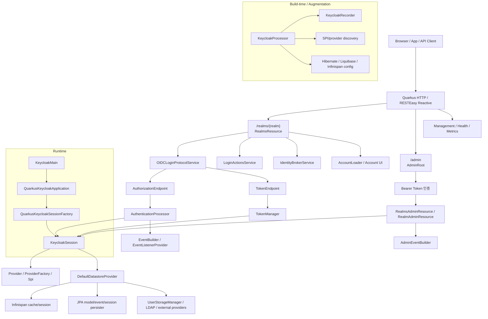
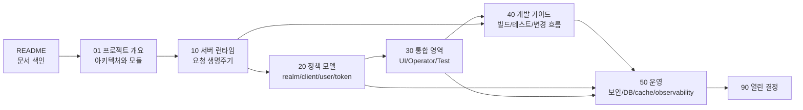

# Keycloak 프로젝트 분석 문서

작성일: 2026-05-16

최신 소스 재검증: 2026-05-16, `/Users/dhsshin/Documents/LLMOps/keycloak` 현재 작업트리 기준

참고 문서 구조: `/Users/dhsshin/Documents/LLMOps/litellm-custom/docs/custom`

## 문서 세트의 목적

이 문서 세트는 Keycloak 저장소를 처음 접하는 사람도 전체 구조, 런타임 흐름, 빌드/테스트, 운영 책임, 확장 지점을 빠짐없이 이해할 수 있도록 정리한 분석 문서다.

이 문서가 답하는 질문:

| 질문 | 답을 찾을 위치 |
| --- | --- |
| Keycloak은 어떤 제품이고 이 저장소는 무엇을 포함하는가 | [01 프로젝트 개요와 기준 아키텍처](00-foundation/01-project-overview-and-reference-architecture.md) |
| Maven 모듈과 Quarkus 배포물은 어떻게 구성되는가 | [01](00-foundation/01-project-overview-and-reference-architecture.md), [40 개발/빌드/테스트 가이드](40-implementation/40-development-build-test-guide.md) |
| 서버가 어떻게 시작되고 요청을 처리하는가 | [10 서버 런타임과 요청 생명주기](10-architecture/10-server-runtime-and-request-lifecycle.md) |
| `Realm`, `Client`, `User`, `Role`, `Session`, `Token`은 어떤 관계인가 | [20 Realm/Client/User 정책 모델](20-policy/20-realm-client-user-policy-model.md) |
| Admin UI, Account UI, Theme, Operator, 테스트 프레임워크는 어디에 있는가 | [30 UI, Operator, 테스트와 확장 지점](30-integration/30-ui-operator-tests-and-extension-points.md) |
| 로컬에서 무엇을 빌드하고 어떤 테스트를 실행해야 하는가 | [40](40-implementation/40-development-build-test-guide.md) |
| 운영 시 DB, cache, 보안, 관측성, 장애 모드는 어떻게 봐야 하는가 | [50 운영, 보안, 관측성](50-operations/50-operations-security-observability.md) |
| 아직 결정되지 않은 분석/운영 질문은 무엇인가 | [90 열린 결정 기록](90-decisions/90-open-decision-register.md) |

## 핵심 결론

| 영역 | 결론 |
| --- | --- |
| 제품 성격 | Keycloak은 인증, 인가, 사용자/세션 관리, federation, identity brokering, OIDC/SAML token 발급을 제공하는 IAM 서버다. |
| 서버 런타임 | 현재 서버 배포물의 중심은 `quarkus/`이며 Keycloak은 Quarkus extension과 command-mode application 형태로 실행된다. |
| 중심 객체 | 요청 처리의 중심은 `KeycloakSession`이다. REST resource, 인증 flow, token 발급, storage 접근은 모두 session을 통한다. |
| 확장 모델 | `Provider` / `ProviderFactory` / `Spi` 체계가 서버 기능 확장의 기준이다. ProviderFactory는 서버 단위, Provider는 session 단위로 동작한다. |
| 데이터 모델 | `RealmModel`, `ClientModel`, `UserModel`, `RoleModel`, `GroupModel`은 persistence 구현과 분리된 모델 인터페이스다. |
| 저장소 | 현재 핵심 런타임은 `DefaultDatastoreProvider`를 통해 cache, storage manager, JPA, federation provider를 조합한다. |
| 프로토콜 | `/realms/{realm}/protocol/openid-connect/*`가 OIDC 주요 endpoint이며, `OIDCLoginProtocolService`, `AuthorizationEndpoint`, `TokenEndpoint`, `TokenManager`가 중심이다. |
| Admin API | `/admin/realms/*`는 `AdminRoot`가 bearer token을 인증한 뒤 `RealmsAdminResource`, `RealmAdminResource` 하위 resource로 위임한다. |
| UI | `js/`는 pnpm workspace다. `admin-ui`, `account-ui`, `ui-shared`, `keycloak-admin-client`, `themes-vendor`가 핵심이다. |
| Operator | `operator/`는 Quarkus Operator SDK 기반이며 `Keycloak`, `KeycloakRealmImport`, OIDC/SAML client CR을 관리한다. |
| 테스트 | 신규 테스트는 `test-framework/`의 JUnit 5 extension 기반 구조가 기준이며, 기존 `testsuite/`는 deprecated로 분류된다. |

## 디렉토리 구조

`litellm-custom/docs/custom` 패턴을 따라 색인 README와 책임 영역별 하위 문서를 둔다.

```text
docs/custom/
  README.md
  00-foundation/
    01-project-overview-and-reference-architecture.md
  10-architecture/
    10-server-runtime-and-request-lifecycle.md
  20-policy/
    20-realm-client-user-policy-model.md
  30-integration/
    30-ui-operator-tests-and-extension-points.md
  40-implementation/
    40-development-build-test-guide.md
  50-operations/
    50-operations-security-observability.md
  90-decisions/
    90-open-decision-register.md
```

| 디렉토리 | 책임 |
| --- | --- |
| `00-foundation` | 제품 목적, repository 범위, 기준 아키텍처, module map, trust boundary |
| `10-architecture` | Quarkus bootstrap, SPI/session, OIDC/Admin API, storage, event, cache lifecycle |
| `20-policy` | realm/client/user/role/group/scope/token/authentication flow 정책 모델 |
| `30-integration` | JS UI, themes, Operator, test framework, 외부 연동과 extension points |
| `40-implementation` | 로컬 개발, 빌드, Maven profile, 테스트 실행, 변경 유형별 작업 흐름 |
| `50-operations` | production 운영, DB/cache, Kubernetes, 보안, backup/restore, observability, 장애 대응 |
| `90-decisions` | 열린 질문, 확인 필요 사항, 문서화된 결정 후보 |

## 독자별 빠른 읽기 경로

| 독자 | 읽는 순서 | 목적 |
| --- | --- | --- |
| 처음 온 개발자 | README → [01](00-foundation/01-project-overview-and-reference-architecture.md) → [40](40-implementation/40-development-build-test-guide.md) → [10](10-architecture/10-server-runtime-and-request-lifecycle.md) | 저장소 구조, 빌드 방법, 런타임 흐름 파악 |
| 서버 런타임 분석자 | README → [10](10-architecture/10-server-runtime-and-request-lifecycle.md) → [20](20-policy/20-realm-client-user-policy-model.md) → [01](00-foundation/01-project-overview-and-reference-architecture.md) | request lifecycle과 domain model 연결 |
| IAM 설계자 | README → [20](20-policy/20-realm-client-user-policy-model.md) → [10](10-architecture/10-server-runtime-and-request-lifecycle.md) → [50](50-operations/50-operations-security-observability.md) | realm/client/token/session/federation 정책 이해 |
| UI 개발자 | README → [30](30-integration/30-ui-operator-tests-and-extension-points.md) → [40](40-implementation/40-development-build-test-guide.md) | Admin UI, Account UI, theme packaging, local UI server 파악 |
| Operator 개발자 | README → [30](30-integration/30-ui-operator-tests-and-extension-points.md) → [50](50-operations/50-operations-security-observability.md) → [40](40-implementation/40-development-build-test-guide.md) | CRD/controller/dependent resource와 운영 관점 확인 |
| 운영 담당자 | README → [50](50-operations/50-operations-security-observability.md) → [01](00-foundation/01-project-overview-and-reference-architecture.md) → [40](40-implementation/40-development-build-test-guide.md) | 배포, DB/cache, 보안, observability, 장애 모드 확인 |
| 테스트 담당자 | README → [40](40-implementation/40-development-build-test-guide.md) → [30](30-integration/30-ui-operator-tests-and-extension-points.md) | test-framework, testsuite, UI/Operator 테스트 경계 파악 |

## 한 장으로 보는 전체 구조



## 전체 읽기 흐름



## 전체 문서 맵

| 계층 | 문서 | 역할 |
| --- | --- | --- |
| 색인 | [README](README.md) | 문서 세트 목적, 빠른 읽기 경로, 전체 구조 |
| Foundation | [01 프로젝트 개요와 기준 아키텍처](00-foundation/01-project-overview-and-reference-architecture.md) | 제품 목적, repository 범위, Maven/Quarkus module map, trust boundary |
| Architecture | [10 서버 런타임과 요청 생명주기](10-architecture/10-server-runtime-and-request-lifecycle.md) | bootstrap, `KeycloakSession`, SPI, OIDC/Admin API, storage/event/cache 흐름 |
| Policy | [20 Realm/Client/User 정책 모델](20-policy/20-realm-client-user-policy-model.md) | realm/client/user/role/group/scope/token/authentication flow 정책과 설계 기준 |
| Integration | [30 UI, Operator, 테스트와 확장 지점](30-integration/30-ui-operator-tests-and-extension-points.md) | JS workspace, theme packaging, Operator CRD/controller, test framework, extension points |
| Implementation | [40 개발/빌드/테스트 가이드](40-implementation/40-development-build-test-guide.md) | 로컬 개발 환경, 명령, Maven profile, 테스트 matrix, 변경 유형별 가이드 |
| Operations | [50 운영, 보안, 관측성](50-operations/50-operations-security-observability.md) | 운영 구성, DB/cache, Kubernetes, secret, backup, metrics/logging, failure modes |
| Decisions | [90 열린 결정 기록](90-decisions/90-open-decision-register.md) | 추가 확인이 필요한 질문과 decision register |

## 최상위 디렉토리 역할 요약

| 경로 | 역할 |
| --- | --- |
| `quarkus/` | Quarkus 기반 Keycloak 서버 runtime, deployment, server app, dist, container, tests |
| `services/` | REST resources, authentication flow, protocol services, token/session/event manager 등 핵심 서버 서비스 구현 |
| `server-spi/` | 공개 서버 SPI와 domain model interface |
| `server-spi-private/` | 내부/private SPI, event model 등 내부 확장 계약 |
| `model/` | JPA, Infinispan, storage manager, datastore, cache/session provider 구현 |
| `core/` | core representation, protocol 공통 타입, JSON/model utility |
| `common/` | 서버/어댑터 공통 유틸리티와 공통 타입 |
| `crypto/` | 기본/FIPS/Elytron crypto provider |
| `federation/` | LDAP, Kerberos, SSSD, IPA Tuura 등 user federation provider |
| `integration/` | admin client, client registration, client CLI |
| `authz/` | Authorization Services policy/client 관련 모듈 |
| `rest/` | Admin v2 API와 Admin UI extension service |
| `js/` | TypeScript/React UI, admin client, shared UI, theme vendor workspace |
| `themes/` | built-in Freemarker themes와 JS UI/theme artifact 묶음 |
| `operator/` | Quarkus Operator SDK 기반 Keycloak Operator |
| `test-framework/` | 신규 JUnit 5 기반 Keycloak test framework |
| `tests/` | 신규 테스트 모듈과 custom providers, clustering, webauthn 등 |
| `testsuite/` | 기존 Arquillian/model testsuite. 현재 deprecated 문서가 존재함 |
| `distribution/` | SAML adapters, Galleon feature packs, licenses, downloads/API docs 배포 부가 산출물 |
| `docs/` | 공식 문서 소스와 문서 빌드 모듈 |
| `adapters/` | SAML 및 adapter SPI. 기본 빌드에는 profile로 추가될 수 있음 |
| `scim/` | SCIM core/model/client/services/tests |
| `ssf/` | Shared Signals Framework core/transmitter/services/tests |
| `authzen/` | AuthZen services/tests |

## 핵심 코드 참조 색인

| 영역 | 핵심 파일 |
| --- | --- |
| Quarkus entrypoint | `quarkus/runtime/src/main/java/org/keycloak/quarkus/runtime/KeycloakMain.java` |
| Quarkus build step | `quarkus/deployment/src/main/java/org/keycloak/quarkus/deployment/KeycloakProcessor.java` |
| Runtime recorder | `quarkus/runtime/src/main/java/org/keycloak/quarkus/runtime/KeycloakRecorder.java` |
| Quarkus application | `quarkus/runtime/src/main/java/org/keycloak/quarkus/runtime/integration/jaxrs/QuarkusKeycloakApplication.java` |
| Session factory | `services/src/main/java/org/keycloak/services/DefaultKeycloakSessionFactory.java` |
| Quarkus session factory | `quarkus/runtime/src/main/java/org/keycloak/quarkus/runtime/integration/QuarkusKeycloakSessionFactory.java` |
| Session interface | `server-spi/src/main/java/org/keycloak/models/KeycloakSession.java` |
| Session implementation | `services/src/main/java/org/keycloak/services/DefaultKeycloakSession.java` |
| Public realm root | `services/src/main/java/org/keycloak/services/resources/RealmsResource.java` |
| Admin root | `services/src/main/java/org/keycloak/services/resources/admin/AdminRoot.java` |
| OIDC protocol root | `services/src/main/java/org/keycloak/protocol/oidc/OIDCLoginProtocolService.java` |
| Authorization endpoint | `services/src/main/java/org/keycloak/protocol/oidc/endpoints/AuthorizationEndpoint.java` |
| Token endpoint | `services/src/main/java/org/keycloak/protocol/oidc/endpoints/TokenEndpoint.java` |
| Token manager | `services/src/main/java/org/keycloak/protocol/oidc/TokenManager.java` |
| Authentication processor | `services/src/main/java/org/keycloak/authentication/AuthenticationProcessor.java` |
| Datastore provider | `model/storage-private/src/main/java/org/keycloak/storage/datastore/DefaultDatastoreProvider.java` |
| JPA realm/user provider | `model/jpa/src/main/java/org/keycloak/models/jpa/JpaRealmProvider.java`, `model/jpa/src/main/java/org/keycloak/models/jpa/JpaUserProvider.java` |
| Infinispan sessions/cache | `model/infinispan/src/main/java/org/keycloak/models/sessions/infinispan/`, `model/infinispan/src/main/java/org/keycloak/models/cache/infinispan/` |
| JS workspace | `js/package.json`, `js/pnpm-workspace.yaml`, `js/pom.xml` |
| Operator controller | `operator/src/main/java/org/keycloak/operator/controllers/KeycloakController.java` |
| Test framework entry | `test-framework/core/src/main/java/org/keycloak/testframework/KeycloakIntegrationTestExtension.java` |

## 주요 빌드와 실행 명령

| 목적 | 명령 |
| --- | --- |
| 테스트 생략 전체 빌드 | `./mvnw clean install -DskipTests` |
| 테스트 포함 전체 빌드 | `./mvnw clean install` |
| distribution 포함 빌드 | `./mvnw clean install -DskipTests -Pdistribution` |
| 서버만 빌드 | `./mvnw -pl quarkus/deployment,quarkus/dist -am -DskipTests clean install` |
| Quarkus 최초 개발 빌드 | `../mvnw -f ../pom.xml clean install -DskipTestsuite -DskipExamples -DskipTests` |
| Quarkus dev mode | `../mvnw -f server/pom.xml compile quarkus:dev -Dkc.config.built=true -Dquarkus.args="start-dev"` |
| distribution 실행 | `bin/kc.sh start-dev` 또는 `bin\kc.bat start-dev` |
| JS 처리 생략 | `-Dskip.npm` |
| Operator 포함 빌드 | `./mvnw clean install -Poperator -DskipTests` |
| proto lock check 생략 | `-DskipProtoLock=true` |

## 문서 작성 규칙

| 규칙 | 설명 |
| --- | --- |
| 한국어 우선 | 제목, 섹션명, 표 헤더, 설명 문장은 한국어를 기본으로 한다. |
| 기술 식별자 보존 | class, method, config key, command, 파일 경로, protocol 명칭은 원문을 유지한다. |
| 표 우선 | 책임, 결정, 파일 map, 테스트 matrix, 운영 기준은 표로 정리한다. |
| Mermaid 사용 | lifecycle, architecture, data flow는 Mermaid로 표현하고 반드시 텍스트 설명을 함께 둔다. |
| 결정과 분석 분리 | 핵심 판단은 foundation/policy/operations에 두고, code path 상세는 architecture/implementation에 둔다. |
| 범위 명시 | 문서마다 다루는 범위와 제외 범위를 명확히 한다. |
| source 기준 기록 | 분석 기준 날짜와 확인한 repository 경로를 남긴다. |

## 조사 대상 repository

| 경로 | 역할 | 분석 수준 |
| --- | --- | --- |
| `/Users/dhsshin/Documents/LLMOps/keycloak` | 현재 작업 대상 Keycloak repository | 상세 분석, 최신 소스 기준 |
| `/Users/dhsshin/Documents/LLMOps/litellm-custom` | 문서 구조와 작성 패턴 reference | 문서 구조 참고 |
| `/Users/dhsshin/Documents/LLMOps` | 상위 multi-project workspace | parent `AGENTS.md`와 주변 project 위치 확인 |

## 작업 범위 기록

이 단계에서는 분석 문서만 작성했다. Java, TypeScript, Maven, Operator, 테스트 runtime 코드는 수정하지 않는다.
