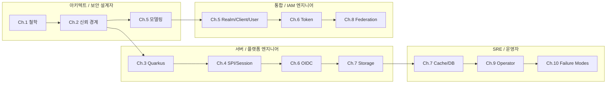

# Keycloak 시스템 백서

**Identity Control Plane의 설계 철학, 신뢰 경계, 런타임 구조, 운영 모델**

> 버전: 2.0 · 2026-05-16 · Keycloak upstream repository 분석 기반 기술 백서

---

## Abstract

Keycloak은 단순한 로그인 서버가 아니다. Keycloak의 본질은 애플리케이션마다 반복되던 신원 확인, 인증, 인가, 세션, 토큰, 외부 IdP/LDAP 연동, 운영 감사의 복잡성을 중앙의 정책 실행 엔진으로 수렴시키는 것이다.

이 백서는 Keycloak을 **Identity Control Plane**으로 해석한다. Keycloak은 조직의 사용자와 애플리케이션 사이에 놓인 신뢰 경계를 `Realm`, `Client`, `User`, `Group`, `Role`, `Session`, `Token`, `Provider`라는 모델로 표현하고, 이를 Quarkus 기반 런타임, JPA/Infinispan storage, SPI/provider 확장 모델, Operator, test-framework로 production system화한 IAM 플랫폼이다.

기존 `docs/custom` 문서는 파일 위치와 기능별 참조를 제공한다. 이 백서는 그 위에 놓이는 상위 서사다. 목표는 “어디에 무엇이 있는가”를 넘어 “왜 이렇게 설계되었고, 어떤 대가를 감수하며, 운영자는 무엇을 결정해야 하는가”를 설명하는 것이다.

---

## 핵심 Thesis

> Keycloak은 identity를 애플리케이션 코드에서 분리해 중앙화하되, 모든 정책을 realm 단위로 격리하고 client/user/session/token 모델로 실행하며, SPI/provider/storage 계층으로 확장성을 제공하고, Quarkus build-time 최적화와 DB/cache/operator/test-framework를 통해 클라우드 네이티브 운영 가능성을 확보한 IAM 플랫폼이다.

이 thesis는 다음 판단에서 출발한다.

| 판단 | 의미 |
| --- | --- |
| 인증은 로그인 화면이 아니라 신뢰 경계의 설계다 | 사용자가 누구인지, 어느 앱을 신뢰할지, 어떤 claim을 넘길지의 문제다. |
| Token은 권한 그 자체가 아니라 검증 가능한 주장(claim)의 컨테이너다 | resource server는 token의 서명뿐 아니라 issuer, audience, expiration, scope, role을 검증해야 한다. |
| Realm은 조직적 격리 단위다 | realm 수를 늘리면 격리는 강해지지만 운영 복잡성이 증가한다. |
| Client는 애플리케이션과 IdP 사이의 신뢰 계약이다 | redirect URI, client auth, scope, mapper가 계약의 보안성을 결정한다. |
| SPI/provider는 확장성이자 신뢰 경계 확장이다 | custom provider는 sandbox가 아니라 server process 안에서 실행되는 code extension이다. |
| SSO는 session/cache/DB의 분산 시스템 문제다 | UX를 얻는 대신 cache consistency, sticky session, logout propagation, TTL 정책을 운영해야 한다. |
| Quarkus 전환은 runtime 동적성에서 build-time 예측 가능성으로의 이동이다 | startup과 immutable 운영성을 얻는 대신 provider/theme/config 변경이 build pipeline에 결합된다. |

---

## 목차

| Ch. | 제목 | 핵심 질문 |
| --- | --- | --- |
| 1 | [Identity Control Plane으로서의 Keycloak](whitepaper/ch01-identity-control-plane.md) | 왜 애플리케이션별 인증 구현을 중앙 IAM 플랫폼으로 옮기는가? |
| 2 | [시스템 토폴로지와 신뢰 경계](whitepaper/ch02-topology-and-trust-boundaries.md) | Browser, App, Keycloak, DB, cache, LDAP, IdP는 어떤 신뢰 관계로 연결되는가? |
| 3 | [Quarkus 전환과 build-time/runtime 분리](whitepaper/ch03-quarkus-build-runtime-boundary.md) | 왜 Keycloak은 동적 application server 모델에서 optimized IAM appliance 모델로 이동했는가? |
| 4 | [SPI, Provider, Session 계약](whitepaper/ch04-spi-provider-session-contract.md) | 확장성은 어떻게 얻고, 그 대가는 무엇인가? |
| 5 | [Realm, Client, User 모델링](whitepaper/ch05-realm-client-user-modeling.md) | 조직, 서비스, 권한을 Keycloak 객체로 어떻게 표현해야 하는가? |
| 6 | [OIDC 인증과 Token 발급 생명주기](whitepaper/ch06-oidc-token-lifecycle.md) | 로그인 버튼부터 access token까지 어떤 일이 벌어지는가? |
| 7 | [Session, Cache, Storage](whitepaper/ch07-session-cache-storage.md) | SSO UX는 어떤 상태 저장소와 consistency 비용을 요구하는가? |
| 8 | [Federation과 Identity Brokering](whitepaper/ch08-federation-and-brokering.md) | 기존 LDAP/AD/외부 IdP를 통합할 때 무엇을 얻고 무엇을 잃는가? |
| 9 | [Operator, 테스트, 배포 모델](whitepaper/ch09-operator-test-delivery.md) | Kubernetes에서 Keycloak을 안전하게 운영하려면 무엇을 desired state로 봐야 하는가? |
| 10 | [운영, 보안, 실패 모드](whitepaper/ch10-operations-security-failure-modes.md) | 우리가 선택한 통합 방식의 이유와 대가는 무엇인가? |

---

## 이 백서의 읽는 법

모든 장은 동일한 질문을 반복한다.

| 질문 | 설명 |
| --- | --- |
| 설계 질문 | 이 영역이 해결하려는 본질적 문제는 무엇인가? |
| Keycloak의 답 | 실제 코드와 모델은 어떤 구조를 선택했는가? |
| 왜 이 방식인가 | 대안은 무엇이고 어떤 tradeoff 때문에 현재 방식이 선택되었는가? |
| 소스코드 증거 | 어떤 파일과 class가 이 결정을 구현하는가? |
| 운영자가 결정할 것 | production 적용 시 어떤 값을 선택해야 하는가? |
| 핵심 인사이트 | 해당 장에서 기억해야 할 압축된 결론은 무엇인가? |

---

## 기존 문서와의 관계

본 백서는 기존 `docs/custom` 하위 문서들의 상위 서사(Narrative)를 제공한다. 기존 문서는 참조용으로 유지한다.

| 백서 장 | 기존 참조 문서 |
| --- | --- |
| Ch.1 | [프로젝트 개요와 기준 아키텍처](00-foundation/01-project-overview-and-reference-architecture.md) |
| Ch.2 | [프로젝트 개요와 기준 아키텍처](00-foundation/01-project-overview-and-reference-architecture.md), [운영, 보안, 관측성](50-operations/50-operations-security-observability.md) |
| Ch.3 | [서버 런타임과 요청 생명주기](10-architecture/10-server-runtime-and-request-lifecycle.md), `quarkus/README.md` |
| Ch.4 | [서버 런타임과 요청 생명주기](10-architecture/10-server-runtime-and-request-lifecycle.md) |
| Ch.5 | [Realm/Client/User 정책 모델](20-policy/20-realm-client-user-policy-model.md) |
| Ch.6 | [서버 런타임과 요청 생명주기](10-architecture/10-server-runtime-and-request-lifecycle.md) |
| Ch.7 | [운영, 보안, 관측성](50-operations/50-operations-security-observability.md) |
| Ch.8 | [Realm/Client/User 정책 모델](20-policy/20-realm-client-user-policy-model.md), [UI, Operator, 테스트와 확장 지점](30-integration/30-ui-operator-tests-and-extension-points.md) |
| Ch.9 | [UI, Operator, 테스트와 확장 지점](30-integration/30-ui-operator-tests-and-extension-points.md), [개발/빌드/테스트 가이드](40-implementation/40-development-build-test-guide.md) |
| Ch.10 | [열린 결정 기록](90-decisions/90-open-decision-register.md), [운영, 보안, 관측성](50-operations/50-operations-security-observability.md) |

---

## 전체 설계 결정 매트릭스

| # | 설계 결정 | 대안 | 선택 이유 | 대가 |
| --- | --- | --- | --- | --- |
| 1 | 중앙 IdP로 Keycloak 사용 | 앱별 인증 구현 | 보안 정책, SSO, 감사 중앙화 | Keycloak이 critical dependency가 됨 |
| 2 | Realm을 격리 단위로 사용 | client/group만으로 분리 | key, IdP, flow, user, token 정책 독립성 | realm 수 증가 시 운영 자동화 필요 |
| 3 | Authorization Code + PKCE | Implicit flow | browser code 탈취 위험 감소, 최신 표준 | client 구현 복잡도 증가 |
| 4 | Confidential client 기본 | public client 남용 | secret/private key 기반 client auth 가능 | secret rotation과 저장소 필요 |
| 5 | 짧은 access token TTL | 긴 access token TTL | 탈취 피해와 stale permission 최소화 | refresh/token endpoint 부하 증가 |
| 6 | Group/Role 중앙 관리 | 앱별 권한 DB | 권한 정책 통합과 audit 쉬움 | mapping drift와 composite role 복잡도 |
| 7 | Protocol mapper 최소화 | 모든 user attribute claim화 | PII 노출과 token bloat 방지 | resource server 추가 조회 가능성 |
| 8 | DB를 source of truth로 사용 | cache-only 정책 | durability와 transaction 확보 | DB HA/backup/migration 필요 |
| 9 | Infinispan으로 cache/session 관리 | pod-local session | multi-pod SSO와 invalidation 지원 | cache topology와 sticky session 고려 필요 |
| 10 | Quarkus optimized image | runtime dynamic server | startup predictability와 immutable 운영 | provider/theme 변경 시 rebuild 필요 |
| 11 | Operator로 Kubernetes 운영 | raw manifests only | desired state와 status reconciliation | CRD가 모든 외부 상태를 소유하지 못함 |
| 12 | test-framework 기반 신규 테스트 | legacy testsuite 중심 | 선언적 resource lifecycle과 JUnit 5 통합 | 기존 testsuite migration 비용 |

---

## 다음 고도화 방향

아래 항목은 현재 백서의 범위를 넘어서는 **제안된 후속 문서**다. 아직 파일로 생성하지 않았으며, 실제 운영 환경이나 구현 변경 요구가 생길 때 별도 문서로 분리한다.

| 후보 | 목적 |
| --- | --- |
| `whitepaper/ch06.1-authorization-code-code-path.md` | Authorization Code + PKCE를 method 단위로 상세 추적 |
| `whitepaper/ch07.1-infinispan-cache-topology.md` | cache/session별 Infinispan topology와 sticky session 상세화 |
| `whitepaper/ch09.1-operator-reconciliation-runbook.md` | Operator reconcile, status, update strategy 상세 runbook |
| `whitepaper/ch10.1-security-hardening-controls.md` | 실패 모드별 hardening control과 검증 명령 정리 |

---

| 방향 | 문서 |
| --- | --- |
| 다음 | [Ch.1 Identity Control Plane으로서의 Keycloak](whitepaper/ch01-identity-control-plane.md) |
| 문서 색인 | [README.md](README.md) |
