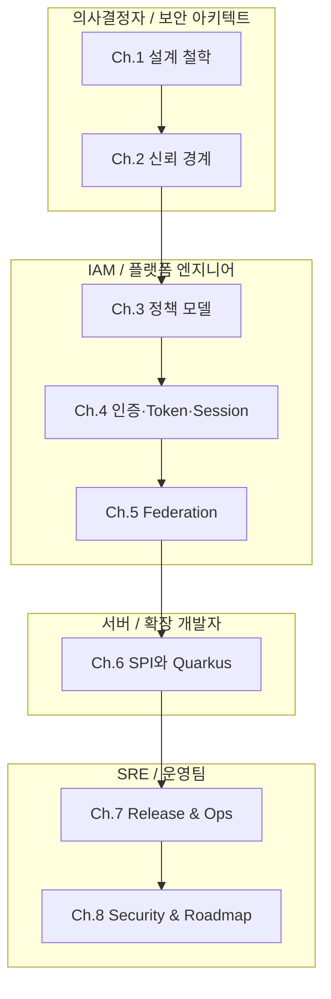

# Keycloak Identity Governance 시스템 백서

**기업급 인증·인가 운영을 위한 Identity Control Plane의 설계 철학, 아키텍처, 그리고 운영 모델**

> 버전: 2.1 · 2026-05-16 · Keycloak upstream repository 분석 기반 기술 백서

---

## Abstract

처음에는 로그인 기능이 작아 보입니다. 애플리케이션 하나에 로그인 화면을 붙이고, 사용자 테이블을 만들고, 관리자 권한 몇 개를 코드에 넣으면 충분해 보입니다. 문제는 서비스가 세 개, 열 개, 수십 개로 늘어나는 순간 시작됩니다. 어떤 서비스는 MFA를 요구하고, 어떤 서비스는 오래된 비밀번호 정책을 쓰며, 어떤 API는 서명만 맞으면 다른 서비스용 token도 받아들입니다. 퇴사자는 LDAP에서는 비활성화되었지만 어느 애플리케이션의 session은 아직 살아 있을 수도 있습니다.

이때 인증은 더 이상 화면 하나의 기능이 아닙니다. 인증은 조직의 신뢰 경계를 정하고, 누가 어떤 애플리케이션을 어떤 조건으로 통과할 수 있는지 설명하는 **Identity Governance** 문제가 됩니다.

Keycloak은 이 문제에 대한 강력한 답입니다. Keycloak은 사용자, 애플리케이션, 외부 IdP, LDAP, token, session, role, audit event를 하나의 **Identity Control Plane** 안에 모읍니다. 애플리케이션은 더 이상 각자 신원 확인 로직을 발명하지 않습니다. 대신 Keycloak이 발급한 검증 가능한 token을 받고, 자신이 책임지는 비즈니스 권한만 판단합니다.

본 백서는 Keycloak을 단순한 오픈소스 IAM 서버가 아니라, 기업이 인증·인가를 안전하게 운영하기 위해 세우는 **신원 관제탑**으로 읽습니다. 목표는 “파일이 어디 있는가”를 넘어서, “왜 이런 구조가 필요하고, 어떤 대가를 치르며, 운영자는 무엇을 결정해야 하는가”를 새로 합류한 사람도 이해할 수 있게 설명하는 것입니다.

---

## 목차

### Volume 1: Foundation & Philosophy (기반 철학과 신뢰 경계)

| Ch. | 제목 | 핵심 질문 |
| --- | --- | --- |
| **1** | [설계 철학과 첫 번째 원칙](./whitepaper/ch01-design-philosophy.md) | 왜 Keycloak을 로그인 서버가 아니라 Identity Control Plane으로 봐야 하는가? |
| **2** | [시스템 토폴로지와 신뢰 경계](./whitepaper/ch02-system-topology.md) | Browser, App, Keycloak, DB, LDAP, IdP는 어디서 서로를 신뢰하고 의심해야 하는가? |

### Volume 2: Identity Model & Execution (신원 모델과 실행 흐름)

| Ch. | 제목 | 핵심 질문 |
| --- | --- | --- |
| **3** | [Realm, Client, Role 정책 모델](./whitepaper/ch03-identity-policy-model.md) | 조직, tenant, 애플리케이션, 권한을 Keycloak 객체로 어떻게 번역할 것인가? |
| **4** | [인증, Token, Session 생명주기](./whitepaper/ch04-authentication-session-token-lifecycle.md) | 로그인 버튼부터 API 호출까지 어떤 상태와 증거가 만들어지는가? |
| **5** | [Federation과 Identity Brokering](./whitepaper/ch05-federation-and-brokering.md) | 이미 존재하는 LDAP/AD/외부 IdP를 어떻게 안전하게 받아들일 것인가? |

### Volume 3: Extension & Operations (확장성과 운영)

| Ch. | 제목 | 핵심 질문 |
| --- | --- | --- |
| **6** | [SPI, Provider, Quarkus 런타임](./whitepaper/ch06-extension-runtime-model.md) | 확장성을 얻는 대신 어떤 신뢰와 배포 책임을 떠안는가? |
| **7** | [Release, Operator, 운영 안정성](./whitepaper/ch07-release-and-operations.md) | Kubernetes에서 Keycloak을 안전하게 배포하고 업그레이드하려면 무엇을 검증해야 하는가? |
| **8** | [보안, 감사, 미결 결정과 로드맵](./whitepaper/ch08-security-audit-and-roadmap.md) | 좋은 IAM 운영은 어떤 실패를 막고, 무엇을 아직 결정해야 하는가? |

---

## 이 백서의 읽는 법

각 챕터는 같은 리듬을 따릅니다. 제목은 장의 성격에 따라 조금 달라질 수 있지만, 독자가 따라가는 흐름은 동일합니다.

1. **설계 배경** — 실제 운영자가 왜 이 문제를 만나게 되는가
2. **설계 질문** — 우리가 반드시 답해야 하는 핵심 질문
3. **Keycloak의 답** — Keycloak이 제공하는 모델과 흐름
4. **왜 이 방식인가** — 버린 대안과 tradeoff
5. **코드로 확인하는 증거** — 실제 repository에서 이 구조를 확인할 수 있는 class, endpoint, provider 파일
6. **운영자의 체크포인트** — production 적용 전에 결정해야 할 기준

---

## 백서의 첫 번째 원칙

> **신뢰는 중앙에서 선언하고, 서비스는 검증 가능한 증거만 소비한다.**

Keycloak의 핵심은 모든 애플리케이션을 무지하게 만드는 것이 아닙니다. 오히려 각 애플리케이션이 자기 책임에 집중하게 만드는 것입니다.

| 영역 | Keycloak이 책임지는 것 | 애플리케이션이 책임지는 것 |
| --- | --- | --- |
| 신원 확인 | 로그인, MFA, 외부 IdP, credential 정책 | 로그인 UI를 직접 발명하지 않음 |
| 신뢰 계약 | client, redirect URI, grant, scope, token 발급 | issuer, audience, signature, scope 검증 |
| 권한 표현 | role, group, client scope, mapper | 비즈니스 객체 단위 최종 인가 |
| 상태 관리 | SSO session, refresh token, logout, federation link | 자체 session과 API authorization 정책 |
| 감사 | admin event, user event, login failure | application-level audit와 domain event |

이 분업이 깨지면 두 가지 실패가 생깁니다. Keycloak이 모든 비즈니스 권한을 떠안으면 중앙 시스템이 과도하게 복잡해집니다. 반대로 애플리케이션이 신원 확인을 제각각 구현하면 MFA, 퇴사자 처리, token 검증, audit가 흩어집니다. 좋은 설계는 이 둘 사이의 경계를 명확히 긋는 일에서 시작합니다.

---

## 기존 문서와의 관계

본 백서는 `docs/custom` 하위 참조 문서를 하나의 서사로 엮은 상위 가이드입니다. 상세 code path, build command, 운영 checklist는 기존 참조 문서에 남겨 둡니다.

| 백서 챕터 | 기존 참조 문서 |
| --- | --- |
| Ch.1 | [프로젝트 개요와 기준 아키텍처](00-foundation/01-project-overview-and-reference-architecture.md) |
| Ch.2 | [프로젝트 개요와 기준 아키텍처](00-foundation/01-project-overview-and-reference-architecture.md), [운영, 보안, 관측성 계약](50-operations/50-operations-security-observability.md) |
| Ch.3 | [Realm/Client/User 정책 모델](20-policy/20-realm-client-user-policy-model.md) |
| Ch.4 | [서버 런타임과 요청 생명주기](10-architecture/10-server-runtime-and-request-lifecycle.md), [운영, 보안, 관측성 계약](50-operations/50-operations-security-observability.md) |
| Ch.5 | [Realm/Client/User 정책 모델](20-policy/20-realm-client-user-policy-model.md), [UI, Operator, 테스트와 확장 지점](30-integration/30-ui-operator-tests-and-extension-points.md) |
| Ch.6 | [서버 런타임과 요청 생명주기](10-architecture/10-server-runtime-and-request-lifecycle.md), [개발, 빌드, 테스트 실행 계약](40-implementation/40-development-build-test-guide.md) |
| Ch.7 | [UI, Operator, 테스트와 확장 지점](30-integration/30-ui-operator-tests-and-extension-points.md), [개발, 빌드, 테스트 실행 계약](40-implementation/40-development-build-test-guide.md), [운영, 보안, 관측성 계약](50-operations/50-operations-security-observability.md) |
| Ch.8 | [열린 결정 기록](90-decisions/90-open-decision-register.md), [운영, 보안, 관측성 계약](50-operations/50-operations-security-observability.md) |

---

## Executive Decision Summary

| 결정 | 우리가 채택한 방향 | 포기한 것 / 대가 |
| --- | --- | --- |
| 중앙 IdP | 인증과 token 발급을 Keycloak으로 중앙화 | Keycloak이 critical dependency가 됨 |
| Realm | 보안 구역과 운영 격리의 단위로 사용 | realm 수 증가 시 자동화 필요 |
| Client | 애플리케이션과 IdP 사이의 신뢰 계약으로 관리 | redirect URI, secret, scope drift 관리 필요 |
| Authorization Code + PKCE | browser 기반 app의 기본 흐름으로 채택 | client 구현이 단순 password flow보다 복잡 |
| 짧은 access token | 탈취 피해와 stale permission을 줄임 | refresh/token endpoint 부하 증가 |
| 최소 token claim | privacy와 token size를 보호 | resource server가 추가 조회 또는 domain authorization 필요 |
| DB + cache 분리 | DB는 장부, Infinispan은 빠른 상태 저장소 | cache topology, sticky session, cleanup 운영 필요 |
| SPI/provider | 서버 내부 확장 모델 사용 | custom provider가 신뢰 경계 안으로 들어옴 |
| Quarkus optimized image | 예측 가능한 startup과 immutable delivery | provider/theme 변경 시 build pipeline과 결합 |
| Operator | Kubernetes desired state를 선언적으로 운영 | 외부 DB/cache/IdP/DNS/TLS까지 모두 소유하지는 않음 |

---

## 관련 문서

| 목적 | 문서 |
| --- | --- |
| 전체 문서 색인 | [Keycloak custom 문서 색인](README.md) |
| 기준 아키텍처 | [프로젝트 개요와 기준 아키텍처](00-foundation/01-project-overview-and-reference-architecture.md) |
| 서버 런타임 | [서버 런타임과 요청 생명주기](10-architecture/10-server-runtime-and-request-lifecycle.md) |
| 운영 기준 | [운영, 보안, 관측성 계약](50-operations/50-operations-security-observability.md) |

## 문서 이동

| 이전 | 다음 | 상위 |
| --- | --- | --- |
| [문서 색인](README.md) | [Ch.1 설계 철학과 첫 번째 원칙](./whitepaper/ch01-design-philosophy.md) | [문서 색인](README.md) |
