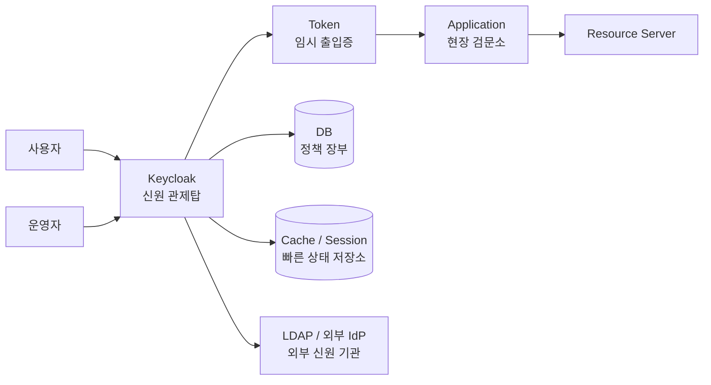

# Chapter 1. 설계 철학과 첫 번째 원칙

> "인증은 문을 여는 기능이 아니라, 조직의 신뢰 경계를 정의하는 일입니다."

Keycloak을 처음 보면 로그인 화면, 관리자 콘솔, OIDC endpoint가 먼저 보입니다. 하지만 운영 현장에서 Keycloak의 진짜 가치는 화면보다 훨씬 깊은 곳에 있습니다. Keycloak은 “누가 누구를 신뢰하는가”라는 질문을 애플리케이션 코드 밖으로 꺼내 중앙의 정책 언어로 바꿉니다.

이 챕터는 Keycloak을 왜 단순 로그인 서버가 아니라 **Identity Control Plane**으로 읽어야 하는지 설명합니다.

---

## 1.1 설계 배경: 앱마다 로그인하던 시절의 끝

초기에는 서비스마다 로그인 기능을 직접 구현해도 문제가 없어 보입니다. 첫 번째 앱은 사용자 테이블을 만들고, 두 번째 앱은 자체 role을 만들고, 세 번째 앱은 외부 OAuth 로그인을 붙입니다. 각 팀은 빠르게 움직입니다.

문제는 시간이 지나면서 누적됩니다.

### 1단계: 인증 정책의 불일치

어떤 서비스는 MFA를 요구하고, 어떤 서비스는 비밀번호만 받습니다. 어떤 서비스는 refresh token을 짧게 유지하고, 다른 서비스는 한 달짜리 session을 둡니다. 사용자는 같은 회사 시스템인데 매번 다른 보안 정책을 만납니다.

### 2단계: 권한과 감사의 파편화

권한은 각 애플리케이션 DB와 코드에 흩어집니다. “이 사용자가 왜 이 API에 접근했는가?”를 설명하려면 여러 팀의 DB, 로그, 배포 이력을 뒤져야 합니다. 감사와 사고 대응은 점점 느려집니다.

### 3단계: 계정 생명주기 실패

퇴사자가 LDAP에서는 비활성화되었지만 어떤 앱의 local user는 살아 있습니다. 외부 IdP의 group이 바뀌었지만 이미 발급된 token에는 예전 claim이 남아 있습니다. 이때 인증은 더 이상 개발 편의 기능이 아니라 운영 리스크가 됩니다.

---

## 1.2 설계 질문: "어떻게 신뢰를 중앙화하면서 서비스 자율성을 지킬까?"

우리는 두 가지를 동시에 만족해야 합니다.

1. **중앙 통제**: 로그인, MFA, token, 외부 IdP, 계정 생명주기는 한곳에서 일관되게 관리해야 합니다.
2. **서비스 자율성**: 각 애플리케이션은 자기 도메인의 세부 권한과 비즈니스 규칙을 계속 책임져야 합니다.

Keycloak의 첫 번째 원칙은 다음과 같습니다.

> **신뢰는 중앙에서 선언하고, 서비스는 검증 가능한 증거만 소비한다.**

Keycloak은 사용자의 신원을 확인하고, client와 scope를 검증하고, token이라는 증거를 발급합니다. 애플리케이션은 그 token의 issuer, audience, signature, expiration, scope를 검증한 뒤, 자기 도메인의 최종 권한 판단을 수행합니다.

---

## 1.3 기존 방식에서 Identity Control Plane으로

| 구분 | 앱별 인증 모델 | Keycloak Identity Control Plane |
| --- | --- | --- |
| 로그인 | 서비스마다 직접 구현 | Keycloak의 realm/authentication flow로 중앙화 |
| MFA/Password 정책 | 앱마다 다르게 적용 | realm 정책으로 일관성 확보 |
| 권한 표현 | 앱 DB와 코드에 흩어짐 | role, group, client scope, mapper로 표준화 |
| 외부 IdP/LDAP | 앱마다 별도 연동 | federation/broker 계층에서 통합 |
| 감사 | 각 앱 로그에 의존 | admin event, user event, login failure로 중앙 추적 |
| 장애 영향 | 앱별로 분산 | Keycloak이 critical dependency가 됨 |

중앙화는 만능이 아닙니다. Keycloak이 멈추면 로그인과 token refresh가 광범위하게 영향을 받습니다. 따라서 Keycloak을 도입한다는 것은 “로그인을 맡긴다”가 아니라 “신원 관제탑을 운영한다”는 뜻입니다.

---

## 1.4 Control Plane과 Data Plane의 분리

Keycloak은 신뢰 정책을 정의하고 증거를 발급하는 **Control Plane**입니다. 실제 API 요청을 받는 애플리케이션과 resource server는 **Data Plane**입니다.

비유하면 Keycloak은 출입국 관리청입니다. 여권을 발급하고, 어떤 출입문을 통과할 수 있는지 증명서를 줍니다. 하지만 실제 건물 안에서 어떤 회의실에 들어갈 수 있는지까지 모두 결정하지는 않습니다. 그 판단은 각 건물의 보안 규칙, 즉 애플리케이션의 domain authorization이 맡습니다.

---

## 1.5 왜 이 방식인가

| 대안 | 장점 | 버린 이유 |
| --- | --- | --- |
| 앱마다 인증 구현 | 초기 개발이 빠름 | MFA, audit, token 검증, 퇴사자 처리가 파편화됨 |
| API Gateway에서 모든 권한 처리 | 중앙 통제가 강함 | 사용자 생명주기, consent, IdP, session 모델을 모두 gateway가 떠안게 됨 |
| LDAP만 직접 사용 | 기존 계정 저장소를 재사용 | modern OIDC/SAML token, client, scope, session, broker 모델이 부족 |
| Keycloak 중앙화 | 표준 프로토콜과 운영 모델 확보 | Keycloak HA, backup, upgrade, cache/session 운영 책임 발생 |

Keycloak의 선택은 현실적인 절충입니다. 모든 것을 애플리케이션에 맡기지 않고, 모든 비즈니스 권한을 중앙에 몰아넣지도 않습니다. 신원 확인과 token 발급은 중앙에서, 도메인 권한은 각 서비스에서 맡는 구조가 가장 오래 버틸 수 있습니다.

---

## 1.6 코드로 확인하는 증거

| 주장 | 확인할 파일 |
| --- | --- |
| realm 단위 public endpoint는 `RealmsResource`에서 시작한다 | `services/src/main/java/org/keycloak/services/resources/RealmsResource.java` |
| admin API는 별도 root에서 bearer token 인증 후 위임한다 | `services/src/main/java/org/keycloak/services/resources/admin/AdminRoot.java` |
| 요청 처리의 중심은 `KeycloakSession`이다 | `server-spi/src/main/java/org/keycloak/models/KeycloakSession.java`, `services/src/main/java/org/keycloak/services/DefaultKeycloakSession.java` |
| OIDC token 발급은 protocol service와 endpoint로 분리된다 | `services/src/main/java/org/keycloak/protocol/oidc/OIDCLoginProtocolService.java`, `services/src/main/java/org/keycloak/protocol/oidc/endpoints/TokenEndpoint.java` |
| 사용자/realm/client 모델은 persistence 구현과 분리된 SPI로 노출된다 | `server-spi/src/main/java/org/keycloak/models/RealmModel.java`, `server-spi/src/main/java/org/keycloak/models/ClientModel.java`, `server-spi/src/main/java/org/keycloak/models/UserModel.java` |

---

## 1.7 운영자의 체크포인트

| 질문 | 왜 중요한가 |
| --- | --- |
| Keycloak 장애 시 어떤 서비스가 어떤 방식으로 degrade되는가? | 중앙 IdP는 critical dependency입니다. |
| resource server가 issuer, audience, signature, scope를 모두 검증하는가? | token을 받았다는 사실만으로 안전하지 않습니다. |
| realm과 client 변경은 어떤 승인 과정을 거치는가? | 작은 설정 변경이 전사 로그인 장애가 될 수 있습니다. |
| admin event와 user event를 어디까지 보관하는가? | 사고 후 “누가 바꿨는가”를 설명해야 합니다. |

---

## 1.8 핵심 인사이트

1. **로그인은 기능이 아니라 신뢰 경계입니다.** Keycloak은 이 경계를 realm, client, token, session으로 모델링합니다.
2. **중앙화는 운영 책임을 동반합니다.** Keycloak을 도입하면 SSO와 audit를 얻지만 HA, backup, upgrade, cache 운영도 함께 떠안습니다.
3. **서비스는 token을 맹신하지 않습니다.** token은 증거일 뿐이며, resource server는 검증과 domain authorization을 계속 수행해야 합니다.

---

## 관련 문서

| 목적 | 문서 |
| --- | --- |
| 기준 아키텍처 | [프로젝트 개요와 기준 아키텍처](../00-foundation/01-project-overview-and-reference-architecture.md) |
| 신뢰 경계 상세 | [Ch.2 시스템 토폴로지와 신뢰 경계](./ch02-system-topology.md) |
| 정책 모델 상세 | [Realm, Client, User 정책 모델](../20-policy/20-realm-client-user-policy-model.md) |

## 문서 이동

| 이전 | 다음 | 상위 |
| --- | --- | --- |
| [백서 홈](../WHITEPAPER.md) | [Ch.2 시스템 토폴로지와 신뢰 경계](./ch02-system-topology.md) | [백서 홈](../WHITEPAPER.md) |
