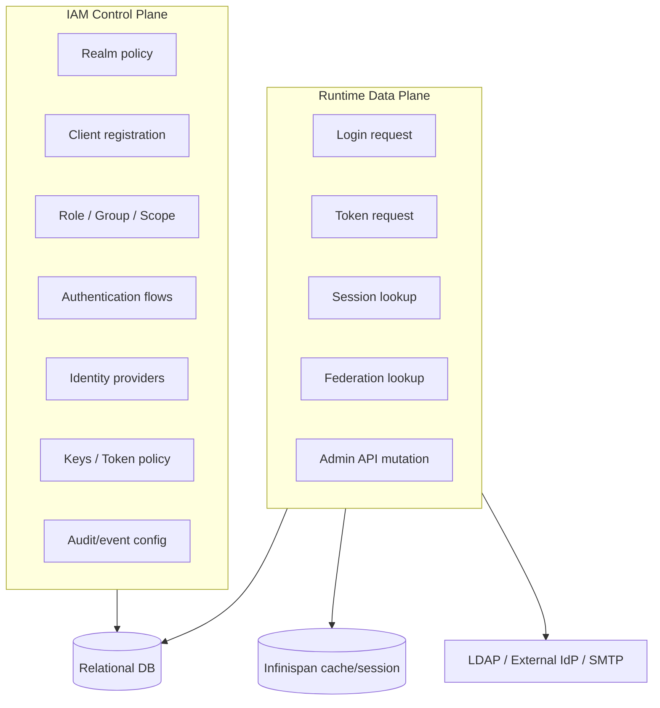

# Chapter 1. Identity Control Plane으로서의 Keycloak

> 애플리케이션이 직접 보안 정책을 구현할수록 조직의 인증 체계는 더 빨리 파편화된다.

---

## 1.1 설계 질문

왜 각 애플리케이션이 로그인, 비밀번호 저장, MFA, 세션, 권한, 감사 로그를 직접 구현하지 않고 Keycloak 같은 중앙 IAM 플랫폼에 위임해야 하는가?

이 질문은 단순한 개발 생산성 문제가 아니다. 인증과 인가는 보안 정책, 사용자 경험, 감사 가능성, 장애 전파, 운영 책임이 동시에 얽힌 영역이다. 애플리케이션 수가 늘어날수록 각각의 인증 구현은 작은 차이를 만들고, 그 차이는 시간이 지나며 보안 정책의 균열이 된다.

## 1.2 Keycloak이 해결하는 본질적 문제

Keycloak이 해결하는 문제는 “로그인 페이지 제공”이 아니다. 본질은 identity concern을 application concern에서 platform concern으로 끌어올리는 것이다.

| 파편화된 애플리케이션 보안 | Keycloak의 중앙화된 해법 |
| --- | --- |
| 앱마다 비밀번호 저장 방식이 다름 | credential provider와 password policy 중앙화 |
| 앱마다 MFA 구현이 다름 | authentication flow와 required action으로 정책화 |
| 앱마다 OAuth/OIDC/SAML 구현이 다름 | 표준 protocol endpoint와 token engine 제공 |
| 권한이 앱 DB마다 다름 | realm role, client role, group, client scope로 모델링 |
| 사용자 출처가 DB, LDAP, 외부 IdP로 흩어짐 | user federation과 identity brokering으로 통합 |
| admin 변경 이력과 login event가 산발적 | user/admin event와 listener/store로 감사 가능성 제공 |
| 운영 환경의 HA, cache, rollout, secret 관리가 제각각 | Quarkus runtime, Infinispan, Operator, test-framework로 운영 모델 제공 |

## 1.3 Keycloak의 답: IAM control plane과 runtime data plane

Keycloak은 두 역할을 동시에 수행한다.

Control plane은 “정책을 정의”한다. Runtime data plane은 “정책을 요청마다 실행”한다. 이 이중성 때문에 Keycloak은 단순 stateless API 서버가 아니다. 정책은 DB에 영속화되고, session은 cache와 DB에 걸쳐 있으며, token은 외부 resource server에서 독립적으로 검증된다.

## 1.4 왜 중앙화인가

Identity를 중앙화한다는 것은 다음 문제를 중앙에서 다룬다는 뜻이다.

| 영역 | 중앙화의 의미 |
| --- | --- |
| 사용자 생명주기 | 입사, 부서 변경, 퇴사, 계정 잠금, 비밀번호 재설정이 한 곳에서 정책화된다. |
| 애플리케이션 신뢰 | 어떤 앱이 어떤 redirect URI와 credential로 IdP를 신뢰할 수 있는지 `Client`로 표현된다. |
| 권한 주장 | 권한은 앱 내부 세션 변수가 아니라 token claim으로 전달 가능한 표준 계약이 된다. |
| 감사 | 누가 언제 로그인했고, 누가 어떤 realm/client/user 설정을 바꿨는지 event로 남긴다. |
| 정책 변경 | password policy, MFA, token lifespan, role mapper를 앱별 배포 없이 조정할 수 있다. |

## 1.5 대안 분석: 앱별 인증 vs 중앙 IdP

| 기준 | 앱별 인증 구현 | 중앙 Keycloak |
| --- | --- | --- |
| 초기 개발 속도 | 작은 앱에서는 빠름 | 초기 realm/client 설계 필요 |
| 보안 일관성 | 앱마다 달라짐 | 중앙 정책 적용 가능 |
| 감사 가능성 | 로그 포맷과 보존 정책이 분산 | user/admin event로 중앙화 가능 |
| MFA/Password 정책 | 중복 구현 필요 | flow/required action으로 재사용 |
| 외부 IdP/LDAP 통합 | 앱마다 구현 | federation/broker로 중앙화 |
| 장애 영향 | 앱별로 분리 | IdP 장애가 광범위한 login 장애가 될 수 있음 |
| 운영 복잡도 | 앱 수에 비례해 증가 | Keycloak 자체 운영 복잡도에 집중 |

핵심 tradeoff는 명확하다. 중앙 IdP는 보안 정책과 감사 가능성을 통합하지만, 그 대가로 Keycloak 자체가 조직의 critical dependency가 된다. 따라서 Keycloak을 도입한다는 것은 단순히 인증 기능을 구매하는 것이 아니라, 조직의 로그인 SLO와 보안 통제 지점을 새로 정의하는 일이다.

## 1.6 Identity Control Plane의 책임 경계

Keycloak은 모든 authorization decision을 대신 내려주는 만능 policy engine이 아니다. Keycloak은 보통 인증과 token 발급, role/scope/claim 전달을 맡고, resource server는 token을 검증한 뒤 domain-specific authorization을 수행한다.

| 책임 | Keycloak | Resource server/Application |
| --- | --- | --- |
| 사용자 인증 | 담당 | 보통 위임 |
| credential/MFA | 담당 | 직접 다루지 않음 |
| token 발급 | 담당 | 검증 담당 |
| role/scope claim 제공 | 담당 | 해석 담당 |
| domain object 권한 | 일부 Authorization Services 가능 | 대개 최종 책임 |
| audit | login/admin event 담당 | business action audit 담당 |

이 경계를 흐리면 문제가 생긴다. Keycloak token에 모든 business permission을 넣으면 token이 커지고 stale해진다. 반대로 Keycloak이 너무 적은 정보를 주면 각 애플리케이션이 다시 identity lookup을 반복한다. 좋은 설계는 token을 “검증 가능한 identity와 coarse-grained authorization claim”으로 제한하고, 세밀한 domain authorization은 resource server가 수행하도록 분리한다.

## 1.7 소스코드 증거

| 주장 | 근거 파일 |
| --- | --- |
| 요청 처리는 `KeycloakSession` 중심이다 | `server-spi/src/main/java/org/keycloak/models/KeycloakSession.java` |
| Public realm endpoint는 realm을 resolve하고 하위 protocol/resource로 위임한다 | `services/src/main/java/org/keycloak/services/resources/RealmsResource.java` |
| Admin API는 bearer token을 검증한 뒤 realm admin resource로 위임한다 | `services/src/main/java/org/keycloak/services/resources/admin/AdminRoot.java` |
| OIDC endpoint는 authorization/token/userinfo/logout/certs로 분기한다 | `services/src/main/java/org/keycloak/protocol/oidc/OIDCLoginProtocolService.java` |
| 저장소 접근은 datastore/cache/storage manager를 경유한다 | `model/storage-private/src/main/java/org/keycloak/storage/datastore/DefaultDatastoreProvider.java` |

## 1.8 운영자가 결정할 것

| 결정 | 질문 | 영향 |
| --- | --- | --- |
| IdP centrality | Keycloak이 전체 조직 로그인 경로의 단일 control point인가? | HA, DR, SLO 요구가 커진다. |
| authorization boundary | role/scope까지만 중앙화할 것인가, resource permission까지 중앙화할 것인가? | token design과 application authorization 구조가 달라진다. |
| audit 책임 | Keycloak event와 application audit의 경계를 어디에 둘 것인가? | SIEM, retention, incident response 설계에 영향이 있다. |
| identity source | Keycloak local user, LDAP federation, external IdP 중 무엇을 source of truth로 볼 것인가? | deprovisioning, password policy, latency, sync 전략이 달라진다. |

## 1.9 이 챕터의 핵심 인사이트

1. Keycloak은 로그인 화면이 아니라 조직의 identity control plane이다.
2. 중앙 IdP는 보안 일관성과 감사 가능성을 제공하지만, IdP 자체의 가용성이 전체 시스템의 SLO가 된다.
3. Keycloak의 가치는 protocol endpoint, policy model, storage/cache, extension, operations가 함께 맞물릴 때 발생한다.
4. Token에는 모든 권한을 넣는 것이 아니라 resource server가 검증할 수 있는 identity와 coarse-grained claim을 넣어야 한다.

---

| 방향 | 문서 |
| --- | --- |
| 다음 | [Ch.2 시스템 토폴로지와 신뢰 경계](ch02-topology-and-trust-boundaries.md) |
| 백서 색인 | [WHITEPAPER.md](../WHITEPAPER.md) |
