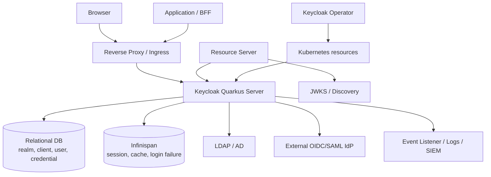

# Chapter 2. 시스템 토폴로지와 신뢰 경계

> "로그인 요청 하나는 브라우저, 앱, Keycloak, DB, 외부 IdP를 건너는 작은 여행입니다."

사용자는 로그인 버튼 하나를 누릅니다. 하지만 그 뒤에서는 브라우저, 애플리케이션, Keycloak, DB, cache, LDAP, 외부 IdP, reverse proxy가 서로를 확인하고 의심합니다. 이 중 한 경계라도 잘못 설계되면 token은 발급되었는데 API가 거부하거나, 잘못된 redirect URI로 authorization code가 새어 나가거나, issuer가 바뀌어 모든 resource server가 token을 믿지 못하는 일이 생깁니다.

이 챕터는 Keycloak 주변의 시스템들이 어떤 책임과 신뢰 경계를 갖는지 설명합니다.

---

## 2.1 설계 질문: "누가 누구를 어떤 증거로 신뢰하는가?"

인증 시스템의 장애는 대개 “로그인 로직이 틀렸다”보다 “경계가 흐릿했다”에서 시작합니다.

1. Browser는 어떤 redirect URI로 돌아가야 하는가?
2. 애플리케이션은 어떤 issuer의 token만 믿어야 하는가?
3. Keycloak은 reverse proxy가 넘긴 hostname과 header를 어디까지 믿어야 하는가?
4. 외부 LDAP/IdP의 claim을 local 권한으로 바로 승격해도 되는가?

이 질문에 답하지 않으면 시스템은 동작하지만 설명할 수 없습니다. 설명할 수 없는 인증 시스템은 운영할 수 없습니다.

---

## 2.2 기준 토폴로지

Keycloak은 혼자 서 있지 않습니다. DB는 정책 장부이고, Infinispan은 빠른 session/cache 저장소이며, LDAP/IdP는 외부 신원 기관입니다. Operator는 Kubernetes object를 조율하지만 DB, DNS, TLS, 외부 IdP의 실제 상태까지 모두 소유하지는 않습니다.

---

## 2.3 경계별 대표 사고

| 경계 | 흔한 사고 | 운영 기본값 |
| --- | --- | --- |
| Browser ↔ Keycloak | wildcard redirect URI로 authorization code 노출 | exact redirect URI와 환경별 client 분리 |
| App ↔ Keycloak | app이 state/nonce/PKCE를 약하게 검증 | Authorization Code + PKCE 기본화 |
| API ↔ Token | signature만 검증하고 audience를 보지 않음 | issuer, audience, exp, scope, role 모두 검증 |
| Proxy ↔ Keycloak | 외부 URL과 token issuer가 불일치 | hostname/proxy 설정을 discovery endpoint로 smoke test |
| Keycloak ↔ DB | DB failover 후 connection storm | readiness, pool sizing, failover drill |
| Keycloak ↔ Cache | cache split으로 stale session/realm state | cluster health와 cache metrics 관측 |
| Keycloak ↔ LDAP/IdP | 외부 timeout이 login thread를 점유 | timeout, fallback, deprovisioning SLA 정의 |
| Operator ↔ Cluster | 수동 수정과 CR desired state 충돌 | GitOps 원칙과 status condition alert |

이 표는 “무엇이 위험한가”보다 “어디가 경계인가”를 보여 줍니다. 경계가 보이면 테스트와 runbook을 만들 수 있습니다.

---

## 2.4 Public client와 Confidential client

Keycloak에서 client는 단순 애플리케이션 이름이 아닙니다. client는 Keycloak과 애플리케이션 사이의 신뢰 계약입니다.

| Client 유형 | 예시 | 신뢰 방식 | 주의할 점 |
| --- | --- | --- | --- |
| Public client | SPA, mobile app, CLI | secret을 안전하게 숨길 수 없으므로 PKCE에 의존 | redirect URI와 token TTL이 중요 |
| Confidential client | server-side web app, BFF | client secret 또는 private key로 client 인증 | secret rotation과 저장소 필요 |
| Service account | machine-to-machine | client credentials grant | service role 최소화와 audit 필요 |
| SAML client | legacy enterprise app | assertion과 metadata 신뢰 | certificate rotation과 ACS URL 관리 필요 |

초보자가 자주 하는 실수는 public client에 secret을 넣고 안전하다고 생각하는 것입니다. 브라우저와 모바일 앱에 들어간 secret은 secret이 아닙니다. 그래서 Authorization Code + PKCE가 modern browser client의 기본값이 됩니다.

---

## 2.5 Reverse proxy와 issuer correctness

Keycloak이 발급한 token에는 issuer가 들어갑니다. Resource server는 이 issuer가 자신이 신뢰하는 realm의 주소인지 확인합니다. 따라서 proxy, hostname, TLS, external URL 설정은 단순 네트워크 설정이 아니라 protocol correctness의 일부입니다.

| 잘못된 설정 | 결과 |
| --- | --- |
| 내부 pod hostname이 issuer로 노출 | 외부 API가 token issuer를 신뢰하지 못함 |
| proxy header trust가 과도함 | host header 기반 URL spoofing 위험 |
| TLS termination과 redirect URI 불일치 | browser flow 실패 또는 insecure redirect |
| admin URL과 frontend URL 혼동 | Admin Console callback과 discovery 혼선 |

운영 기본은 간단합니다. 배포 후 `/.well-known/openid-configuration`을 확인하고, issuer, authorization endpoint, token endpoint, JWKS URI가 외부 사용자가 실제로 접근하는 URL과 일치하는지 검증합니다.

---

## 2.6 코드로 확인하는 증거

| 주장 | 확인할 파일 |
| --- | --- |
| public realm root는 realm resolve와 protocol/account/broker 분기를 담당한다 | `services/src/main/java/org/keycloak/services/resources/RealmsResource.java` |
| OIDC endpoint는 별도 protocol service로 구성된다 | `services/src/main/java/org/keycloak/protocol/oidc/OIDCLoginProtocolService.java` |
| hostname/proxy 설정은 issuer와 외부 URL 구성에 연결된다 | `quarkus/runtime/src/main/java/org/keycloak/quarkus/runtime/configuration/mappers/HostnameV2PropertyMappers.java`, `services/src/main/java/org/keycloak/url/HostnameV2Provider.java` |
| DB readiness와 cluster readiness는 별도 health check로 관리된다 | `quarkus/runtime/src/main/java/org/keycloak/quarkus/runtime/services/health/KeycloakReadyHealthCheck.java`, `quarkus/runtime/src/main/java/org/keycloak/quarkus/runtime/services/health/KeycloakClusterReadyHealthCheck.java` |
| Operator는 Keycloak CR을 Kubernetes resource로 reconcile한다 | `operator/src/main/java/org/keycloak/operator/controllers/KeycloakController.java` |

---

## 2.7 운영자의 체크포인트

| 질문 | 확인 방법 |
| --- | --- |
| discovery issuer가 외부 URL과 일치하는가? | well-known endpoint와 실제 token `iss` 비교 |
| 모든 API가 audience를 검증하는가? | 다른 client용 token으로 접근 실패 테스트 |
| redirect URI는 exact match인가? | client 설정 review와 callback smoke test |
| DB/cache/LDAP 장애 시 readiness와 alert가 동작하는가? | 장애 drill과 metrics 확인 |

---

## 2.8 핵심 인사이트

1. **인증은 경계의 설계입니다.** Browser, app, Keycloak, DB, cache, IdP 각각의 신뢰 기준을 명시해야 합니다.
2. **hostname은 보안 설정입니다.** issuer와 discovery URL이 틀리면 token 검증은 실패하거나 위험해집니다.
3. **client는 신뢰 계약입니다.** public/confidential/service client를 구분하지 않으면 secret 관리와 PKCE 정책이 무너집니다.

---

| 방향 | 문서 |
| --- | --- |
| **이전 챕터** | [Ch.1 설계 철학과 첫 번째 원칙](./ch01-design-philosophy.md) |
| **다음 챕터** | [Ch.3 Realm, Client, Role 정책 모델](./ch03-identity-policy-model.md) |
| **백서 홈** | [WHITEPAPER.md](../WHITEPAPER.md) |
