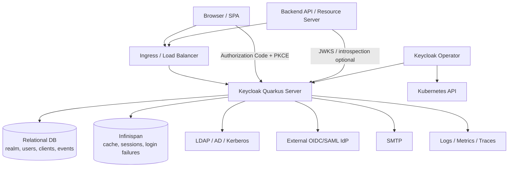

# Chapter 2. 시스템 토폴로지와 신뢰 경계

> 신뢰할 수 없는 브라우저 입력과 신뢰 가능한 token claim 사이에는 여러 개의 경계가 있다.

---

## 2.1 설계 질문

Browser, SPA, backend API, API Gateway, Keycloak, DB, Infinispan, LDAP, 외부 IdP는 어떤 신뢰 관계로 연결되는가? 어느 위치에서 어떤 값을 신뢰하면 안 되는가?

## 2.2 기준 토폴로지

이 토폴로지는 Keycloak의 책임과 한계를 동시에 보여준다. Keycloak은 인증 요청과 token 발급을 처리하지만, token을 사용하는 resource server는 여전히 자체 검증 책임을 가진다. DB는 정책과 장기 상태의 source of truth이고, Infinispan은 session과 cache continuity를 담당한다. LDAP와 외부 IdP는 Keycloak 바깥의 identity source이며, 운영상 장애와 지연을 Keycloak login path 안으로 끌어들인다.

## 2.3 Trust boundary map

| Boundary | 신뢰할 수 있는 것 | 신뢰하면 안 되는 것 | 설계 의미 |
| --- | --- | --- | --- |
| Browser → Keycloak | TLS가 보호하는 protocol request | redirect URI, origin, `state`, `nonce`, client-provided header | protocol parameter 검증이 보안의 시작이다. |
| App → Keycloak | 등록된 confidential client credential 또는 public client + PKCE | public client secret, 임의 callback URL | client type에 따라 trust 수준이 다르다. |
| Keycloak → Resource Server | 서명된 token과 JWKS | token payload를 검증 없이 신뢰하는 행위 | issuer, audience, expiration, signature, scope를 검증해야 한다. |
| Keycloak → DB | transaction으로 보호되는 영속 상태 | DB 장애 시 fallback 없는 정책 변경 | DB는 정책과 장기 상태의 source of truth다. |
| Keycloak → Infinispan | cache/session state | cache가 항상 DB와 즉시 일치한다는 가정 | invalidation과 TTL이 correctness에 영향을 준다. |
| Keycloak → LDAP/User Storage | provider contract로 조회한 user data | 외부 provider가 항상 빠르고 일관적이라는 가정 | timeout과 staleness가 인증 SLO에 직접 영향을 준다. |
| Keycloak → External IdP | signature/issuer/metadata로 검증된 identity assertion | brokered email 또는 username의 무조건 신뢰 | first broker login과 account linking 정책이 중요하다. |
| Operator → Kubernetes | CR spec/status와 generated resource | image 내부 build-time config까지 완전히 아는 것 | CR, image, secret, DB/cache가 함께 정합해야 한다. |

## 2.4 Public client와 confidential client의 차이

| 기준 | Public client | Confidential client |
| --- | --- | --- |
| secret 보관 | 안전하게 보관 불가 | 서버 측에 secret/private key 보관 가능 |
| 대표 환경 | SPA, mobile, desktop app | backend, BFF, service |
| 필수 보완 | PKCE, exact redirect URI, origin 제한 | secret rotation, mTLS/private key JWT 고려 |
| 위험 | authorization code 탈취, redirect URI 오용 | secret 유출, 과도한 service account 권한 |

Public client는 “낮은 신뢰 client”가 아니라 “secret을 보관할 수 없는 client”다. 따라서 PKCE와 redirect URI allowlist가 client authentication의 일부처럼 동작한다.

## 2.5 Reverse proxy와 hostname의 보안적 의미

Keycloak은 external URL, issuer, redirect URI, cookie, admin URL을 다룬다. Ingress나 reverse proxy가 TLS를 종료한다면 Keycloak이 외부 URL을 어떻게 인식하는지가 token issuer와 redirect URI의 correctness를 결정한다.

| 오설정 | 결과 |
| --- | --- |
| 외부 hostname과 issuer 불일치 | resource server token validation 실패 |
| proxy header trust 과다 | spoofed host/proto로 잘못된 redirect 생성 가능 |
| admin URL과 frontend URL 혼동 | admin console redirect와 정보 노출 위험 |
| HTTP/HTTPS scheme mismatch | SSL required 정책과 callback URL 충돌 |

Reverse proxy 설정은 단순 운영 편의가 아니다. Keycloak은 discovery document, issuer, redirect URI, cookie path/domain, admin console URL을 생성한다. 이 값들이 외부 클라이언트가 보는 URL과 일치하지 않으면, 보안 검증이 실패하거나 더 나쁘게는 잘못된 host를 신뢰하게 된다.

## 2.6 North-South와 East-West 인증 경계

| 경계 | 패턴 | 권장 검증 |
| --- | --- | --- |
| Browser → Keycloak | OIDC Authorization Code + PKCE | `state`, `nonce`, `code_verifier`, redirect URI |
| Browser → API | access token bearer | API에서 issuer/audience/scope 검증 |
| Service → Service | client credentials 또는 token exchange | service account role 최소화 |
| Gateway → API | gateway token validation 또는 token forwarding | gateway claim과 원본 token 경계 분리 |
| Admin → Keycloak | admin bearer token | admin realm, fine-grained permission, admin event |

API Gateway에서 token을 검증하더라도 backend API의 authorization 책임이 사라지는 것은 아니다. Gateway는 coarse-grained authentication boundary를 제공하고, API는 domain object 권한을 검증해야 한다. Gateway가 claim을 header로 변환하는 경우, backend는 해당 header가 반드시 trusted gateway에서 온 것인지 네트워크와 mTLS로 보장해야 한다.

## 2.7 소스코드 증거

| 주장 | 근거 파일 |
| --- | --- |
| realm public endpoint가 protocol/account/broker/login-actions로 분기한다 | `services/src/main/java/org/keycloak/services/resources/RealmsResource.java` |
| Admin API는 bearer token을 추출하고 issuer realm을 resolve한다 | `services/src/main/java/org/keycloak/services/resources/admin/AdminRoot.java` |
| OIDC JWKS endpoint가 realm key set을 제공한다 | `services/src/main/java/org/keycloak/protocol/oidc/OIDCLoginProtocolService.java` |
| Token endpoint는 SSL/realm/client/grant를 단계적으로 검사한다 | `services/src/main/java/org/keycloak/protocol/oidc/endpoints/TokenEndpoint.java` |
| Operator는 Kubernetes resource desired state를 생성한다 | `operator/src/main/java/org/keycloak/operator/controllers/KeycloakController.java` |

## 2.8 운영자가 결정할 것

| 결정 | 질문 | 영향 |
| --- | --- | --- |
| TLS termination 위치 | Keycloak pod, ingress, external LB 중 어디서 TLS를 종료할 것인가? | proxy header trust, hostname, SSL required 정책에 영향 |
| Token validation 위치 | gateway, API, 둘 다 중 어디서 검증할 것인가? | 일관성, latency, domain authorization 책임에 영향 |
| Public client 허용 범위 | SPA/mobile을 직접 IdP에 연결할 것인가 BFF로 감쌀 것인가? | token 노출, refresh token policy, UX에 영향 |
| Admin endpoint 노출 | admin URL을 public frontend와 분리할 것인가? | 공격 표면과 운영 편의에 영향 |

## 2.9 이 챕터의 핵심 인사이트

1. Keycloak의 보안은 token 서명만으로 완성되지 않는다. redirect, issuer, audience, proxy, cookie, origin이 모두 신뢰 경계다.
2. Public client는 secret이 없는 대신 PKCE와 redirect URI 통제로 보호된다.
3. Reverse proxy와 hostname 설정은 운영 편의 설정이 아니라 protocol correctness와 직접 연결된다.
4. Gateway 검증은 application authorization을 대체하지 않는다.

---

| 방향 | 문서 |
| --- | --- |
| 이전 | [Ch.1 Identity Control Plane](ch01-identity-control-plane.md) |
| 다음 | [Ch.3 Quarkus 전환과 build-time/runtime 분리](ch03-quarkus-build-runtime-boundary.md) |
| 백서 색인 | [WHITEPAPER.md](../WHITEPAPER.md) |
