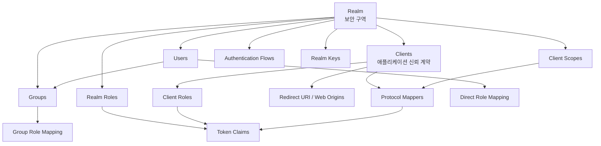

# Chapter 3. Realm, Client, Role 정책 모델

> "Realm은 보안 구역이고, Client는 출입문이며, Role은 출입 권한 배지입니다."

Keycloak을 배우기 어려운 이유는 용어가 많아서가 아닙니다. 현실 세계의 조직, tenant, 서비스, API, 사용자, 권한을 어떤 Keycloak 객체로 번역해야 하는지 결정하기 어렵기 때문입니다. 잘못 번역하면 처음에는 동작하지만, 나중에 realm이 폭증하거나 role이 얽히거나 token에 민감한 claim이 과도하게 실립니다.

이 챕터는 Keycloak의 핵심 객체를 운영자가 이해할 수 있는 모델로 풀어냅니다.

---

## 3.1 설계 질문: "현실의 조직과 권한을 어떤 객체로 표현할까?"

가장 흔한 질문은 이것입니다.

1. tenant를 realm으로 나눌까, group으로 표현할까?
2. 앱별 권한은 realm role로 둘까, client role로 둘까?
3. 조직도 group을 그대로 권한 모델로 써도 될까?
4. API가 필요한 user attribute를 모두 token에 넣어도 될까?

정답은 하나가 아닙니다. 다만 각 객체의 책임을 섞지 않는 것이 중요합니다.

---

## 3.2 핵심 개념 번역표

| Keycloak 개념 | 운영적 비유 | 책임 | 책임이 아닌 것 |
| --- | --- | --- | --- |
| Realm | 독립 보안 구역 | 사용자, client, key, flow, IdP, session 정책 격리 | 모든 조직 구조를 무조건 realm으로 쪼개는 것 |
| Client | 애플리케이션 출입문 | redirect URI, grant, secret, scope, mapper 계약 | 앱 내부 모든 비즈니스 권한 |
| User | 출입 주체 | credential, profile, required action, federation link | HR 원장 전체의 대체재 |
| Group | 사용자 묶음 | role assignment 단순화, 조직적 grouping | 세밀한 API permission engine |
| Role | 권한 배지 | token에 실릴 수 있는 권한 주장 | 영구적인 조직도 원본 |
| Client Scope | claim 묶음 | 여러 client가 공유하는 mapper/scope 표준 | 모든 정보를 기본 token에 넣는 통로 |
| Protocol Mapper | claim 변환기 | user/session/client 정보를 token claim으로 변환 | privacy 검토 없는 데이터 덤프 |

이 표를 기억하면 모델링 실수가 줄어듭니다. Realm은 격리, Client는 신뢰 계약, Role은 권한 주장, Mapper는 token 표면입니다.

---

## 3.3 모델 관계

중요한 점은 모든 화살표가 token으로 끝날 수 있다는 것입니다. token은 외부 시스템으로 전달되는 증거입니다. 그래서 role과 mapper 설계는 내부 편의가 아니라 외부 노출 설계입니다.

---

## 3.4 Realm 분리 전략

| 전략 | 장점 | 대가 | 잘 맞는 경우 |
| --- | --- | --- | --- |
| 환경별 realm | dev/stage/prod 격리가 명확 | client/user 설정 중복 | 환경 간 보안 정책이 다른 조직 |
| tenant별 realm | key, IdP, user, session 정책까지 강하게 분리 | realm 수 증가와 자동화 필요 | B2B SaaS, 강한 tenant 격리 |
| 단일 realm + group/role | SSO와 운영이 단순 | tenant 경계가 약해질 수 있음 | 단일 조직 내부 포털 |
| 조직별 realm | 조직별 정책 독립 | cross-org SSO와 운영 복잡도 증가 | 법적/보안 정책이 독립된 조직 |

Realm을 많이 만들면 격리는 강해집니다. 동시에 key rotation, client 등록, theme, IdP, event retention, backup, automation이 모두 늘어납니다. Realm은 공짜 칸막이가 아니라 운영 단위입니다.

---

## 3.5 Role, Group, Client Scope의 함정

권한은 많이 만들수록 안전해지는 것이 아닙니다. 설명 가능할수록 안전합니다.

| 표현 방식 | 권장 용도 | 피해야 할 사용 |
| --- | --- | --- |
| Realm role | 전역 플랫폼 권한, 공통 admin 권한 | 특정 앱 내부의 세부 permission |
| Client role | 특정 애플리케이션/API 권한 | 모든 서비스가 공유하는 조직 권한 |
| Group | 사용자 묶음과 role assignment | 임시 feature flag나 세밀한 객체 권한 |
| Composite role | 관리 편의를 위한 제한적 묶음 | 중첩이 깊은 effective permission 구조 |
| Client scope | 공통 claim과 mapper 표준화 | 민감정보를 모든 client에 기본 노출 |
| Protocol mapper | 필요한 claim만 token에 싣기 | 모든 user attribute 덤프 |

가장 위험한 조합은 group path를 조직도처럼 만들고, composite role을 깊게 중첩하고, 그 결과를 모두 access token에 넣는 것입니다. 처음에는 편하지만 나중에는 “이 사용자가 왜 이 권한을 가졌는가”를 설명하기 어렵습니다.

---

## 3.6 코드로 확인하는 증거

| 모델 | 확인할 파일 |
| --- | --- |
| Realm | `server-spi/src/main/java/org/keycloak/models/RealmModel.java` |
| Client | `server-spi/src/main/java/org/keycloak/models/ClientModel.java` |
| User | `server-spi/src/main/java/org/keycloak/models/UserModel.java` |
| Role | `server-spi/src/main/java/org/keycloak/models/RoleModel.java` |
| Group | `server-spi/src/main/java/org/keycloak/models/GroupModel.java` |
| Client scope | `server-spi/src/main/java/org/keycloak/models/ClientScopeModel.java` |
| OIDC protocol mapper | `services/src/main/java/org/keycloak/protocol/oidc/mappers/` |

---

## 3.7 운영자의 체크포인트

| 질문 | 실패하면 생기는 일 |
| --- | --- |
| realm 분리 기준이 tenant, 환경, 조직 중 무엇인가? | 격리 부족 또는 realm 폭증 |
| client naming과 ownership이 정해져 있는가? | redirect URI, secret, scope drift |
| role naming convention이 있는가? | effective permission 추적 실패 |
| default scope에 어떤 claim이 들어가는가? | PII 노출과 token bloat |
| group이 조직도인지 권한 묶음인지 구분되는가? | 조직 개편이 권한 사고로 이어짐 |

---

## 3.8 핵심 인사이트

1. **Realm은 운영 단위입니다.** 격리를 얻는 대신 자동화와 lifecycle 관리 비용을 냅니다.
2. **Client는 신뢰 계약입니다.** redirect URI, grant, scope, secret은 모두 보안 결정입니다.
3. **Token claim은 외부 노출입니다.** mapper와 scope는 편의 기능이 아니라 privacy와 compatibility의 경계입니다.

---

## 관련 문서

| 목적 | 문서 |
| --- | --- |
| 정책 모델 상세 | [Realm, Client, User 정책 모델](../20-policy/20-realm-client-user-policy-model.md) |
| 요청 처리 경로 | [서버 런타임과 요청 생명주기](../10-architecture/10-server-runtime-and-request-lifecycle.md) |
| 이전 신뢰 경계 | [Ch.2 시스템 토폴로지와 신뢰 경계](./ch02-system-topology.md) |
| 다음 실행 흐름 | [Ch.4 인증, Token, Session 생명주기](./ch04-authentication-session-token-lifecycle.md) |

## 문서 이동

| 이전 | 다음 | 상위 |
| --- | --- | --- |
| [Ch.2 시스템 토폴로지와 신뢰 경계](./ch02-system-topology.md) | [Ch.4 인증, Token, Session 생명주기](./ch04-authentication-session-token-lifecycle.md) | [백서 홈](../WHITEPAPER.md) |
