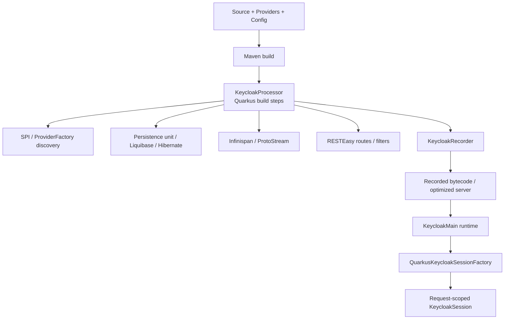
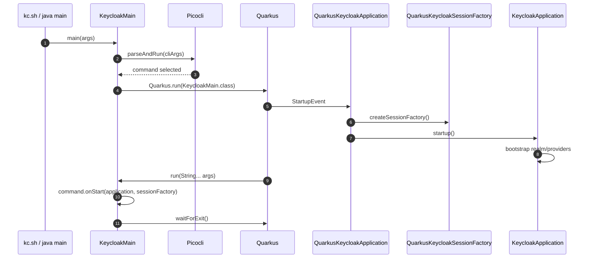

# Chapter 3. Quarkus 전환과 build-time/runtime 분리

> Keycloak on Quarkus는 동적 서버가 아니라 CI/CD에서 조립되는 optimized IAM appliance에 가깝다.

---

## 3.1 설계 질문

왜 Keycloak은 runtime에서 많은 것을 발견하고 동적으로 배포하는 전통적 application server 모델에서, build-time augmentation으로 provider와 runtime topology를 미리 확정하는 Quarkus 모델로 이동했는가?

## 3.2 Keycloak의 답: build-time에 topology를 고정하고 runtime을 가볍게 한다

Keycloak on Quarkus는 Quarkus extension이다. `deployment` module은 build step을 제공하고, `runtime` module은 실제 서버 실행 코드를 제공한다. 이 분리는 단순한 package layout이 아니다. Keycloak이 runtime에서 수행하던 discovery와 bootstrapping 일부를 build-time으로 이동시켜 startup 시간과 runtime 불확실성을 줄이는 설계다.

## 3.3 build-time에 확정하는 것과 runtime에 남기는 것

| Build-time에 확정 | 이유 |
| --- | --- |
| SPI와 provider factory registry | runtime discovery 비용과 불확실성 감소 |
| persistence unit과 JPA entity | Hibernate/Liquibase 초기화 최적화 |
| 일부 build option | optimized server image의 재현성 확보 |
| REST resource/route/filter 구성 | Quarkus native build-time model에 맞춤 |
| theme/provider resource discovery | runtime classpath scanning 최소화 |
| ProtoStream/cache schema | Infinispan serialization 준비 |

| Runtime에 남김 | 이유 |
| --- | --- |
| DB password, client secret, TLS secret | secret은 artifact에 고정하면 안 됨 |
| request context | 요청마다 realm, client, user, headers가 달라짐 |
| realm/client/user 정책 데이터 | Admin API로 변경되는 운영 상태 |
| session/cache state | runtime traffic에 의해 생성/소멸 |
| token 발급과 검증 | 사용자, client, scope, session에 따라 달라짐 |

## 3.4 Keycloak startup lifecycle

이 흐름에서 `KeycloakMain`은 CLI와 Quarkus runtime을 연결하고, `QuarkusKeycloakApplication`은 server lifecycle을 `StartupEvent`와 `ShutdownEvent`에 연결한다. `QuarkusKeycloakSessionFactory`는 build-time에 전달된 provider topology를 runtime의 session factory로 구체화한다.

## 3.5 대안 분석

| 기준 | 전통적 동적 app server 모델 | Quarkus optimized 모델 |
| --- | --- | --- |
| startup | 느릴 수 있음 | 빠르고 예측 가능 |
| runtime discovery | 유연함 | 최소화 |
| provider 변경 | runtime hot-deploy에 가까움 | rebuild/re-augmentation 필요 |
| container immutability | 약함 | 강함 |
| 운영 drift | runtime 변경으로 증가 가능 | image와 config로 통제 가능 |
| 개발 편의 | 동적성 높음 | build-time/runtime option 구분 필요 |

핵심 tradeoff는 명확하다. Quarkus는 startup 예측 가능성과 immutable 운영성을 주는 대신, provider/theme/DB vendor/build option 변경 시점이 runtime에서 build pipeline으로 이동한다.

## 3.6 Custom provider와 optimized image의 운영 대가

custom provider를 `/providers`에 넣는 것은 단순 파일 배포처럼 보일 수 있다. 그러나 Quarkus optimized server에서는 provider discovery와 build-time augmentation이 중요하다. Provider를 추가하면 image build 또는 re-augmentation, compatibility 검증, rolling update 전략이 필요하다.

| 변경 | 필요한 고려 |
| --- | --- |
| provider JAR 추가 | classpath 충돌, SPI discovery, image rebuild |
| provider config 변경 | realm component config와 runtime option 구분 |
| theme JAR 추가 | theme resource discovery, content hash, cache |
| DB vendor 변경 | JDBC driver, persistence unit, build option |
| feature flag 변경 | build-time feature인지 runtime feature인지 확인 |

## 3.7 소스코드 증거

| 주장 | 근거 파일 |
| --- | --- |
| CLI entrypoint는 `KeycloakMain`이다 | `quarkus/runtime/src/main/java/org/keycloak/quarkus/runtime/KeycloakMain.java` |
| build step은 `KeycloakProcessor`가 담당한다 | `quarkus/deployment/src/main/java/org/keycloak/quarkus/deployment/KeycloakProcessor.java` |
| build step과 runtime은 `KeycloakRecorder`로 연결된다 | `quarkus/runtime/src/main/java/org/keycloak/quarkus/runtime/KeycloakRecorder.java` |
| Quarkus application은 `QuarkusKeycloakApplication`이 `KeycloakApplication`을 연결한다 | `quarkus/runtime/src/main/java/org/keycloak/quarkus/runtime/integration/jaxrs/QuarkusKeycloakApplication.java` |
| 서버 distribution은 `quarkus/dist`에서 package된다 | `quarkus/dist/pom.xml`, `quarkus/dist/assembly.xml` |

## 3.8 운영자가 결정할 것

| 결정 | 선택지 | 영향 |
| --- | --- | --- |
| custom provider 배포 방식 | external JAR, custom image, in-tree module | rebuild와 rolling update 전략 결정 |
| optimized image 사용 | `build` 후 optimized start, 자동 build | startup 시간과 설정 변경 유연성의 tradeoff |
| build-time option 관리 | Dockerfile, CI pipeline, Operator CR | 운영자가 실제 runtime state를 추적할 수 있어야 함 |
| dev mode 사용 범위 | local only, shared dev env | production에서는 dev mode 금지 |

## 3.9 이 챕터의 핵심 인사이트

1. Quarkus 전환은 framework 교체가 아니라 운영 모델의 변화다.
2. Keycloak은 provider topology와 persistence topology를 가능한 build-time에 확정하려 한다.
3. custom provider와 theme은 단순 파일 복사가 아니라 image build/re-augmentation 전략의 일부다.
4. Operator가 CR을 관리하더라도 image 내부 build-time state는 별도 supply chain으로 관리해야 한다.

---

| 방향 | 문서 |
| --- | --- |
| 이전 | [Ch.2 시스템 토폴로지와 신뢰 경계](ch02-topology-and-trust-boundaries.md) |
| 다음 | [Ch.4 SPI, Provider, Session 계약](ch04-spi-provider-session-contract.md) |
| 백서 색인 | [WHITEPAPER.md](../WHITEPAPER.md) |
