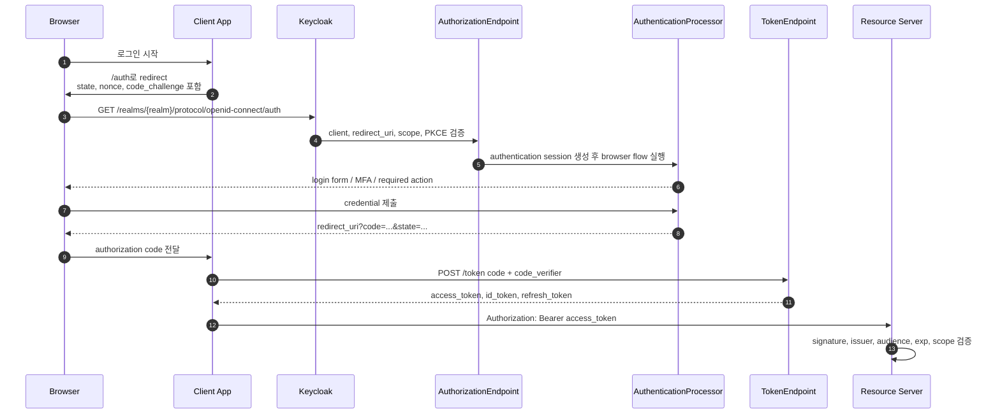

# Chapter 4. 인증, Token, Session 생명주기

> "Token은 영구 권한이 아니라, 제한된 시간 동안 발급되는 신뢰 증명서입니다."

사용자는 로그인에 성공했다고 생각합니다. 하지만 시스템 관점에서 중요한 것은 “화면이 넘어갔다”가 아닙니다. 애플리케이션이 API를 호출할 때 resource server가 검증할 수 있는 증거, 즉 token이 만들어졌는가입니다. 그리고 그 token 뒤에는 authorization code, PKCE, authentication session, user session, refresh token, cache, DB가 연결되어 있습니다.

이 챕터는 로그인 버튼부터 API 호출까지의 여정을 따라가며, Keycloak이 어떤 상태와 증거를 만드는지 설명합니다.

---

## 4.1 설계 질문: "서비스는 무엇을 신뢰해야 하는가?"

브라우저에서 사용자가 비밀번호를 입력했다는 사실을 API 서버가 직접 볼 수는 없습니다. API 서버가 볼 수 있는 것은 bearer token입니다. 따라서 질문은 이렇게 바뀝니다.

1. token은 어떤 client 요청에서 발급되었는가?
2. 사용자는 어떤 flow를 통과했는가?
3. token은 어느 realm의 key로 서명되었는가?
4. 이 token은 내 API를 대상으로 발급되었는가?
5. session과 refresh token은 언제까지 살아 있는가?

---

## 4.2 Authorization Code + PKCE 흐름

Authorization Code + PKCE는 복잡해 보이지만 목적은 명확합니다. 브라우저에서 직접 token을 노출하지 않고, authorization code가 탈취되더라도 code verifier 없이는 token으로 교환하지 못하게 만드는 것입니다.

---

## 4.3 Token 세 종류를 구분하기

| Token | 누구를 위한 것인가 | 담는 의미 | 운영상 주의 |
| --- | --- | --- | --- |
| Access token | Resource server | API 접근에 필요한 claim | 짧게 유지하고 audience/scope 검증 |
| ID token | Client app | 로그인한 사용자의 인증 결과 | API authorization에 사용하지 않음 |
| Refresh token | Client app | 새 access token을 받을 수 있는 권한 | rotation, reuse detection, session TTL과 함께 설계 |
| Offline token | 장기 background job | 사용자 부재 시 장기 접근 | 강한 보관, revocation, audit 필요 |

Access token이 짧아도 refresh token과 user session이 길면 공격자는 refresh 경로를 노립니다. 반대로 모든 TTL을 너무 짧게 잡으면 SSO의 의미가 사라집니다. token TTL과 session TTL은 하나의 위험 수명 모델로 함께 설계해야 합니다.

---

## 4.4 Session은 쿠키 하나가 아니다

SSO는 사용자가 여러 앱을 오가며 다시 로그인하지 않는 경험입니다. 그 경험 뒤에는 여러 상태가 있습니다.

| 상태 | 쉬운 설명 | 깨졌을 때 보이는 현상 |
| --- | --- | --- |
| Authentication session | 로그인 중인 브라우저 탭의 임시 상태 | 로그인 flow가 중간에 끊김 |
| User session | 사용자의 SSO 상태 | 여러 앱에서 재로그인 요구 |
| Client session | user session에 연결된 앱별 상태 | 특정 client logout/refresh 문제 |
| Offline session | 장기 access를 위한 session | 장기 token 탈취와 cleanup 부담 |
| Login failure state | brute force 방어 상태 | lockout 오탐 또는 공격 탐지 실패 |
| Action token | reset/verify 같은 일회성 링크 | replay 방지 실패 또는 이메일 flow 실패 |

Keycloak은 DB와 Infinispan을 함께 사용합니다. DB는 정책과 장기 상태의 장부이고, Infinispan은 session/cache의 빠른 상태 저장소입니다. 이 둘의 경계가 SSO UX와 장애 복구 방식을 결정합니다.

---

## 4.5 DB와 Cache의 역할 분담

| 상태 | 주 저장 위치 | 운영 포인트 |
| --- | --- | --- |
| realm/client/role/group config | DB + cache | invalidation 실패 시 node별 정책 차이 |
| local user profile/credential | DB + user cache | user disable 반영 지연 주의 |
| user/client session | Infinispan, persistent mode에서는 DB persister 병행 | restart resilience와 DB 부하 tradeoff |
| authentication session | Infinispan | 로그인 중간 상태이므로 재시도 가능성 중요 |
| action token/single-use object | Infinispan | replay 방지와 TTL 중요 |
| user/admin event | DB 또는 event listener | audit retention과 SIEM export 결정 |

Persistent session은 restart 후 사용자 경험을 개선할 수 있지만 DB를 session SLO의 일부로 만듭니다. Volatile session은 단순하지만 pod/cache 장애가 재로그인으로 보일 수 있습니다. Sticky session은 보안 필수 조건은 아니지만 cache locality를 높여 latency와 remote lookup을 줄여 줍니다.

---

## 4.6 Resource server의 책임

Keycloak이 token을 발급했다고 해서 API가 자동으로 안전해지는 것은 아닙니다. API는 token을 검증해야 합니다.

처음 OIDC를 접하는 독자라면 이 표를 “출입증을 확인하는 순서”로 보면 됩니다. 서명은 위조 여부를 확인하는 것이고, issuer는 어느 관청이 발급했는지, audience는 이 출입증이 우리 건물용인지, scope와 role은 어느 문까지 열 수 있는지를 확인하는 과정입니다.

| 검증 항목 | 왜 필요한가 |
| --- | --- |
| signature | Keycloak realm key로 발급되었는지 확인 |
| issuer | 올바른 realm에서 나온 token인지 확인 |
| audience | 이 API를 대상으로 발급된 token인지 확인 |
| expiration / not-before | 만료와 revocation boundary 확인 |
| scope / role | 요청 작업에 필요한 권한 claim 확인 |
| azp / client_id | token을 받은 client, 즉 authorized party 확인 |

가장 흔한 실수는 signature만 보고 token을 믿는 것입니다. 서명이 맞는 token도 다른 API를 위한 token일 수 있습니다.

---

## 4.7 코드로 확인하는 증거

| 주장 | 확인할 파일 |
| --- | --- |
| OIDC endpoint는 protocol service에서 분기된다 | `services/src/main/java/org/keycloak/protocol/oidc/OIDCLoginProtocolService.java` |
| authorization request 검증은 authorization endpoint가 담당한다 | `services/src/main/java/org/keycloak/protocol/oidc/endpoints/AuthorizationEndpoint.java` |
| token endpoint는 grant와 client auth를 처리한다 | `services/src/main/java/org/keycloak/protocol/oidc/endpoints/TokenEndpoint.java` |
| token 생성과 refresh validation은 `TokenManager` 중심이다 | `services/src/main/java/org/keycloak/protocol/oidc/TokenManager.java` |
| authentication flow는 processor가 실행한다 | `services/src/main/java/org/keycloak/authentication/AuthenticationProcessor.java` |
| session provider 계약은 public SPI에 있다 | `server-spi/src/main/java/org/keycloak/models/UserSessionProvider.java`, `server-spi/src/main/java/org/keycloak/models/UserSessionModel.java` |
| Infinispan session provider와 persistent session provider가 존재한다 | `model/infinispan/src/main/java/org/keycloak/models/sessions/infinispan/InfinispanUserSessionProvider.java`, `model/infinispan/src/main/java/org/keycloak/models/sessions/infinispan/PersistentUserSessionProvider.java` |
| persistent session JPA entity와 persister가 존재한다 | `model/jpa/src/main/java/org/keycloak/models/jpa/session/PersistentUserSessionEntity.java`, `model/jpa/src/main/java/org/keycloak/models/jpa/session/JpaUserSessionPersisterProvider.java` |

---

## 4.8 운영자의 체크포인트

| 질문 | 기준 |
| --- | --- |
| access token TTL은 얼마나 짧게 잡을 것인가? | 탈취 피해와 refresh 부하의 균형 |
| refresh token rotation을 사용할 것인가? | client 구현 복잡도와 재사용 탐지의 균형 |
| session은 persistent인가 volatile인가? | restart UX와 DB write 비용의 균형 |
| sticky session을 설정할 것인가? | cache locality와 LB 운영 복잡도의 균형 |
| resource server 검증 checklist가 있는가? | issuer/audience/scope 누락 방지 |

---

## 4.9 핵심 인사이트

1. **로그인 성공과 API 신뢰는 다릅니다.** API가 믿는 것은 사용자 입력이 아니라 검증 가능한 token입니다.
2. **SSO는 distributed state 문제입니다.** session, cache, DB, TTL, logout propagation이 함께 움직입니다.
3. **TTL은 UX와 보안의 계약입니다.** access token, refresh token, user session을 따로 보지 말고 하나의 위험 수명으로 설계해야 합니다.

---

| 방향 | 문서 |
| --- | --- |
| **이전 챕터** | [Ch.3 Realm, Client, Role 정책 모델](./ch03-identity-policy-model.md) |
| **다음 챕터** | [Ch.5 Federation과 Identity Brokering](./ch05-federation-and-brokering.md) |
| **백서 홈** | [WHITEPAPER.md](../WHITEPAPER.md) |
