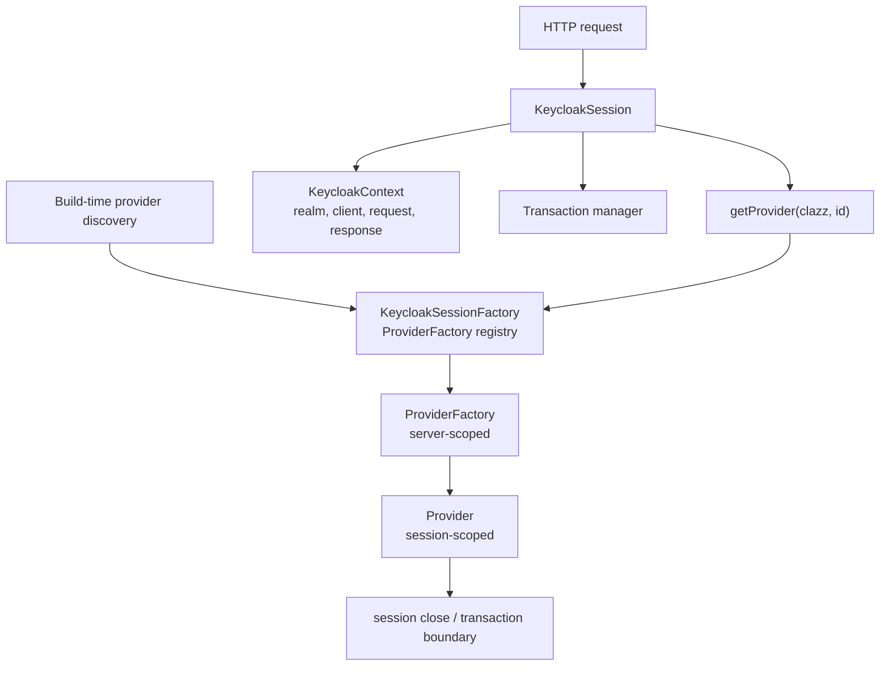

# Chapter 4. SPI, Provider, Session 계약

> Keycloak의 확장성은 plugin 목록이 아니라 request-scoped provider mesh에서 나온다.

---

## 4.1 설계 질문

IAM 서버는 authentication, token mapper, event listener, user storage, theme, protocol extension을 어떻게 확장 가능하게 하면서도 runtime consistency를 유지할 수 있는가?

## 4.2 Keycloak의 답: SPI, ProviderFactory, Provider, KeycloakSession

이 구조는 Keycloak 내부의 거의 모든 확장 지점을 설명한다. Authenticator, required action, protocol mapper, event listener, user storage provider, theme provider, vault provider, key provider 등은 모두 SPI/provider 모델로 이해할 수 있다.

## 4.3 lifecycle 계약

| 개념 | lifecycle | 의미 |
| --- | --- | --- |
| `Spi` | 서버 전체 | provider type과 extension point를 정의한다. |
| `ProviderFactory` | 서버 전체 | `init`, `postInit`, `create(session)`, `close`, `getId`를 가진다. |
| `Provider` | session/request 단위 | session별로 생성/cache되고 close된다. |
| `KeycloakSessionFactory` | 서버 전체 | SPI별 provider factory registry와 default provider를 관리한다. |
| `KeycloakSession` | request/transaction 단위 | provider lookup, context, transaction, datastore 접근의 중심이다. |

`ProviderFactory`는 singleton에 가깝고, `Provider`는 request/session-scoped 실행 객체다. 따라서 factory에는 thread-safe한 shared configuration을 두고, request-specific 상태는 provider나 `KeycloakSession` context에 둬야 한다.

## 4.4 왜 이 방식인가

| 설계 요구 | Keycloak의 선택 | 대가 |
| --- | --- | --- |
| 다양한 인증 방식 추가 | Authenticator SPI | flow execution과 UI/required action까지 이해해야 함 |
| token claim 변환 | Protocol Mapper SPI | token bloat와 PII 노출 위험 |
| 외부 user store 연결 | User Storage Provider SPI | latency, consistency, timeout이 login path에 들어옴 |
| audit/event side effect | Event Listener SPI | transaction boundary와 실패 정책을 설계해야 함 |
| theme customization | Theme provider/resource | build/re-augmentation과 resource cache 고려 필요 |
| build-time 최적화 | provider registry 사전 계산 | runtime hot-deploy 유연성 감소 |

## 4.5 Provider는 sandbox가 아니다

custom provider는 Keycloak process 안에서 실행된다. 이는 강력한 확장성을 의미하지만 동시에 강한 신뢰를 요구한다.

| 위험 | 설명 |
| --- | --- |
| classpath 충돌 | provider JAR dependency가 서버 dependency와 충돌할 수 있다. |
| secret 접근 | provider는 server process 권한 안에서 실행된다. |
| transaction side effect | provider가 session transaction과 얽힐 수 있다. |
| latency 전파 | authenticator/user storage provider 지연이 login/token path를 지연시킨다. |
| rollback 어려움 | provider 변경은 image build와 rolling update에 결합된다. |

## 4.6 Provider category별 설계 압력

| Provider category | 주된 설계 압력 | 실패 영향 |
| --- | --- | --- |
| Authenticator | 사용자 interaction, challenge, credential validation | login 실패, lockout, UX 문제 |
| Required Action | 인증 후 사용자 조치와 action token | 계정 복구/보안 등록 실패 |
| Protocol Mapper | token claim shape | resource server authorization 오류, PII 노출 |
| User Storage Provider | external lookup/query/credential validation | login latency, timeout, stale user |
| Event Listener | audit side effect | 감사 누락, transaction 지연 |
| Key Provider | signing/encryption key | token validation 장애 |
| Theme Provider | UI resource | login/account/admin UI rendering 실패 |

## 4.7 Session context가 중요한 이유

`KeycloakSession`은 단순 provider locator가 아니다. session은 request context, realm context, transaction manager, attribute map, invalidation map, datastore facade를 함께 제공한다. 이는 provider가 realm-aware하고 transaction-aware하게 동작하게 하지만, 동시에 provider가 잘못된 context에서 호출되면 실패할 수 있음을 뜻한다.

| Session 요소 | 의미 |
| --- | --- |
| `getContext().getRealm()` | realm-specific provider/component resolution의 기준 |
| `getTransactionManager()` | provider 작업의 commit/rollback 경계 |
| `getProvider(clazz, id)` | session-scoped provider instance lookup |
| `setAttribute/getAttribute` | request lifecycle 중 provider 간 임시 상태 전달 |
| `invalidate` | cache/provider invalidation hook |
| `realms/users/clients/sessions` | datastore facade shortcut |

## 4.8 소스코드 증거

| 주장 | 근거 파일 |
| --- | --- |
| `ProviderFactory`는 server-scoped factory lifecycle을 가진다 | `server-spi/src/main/java/org/keycloak/provider/ProviderFactory.java` |
| `Provider`는 close 가능한 provider contract다 | `server-spi/src/main/java/org/keycloak/provider/Provider.java` |
| `KeycloakSession`은 provider lookup과 model facade를 제공한다 | `server-spi/src/main/java/org/keycloak/models/KeycloakSession.java` |
| `DefaultKeycloakSession`은 provider instance를 session map에 cache한다 | `services/src/main/java/org/keycloak/services/DefaultKeycloakSession.java` |
| Quarkus는 provider factory를 build-time에 로딩한다 | `quarkus/deployment/src/main/java/org/keycloak/quarkus/deployment/KeycloakProcessor.java` |

## 4.9 운영자가 결정할 것

| 결정 | 질문 | 영향 |
| --- | --- | --- |
| Provider 신뢰 수준 | 사내 provider를 server process 안에 넣어도 되는가? | 코드 리뷰, dependency 검증, supply chain 통제 필요 |
| Provider 배포 단위 | Keycloak image에 포함할 것인가 외부 JAR로 배포할 것인가? | build/re-augmentation, rollback 전략이 달라짐 |
| Event listener 실패 정책 | listener 실패가 요청 실패로 이어져야 하는가? | audit 완전성과 availability tradeoff |
| User storage timeout | 외부 저장소 지연을 얼마나 기다릴 것인가? | login latency와 availability에 영향 |

## 4.10 이 챕터의 핵심 인사이트

1. Keycloak의 확장성은 SPI 목록이 아니라 session-scoped provider lifecycle에서 나온다.
2. ProviderFactory는 서버 전체 singleton이고 Provider는 request/session 단위 실행 객체다.
3. custom provider는 신뢰 경계 내부로 들어오는 코드이므로 보안, dependency, latency, rollout 전략을 함께 검토해야 한다.
4. `KeycloakSession` context를 이해하지 못한 provider는 realm, transaction, cache consistency 문제를 일으킬 수 있다.

---

| 방향 | 문서 |
| --- | --- |
| 이전 | [Ch.3 Quarkus 전환과 build-time/runtime 분리](ch03-quarkus-build-runtime-boundary.md) |
| 다음 | [Ch.5 Realm, Client, User 모델링](ch05-realm-client-user-modeling.md) |
| 백서 색인 | [WHITEPAPER.md](../WHITEPAPER.md) |
