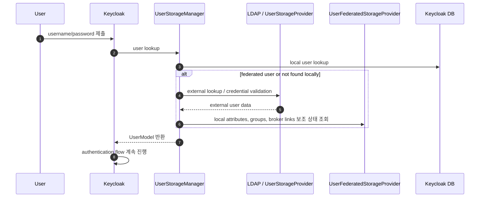

# Chapter 5. Federation과 Identity Brokering

> "외부 신원을 받아들이되, 내부 신뢰 경계는 우리가 결정합니다."

대부분의 조직은 Keycloak을 처음 도입할 때 이미 사용자 저장소를 가지고 있습니다. 직원은 LDAP이나 Active Directory에 있고, 고객은 외부 OIDC IdP에 있고, 파트너는 SAML로 들어오며, 일부 서비스 계정은 Keycloak 내부에 있습니다. 그래서 질문은 “사용자를 어디에 저장할까?”보다 더 복잡합니다.

**어떤 신원 정보는 외부에서 믿고, 어떤 권한 판단은 Keycloak 안에서 다시 해석할 것인가?**

이 챕터는 local user, federation, identity brokering의 차이를 설명하고, account linking과 mapper가 왜 보안 경계인지 다룹니다.

---

## 5.1 설계 질문: "이미 있는 신원 체계를 어떻게 안전하게 연결할까?"

기업은 보통 새 IAM을 도입한다고 해서 기존 LDAP/AD를 버리지 않습니다. 오히려 Keycloak은 기존 identity source를 modern OIDC/SAML 세계로 연결하는 관문이 됩니다.

하지만 연결은 곧 신뢰의 확장입니다.

1. LDAP의 group을 Keycloak role로 자동 매핑해도 되는가?
2. 외부 IdP가 준 email이 기존 local user와 같으면 자동 연결해도 되는가?
3. 외부 계정이 비활성화되었을 때 local session은 언제 사라지는가?
4. 외부 IdP의 claim을 token에 그대로 실어도 되는가?

---

## 5.2 세 가지 사용자 출처

| 모델 | 쉬운 설명 | 장점 | 대가 |
| --- | --- | --- | --- |
| Local user | Keycloak DB가 사용자와 credential을 직접 보관 | 단순하고 독립적 | 기존 enterprise identity와 중복 |
| User federation | LDAP/AD/external store에서 사용자 조회와 credential 검증 | 기존 계정 체계 재사용 | login latency와 availability가 외부 저장소에 종속 |
| Identity brokering | 외부 OIDC/SAML IdP에 인증을 위임 | social/enterprise SSO가 쉬움 | account linking, mapper, logout 동기화 위험 |

Federation은 “Keycloak이 외부 사용자 저장소를 직접 들여다보는 방식”에 가깝습니다. Brokering은 “Keycloak이 외부 IdP의 인증 결과를 받아 local identity로 연결하는 방식”입니다. 둘은 비슷해 보이지만 운영 리스크가 다릅니다.

---

## 5.3 Federation: LDAP을 login path에 넣는다는 것

LDAP federation을 켜면 Keycloak login path 안에 LDAP latency와 availability가 들어옵니다. Import users를 켜면 성능과 독립성이 좋아지지만 stale local copy를 관리해야 합니다. Import를 끄면 최신성이 좋아지지만 LDAP 장애가 곧 login 장애가 됩니다.

---

## 5.4 Broker flow에서 가장 위험한 순간

Identity brokering에서 가장 위험한 순간은 외부 IdP가 인증한 사용자를 local account와 연결할 때입니다.

처음 운영자가 헷갈리는 지점은 “같은 이메일이면 같은 사람 아닌가?”라는 직관입니다. 현실에서는 그렇지 않을 수 있습니다. 외부 IdP마다 email 검증 기준이 다르고, tenant가 재생성될 수 있으며, 같은 이메일 주소가 다른 identity namespace에서 다시 등장할 수 있습니다. 그래서 broker link는 단순 email matching이 아니라 issuer, subject, provider alias, first-login 정책까지 포함한 신뢰 결정입니다.

| 위협 | 발생 조건 | 결과 | 방어 기준 |
| --- | --- | --- | --- |
| email collision | 서로 다른 IdP namespace에서 같은 email 사용 | 잘못된 local account 연결 | issuer/provider alias까지 identity key에 포함 |
| unverified email 신뢰 | 외부 IdP의 `email_verified` 의미가 약함 | 이메일 claim만으로 계정 점유 | verified email만 자동 연결, 민감 realm은 수동 승인 |
| IdP namespace 재사용 | 외부 tenant 재생성 또는 domain 재할당 | 과거 사용자와 새 사용자 subject 충돌 | issuer, subject, tenant lifecycle 검토 |
| mapper claim 오염 | 외부 group/role claim을 local role로 직접 승격 | 권한 과다 부여 | mapper allowlist와 admin event audit |
| stale broker link | 외부 계정 삭제 후 local link 유지 | deprovisioning 지연 | broker link review와 session TTL 제한 |

외부 IdP가 “이 사람은 누구다”라고 말하는 것과, 우리 시스템이 “이 사람에게 어떤 권한을 준다”라고 결정하는 것은 다릅니다. 이 둘을 분리하지 않으면 외부 claim이 내부 권한으로 바로 승격됩니다.

---

## 5.5 Keycloak의 답: sidecar state와 mapper 계층

Keycloak은 외부 identity를 그대로 통과시키지 않습니다. Federation에서는 `UserStorageProvider`가 외부 lookup과 credential validation을 담당하고, `UserFederatedStorageProvider`가 외부 사용자에 대한 local 보조 상태를 저장합니다. Brokering에서는 외부 IdP의 subject와 claim을 받은 뒤, first broker login flow와 mapper를 통해 local user, required action, broker link로 변환합니다.

이 구조는 절충입니다.

| 극단적 접근 | 문제 |
| --- | --- |
| 모든 것을 외부 LDAP/IdP에 맡김 | Keycloak의 role, audit, required action, token mapper를 충분히 활용하기 어려움 |
| 모든 것을 Keycloak DB로 복제 | 기존 identity source와 drift가 생김 |
| sidecar state + mapper | 외부 신원과 local authorization 사이에 통제 가능한 번역 계층을 둠 |

Keycloak의 mapper 계층은 편의 기능이 아니라 신뢰 경계입니다. mapper 변경은 권한 정책 변경으로 취급해야 합니다.

---

## 5.6 LDAP 운영 결정

LDAP 설정에서도 비슷한 혼동이 생깁니다. `import users`는 사용자를 Keycloak DB에 영구 복제한다는 뜻이 아니라, 외부 사용자를 더 빠르게 조회하기 위한 local representation을 만들 수 있다는 뜻입니다. `edit mode`는 “어디에서 수정할 수 있는가”를 정하고, sync schedule은 “얼마나 오래 stale 상태를 허용할 것인가”를 정합니다.

| 결정 | 선택지 | tradeoff |
| --- | --- | --- |
| import users | on, off | on은 성능과 독립성을 높이지만 stale copy 관리 필요 |
| edit mode | `READ_ONLY`, `WRITABLE`, `UNSYNCED` | attribute ownership과 audit 기준이 달라짐 |
| sync schedule | full sync, changed sync, on-demand | batch 부하와 staleness window 균형 |
| group/role mapper | LDAP group을 local group/role로 매핑 | 중앙 권한 관리는 쉬워지지만 token bloat 위험 |
| timeout | 짧게 실패, 길게 대기 | login availability와 정상 사용자 실패율 균형 |
| deprovisioning SLA | 즉시, session TTL 내, batch | 퇴사자 접근 잔존 시간 결정 |

운영 기본은 source of truth를 명확히 하는 것입니다. user profile, credential, group, role 각각이 LDAP, 외부 IdP, Keycloak 중 어디에서 관리되는지 문서화해야 합니다.

---

## 5.7 코드로 확인하는 증거

| 주장 | 확인할 파일 |
| --- | --- |
| user storage provider SPI는 외부 store 계약을 정의한다 | `model/storage/src/main/java/org/keycloak/storage/UserStorageProvider.java` |
| user storage manager가 local/federated/external provider를 통합한다 | `model/storage-private/src/main/java/org/keycloak/storage/UserStorageManager.java` |
| federated sidecar state와 broker link 계약이 존재한다 | `model/storage/src/main/java/org/keycloak/storage/federated/UserFederatedStorageProvider.java`, `model/storage/src/main/java/org/keycloak/storage/federated/UserBrokerLinkFederatedStorage.java` |
| LDAP provider와 mapper 계층이 production federation 구현을 제공한다 | `federation/ldap/src/main/java/org/keycloak/storage/ldap/LDAPStorageProvider.java`, `federation/ldap/src/main/java/org/keycloak/storage/ldap/mappers/` |
| broker endpoint는 realm resource에서 위임된다 | `services/src/main/java/org/keycloak/services/resources/IdentityBrokerService.java` |
| OIDC/SAML broker implementation이 외부 token/assertion을 처리한다 | `services/src/main/java/org/keycloak/broker/oidc/OIDCIdentityProvider.java`, `services/src/main/java/org/keycloak/broker/saml/SAMLIdentityProvider.java` |

---

## 5.8 운영자의 체크포인트

| 질문 | 왜 중요한가 |
| --- | --- |
| user profile, credential, group, role의 source of truth가 각각 어디인가? | ownership이 없으면 sync drift가 생깁니다. |
| 외부 IdP의 email/email_verified를 어떤 수준으로 믿는가? | 자동 account linking의 안전성이 결정됩니다. |
| mapper 변경은 누가 승인하는가? | 외부 claim이 local 권한으로 승격될 수 있습니다. |
| 외부 계정 비활성화 후 access 가능 시간은 얼마인가? | deprovisioning SLA와 token/session TTL이 연결됩니다. |

---

## 5.9 핵심 인사이트

1. **Federation은 편리하지만 login SLO를 외부 시스템에 묶습니다.** LDAP/AD timeout은 곧 사용자 로그인 지연입니다.
2. **Brokered identity와 local authorization은 다릅니다.** 외부 IdP가 인증했다는 사실이 내부 권한을 자동으로 의미하지 않습니다.
3. **Mapper와 account linking은 보안 경계입니다.** 설정 변경 하나가 account takeover나 권한 상승으로 이어질 수 있습니다.

---

## 관련 문서

| 목적 | 문서 |
| --- | --- |
| federation 정책 모델 | [Realm, Client, User 정책 모델](../20-policy/20-realm-client-user-policy-model.md) |
| integration surface | [UI, Operator, 테스트와 확장 지점](../30-integration/30-ui-operator-tests-and-extension-points.md) |
| 운영 dependency 기준 | [운영, 보안, 관측성 계약](../50-operations/50-operations-security-observability.md) |
| 다음 SPI 확장 모델 | [Ch.6 SPI, Provider, Quarkus 런타임](./ch06-extension-runtime-model.md) |

## 문서 이동

| 이전 | 다음 | 상위 |
| --- | --- | --- |
| [Ch.4 인증, Token, Session 생명주기](./ch04-authentication-session-token-lifecycle.md) | [Ch.6 SPI, Provider, Quarkus 런타임](./ch06-extension-runtime-model.md) | [백서 홈](../WHITEPAPER.md) |
