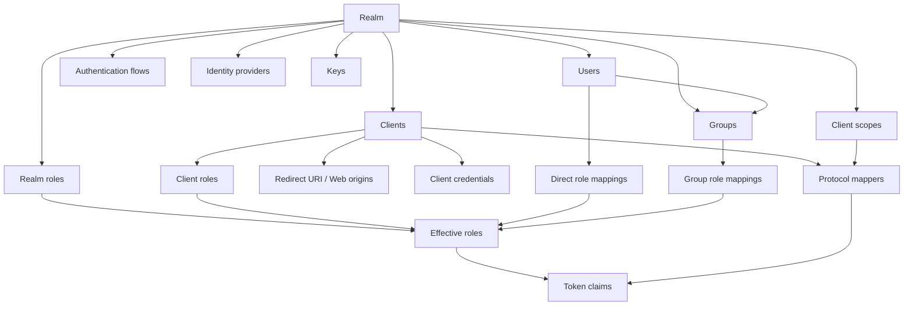

# Chapter 5. Realm, Client, User 모델링

> Realm은 격리의 단위이고, Client는 애플리케이션 신뢰 계약이며, Role은 token에 실릴 수 있는 권한 주장이다.

---

## 5.1 설계 질문

조직, tenant, 환경, 애플리케이션, API, 사용자, 권한을 Keycloak의 어떤 객체로 모델링해야 하는가?

## 5.2 모델 관계

## 5.3 Realm 분리 전략

| 전략 | 장점 | 대가 | 권장 상황 |
| --- | --- | --- | --- |
| 환경별 realm | dev/stage/prod policy 분리 | client/user 중복 관리 | 환경 간 격리가 중요한 조직 |
| tenant별 realm | 강한 tenant 격리, key/IdP 독립 | realm 수 증가, 운영 자동화 필요 | B2B/SaaS 다중 tenant |
| 단일 realm + group/role 분리 | SSO 공유와 운영 단순성 | tenant boundary가 약해질 수 있음 | 내부 사내 포털/단일 조직 |
| 조직별 realm | 조직 정책 독립성 | cross-org SSO/권한 복잡 | 독립 보안 정책 조직 |

Realm은 격리를 제공하지만 공짜가 아니다. realm 수가 늘수록 client 설정, key rotation, theme, IdP, event retention, automation이 모두 증가한다.

## 5.4 Client 설계

| Client 유형 | 권장 flow | 보안 기준 |
| --- | --- | --- |
| SPA | Authorization Code + PKCE | exact redirect URI, short token TTL, refresh token rotation 검토 |
| BFF/Web server | Authorization Code | confidential client secret/private key 관리 |
| Backend API | bearer token validation | issuer/audience/signature/scope 검증 |
| CLI | Device flow 또는 Authorization Code + PKCE | local callback/verification UX 고려 |
| Machine-to-machine | Client Credentials | service account role 최소화, secret rotation |
| Legacy enterprise app | SAML | assertion mapper, clock skew, logout 처리 검토 |

## 5.5 Role과 Group의 tension

| 모델링 방식 | 장점 | 위험 |
| --- | --- | --- |
| realm role 중심 | 전역 권한을 단순하게 표현 | 모든 client에 과도하게 노출될 수 있음 |
| client role 중심 | application-specific 권한에 적합 | client 수 증가 시 관리 복잡 |
| group role 상속 | 조직 단위 권한 관리 쉬움 | 조직 구조와 권한 구조가 혼동될 수 있음 |
| composite role | 권한 묶음 관리 편함 | effective permission이 불투명해질 수 있음 |
| mapper로 role claim 노출 | resource server 단순화 | token size와 정보 노출 증가 |

## 5.6 Client scope와 protocol mapper

Client scope는 여러 client가 공유할 수 있는 mapper와 role scope mapping 묶음이다. Protocol mapper는 내부 user/session/client 정보를 token claim으로 변환한다. 이 두 기능은 강력하지만, 토큰이 외부 시스템에 전달되는 순간 privacy와 compatibility 문제가 된다.

| Mapper 전략 | 장점 | 대가 |
| --- | --- | --- |
| 모든 user attribute 노출 | resource server 구현 단순 | PII 노출, token size 증가 |
| 최소 claim 노출 | privacy와 token size 개선 | API가 추가 lookup 또는 policy call 필요 |
| default scope에 공통 claim | client onboarding 쉬움 | 모든 client에 불필요한 claim 노출 가능 |
| optional scope 사용 | client별 최소 권한 | client integration 문서화 필요 |
| audience mapper 사용 | resource server 검증 명확 | audience 설계가 필요 |

## 5.7 모델링 anti-pattern

| Anti-pattern | 왜 위험한가 | 대안 |
| --- | --- | --- |
| 하나의 admin role에 모든 권한 부여 | 감사와 최소 권한 원칙 훼손 | client별 role과 fine-grained admin permission |
| group path를 그대로 authorization에 사용 | 조직 개편이 권한 변경으로 이어짐 | application-specific client role |
| 모든 claim을 access token에 포함 | token bloat와 PII 노출 | optional scope와 userinfo/API lookup |
| tenant를 client name prefix로만 구분 | token/key/user policy 격리 부족 | realm 또는 group/attribute 기반 명시적 tenant model |
| composite role 중첩 | effective permission 추적 어려움 | 권한 matrix와 role review |

## 5.8 운영자가 결정할 것

| 결정 | 질문 | 잘못 결정했을 때 결과 |
| --- | --- | --- |
| realm 분리 단위 | tenant, 환경, 조직 중 무엇으로 나눌 것인가 | realm 폭증 또는 격리 부족 |
| client naming | 서비스/환경/프로토콜을 어떻게 표현할 것인가 | audit과 automation 어려움 |
| role granularity | coarse-grained vs fine-grained | 권한 과다 또는 관리 폭증 |
| group 사용 범위 | 조직 구조, 권한 묶음, 둘 다? | 권한 상속 불투명 |
| mapper 표준 | 어떤 claim을 token에 넣을 것인가 | PII 노출, token bloat, resource server 복잡도 |

## 5.9 소스코드 증거

| 모델 | 근거 파일 |
| --- | --- |
| Realm | `server-spi/src/main/java/org/keycloak/models/RealmModel.java` |
| Client | `server-spi/src/main/java/org/keycloak/models/ClientModel.java` |
| User | `server-spi/src/main/java/org/keycloak/models/UserModel.java` |
| Role | `server-spi/src/main/java/org/keycloak/models/RoleModel.java` |
| Group | `server-spi/src/main/java/org/keycloak/models/GroupModel.java` |
| Client scope | `server-spi/src/main/java/org/keycloak/models/ClientScopeModel.java` |
| Protocol mappers | `services/src/main/java/org/keycloak/protocol/oidc/mappers/` |

## 5.10 이 챕터의 핵심 인사이트

1. Realm은 tenant/security domain이지만 realm 수는 운영 비용이다.
2. Client는 application 설정이 아니라 IdP와 애플리케이션 사이의 신뢰 계약이다.
3. Group과 composite role은 편의 기능이지만 권한 전파를 불투명하게 만들 수 있다.
4. Token mapper는 개발 편의와 privacy/token size 사이의 경계다.

---

| 방향 | 문서 |
| --- | --- |
| 이전 | [Ch.4 SPI, Provider, Session 계약](ch04-spi-provider-session-contract.md) |
| 다음 | [Ch.6 OIDC 인증과 Token 발급 생명주기](ch06-oidc-token-lifecycle.md) |
| 백서 색인 | [WHITEPAPER.md](../WHITEPAPER.md) |
