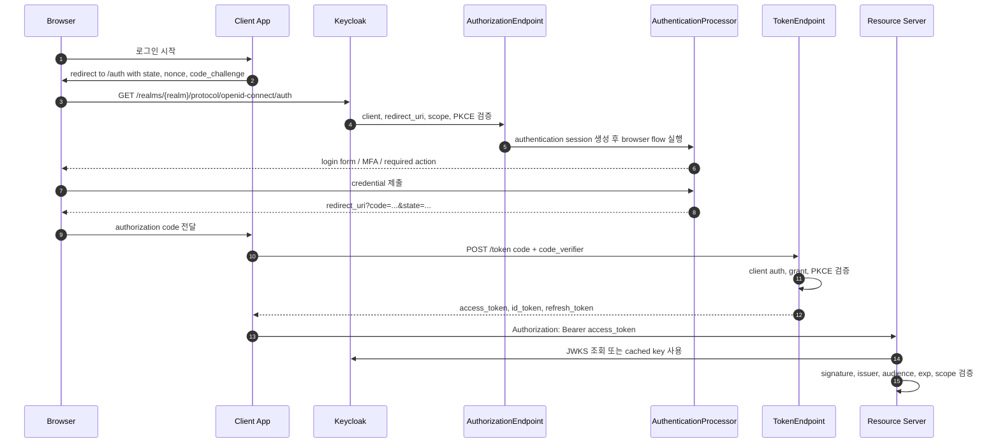

# Chapter 6. OIDC 인증과 Token 발급 생명주기

> Token 발급은 로그인 성공의 부산물이 아니라, client, scope, session, mapper, key policy가 결합된 최종 산출물이다.

---

## 6.1 설계 질문

사용자가 브라우저에서 로그인 버튼을 누른 뒤, backend API가 검증할 수 있는 access token이 발급되기까지 Keycloak 내부에서는 어떤 일이 일어나는가?

## 6.2 Authorization Code + PKCE 흐름

## 6.3 endpoint별 책임

| Endpoint/Class | 책임 |
| --- | --- |
| `RealmsResource.getProtocol` | realm resolve 후 `LoginProtocolFactory`로 protocol endpoint 생성 |
| `OIDCLoginProtocolService.auth` | authorization endpoint resource 생성 |
| `AuthorizationEndpoint` | authorization request parse, client/redirect/scope/PKCE 검증, authentication session 생성 |
| `AuthenticationProcessor` | browser/direct flow execution, authenticator 실행, user session attach |
| `OIDCLoginProtocolService.token` | token endpoint resource 생성 |
| `TokenEndpoint` | grant type, client auth, CORS, DPoP, duplicated parameter, grant provider 호출 |
| `OAuth2GrantType` provider | grant별 token 처리 |
| `TokenManager` | token 생성/검증, mapper 적용, refresh/offline session 처리 |

## 6.4 AuthorizationEndpoint의 보안 gate

| Gate | 왜 필요한가 |
| --- | --- |
| SSL/realm enabled 검사 | 비활성 realm 또는 insecure transport 방지 |
| client existence/status 검사 | 등록되지 않은 client 요청 차단 |
| redirect URI 검사 | authorization code 탈취 방지 |
| response type/mode 검사 | client가 허용된 flow만 사용하도록 제한 |
| scope/resource 검사 | 요청 scope와 resource 범위 제한 |
| PKCE 검사 | public client code interception 방지 |
| client policy trigger | 조직별 OAuth/OIDC 정책 강제 |
| authentication session 생성 | login flow state를 tab/client 단위로 격리 |

## 6.5 TokenEndpoint의 보안 gate

| Gate | 왜 필요한가 |
| --- | --- |
| `grant_type` 검사 | 지원하지 않는 grant 차단 |
| client authentication | confidential client 신뢰 확인 |
| duplicated parameter 검사 | parameter smuggling/ambiguity 방지 |
| parameter length 검사 | oversized request와 parser abuse 완화 |
| DPoP 처리 | sender-constrained token 지원 |
| grant provider dispatch | grant별 정책을 분리 |

## 6.6 Token 검증은 서명 검증만이 아니다

| 검증 항목 | 이유 |
| --- | --- |
| signature | Keycloak realm key로 발급된 token인지 확인 |
| issuer | 올바른 realm에서 나온 token인지 확인 |
| audience | 이 resource server를 대상으로 발급된 token인지 확인 |
| expiration | token 유효기간 확인 |
| not-before | realm/client/user level revocation boundary 확인 |
| scope/roles | 요청한 operation에 필요한 권한 확인 |
| nonce | ID token replay 방지 |
| azp/client_id | token을 받은 authorized party 확인 |

## 6.7 Token lifespan tradeoff

| 선택 | 장점 | 대가 |
| --- | --- | --- |
| 긴 access token TTL | resource server가 자주 refresh하지 않음 | 탈취 피해와 권한 변경 반영 지연 증가 |
| 짧은 access token TTL | 탈취 피해 제한 | refresh endpoint 부하와 UX 복잡도 증가 |
| refresh token rotation | refresh token 재사용 감지 가능 | client 구현 복잡도 증가 |
| offline token 허용 | 장기 background job 가능 | 강한 secret 관리와 revocation/audit 필요 |
| 풍부한 claim 포함 | resource server 단순화 | token size 증가, PII 노출, stale claim 위험 |
| 최소 claim | privacy와 size 개선 | resource server 추가 조회 또는 policy engine 필요 |

## 6.8 Resource server 검증 책임

Keycloak이 token을 발급했다고 해서 API가 자동으로 안전해지는 것은 아니다. Resource server는 token validation을 수행하고, 그 뒤 domain-level authorization을 수행해야 한다.

| Resource server 책임 | 설명 |
| --- | --- |
| JWKS cache | realm key rotation을 고려해 적절한 cache TTL을 둔다. |
| issuer validation | 잘못된 realm token 수락을 방지한다. |
| audience validation | 다른 API용 access token 재사용을 막는다. |
| scope/role validation | API operation에 필요한 claim을 검사한다. |
| domain authorization | token claim만으로 판단할 수 없는 object-level 권한을 검사한다. |
| clock skew 처리 | exp/nbf 검증에서 제한적 clock skew를 허용한다. |

## 6.9 소스코드 증거

| 주장 | 근거 파일 |
| --- | --- |
| OIDC root service가 endpoint를 분기한다 | `services/src/main/java/org/keycloak/protocol/oidc/OIDCLoginProtocolService.java` |
| authorization request 검증은 `AuthorizationEndpoint`와 checker가 수행한다 | `services/src/main/java/org/keycloak/protocol/oidc/endpoints/AuthorizationEndpoint.java`, `AuthorizationEndpointChecker.java` |
| token endpoint는 grant provider를 session에서 조회한다 | `services/src/main/java/org/keycloak/protocol/oidc/endpoints/TokenEndpoint.java` |
| token 생성과 refresh validation은 `TokenManager` 중심이다 | `services/src/main/java/org/keycloak/protocol/oidc/TokenManager.java` |
| mapper는 token claim surface를 결정한다 | `services/src/main/java/org/keycloak/protocol/oidc/mappers/` |

## 6.10 이 챕터의 핵심 인사이트

1. Authorization Code + PKCE는 browser 환경에서 code 탈취 위험을 줄이기 위한 기본 설계다.
2. Access token은 권한 그 자체가 아니라 검증 가능한 claim set이다.
3. Token TTL과 mapper는 보안, UX, resource server 복잡도 사이의 tradeoff다.
4. Resource server는 signature뿐 아니라 issuer, audience, expiration, scope, role을 검증해야 한다.

---

| 방향 | 문서 |
| --- | --- |
| 이전 | [Ch.5 Realm, Client, User 모델링](ch05-realm-client-user-modeling.md) |
| 다음 | [Ch.7 Session, Cache, Storage](ch07-session-cache-storage.md) |
| 백서 색인 | [WHITEPAPER.md](../WHITEPAPER.md) |
