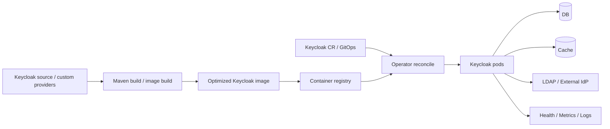

# Chapter 7. Release, Operator, 운영 안정성

> "Identity Platform의 장애는 한 서비스의 장애가 아니라, 모든 서비스의 출입문이 닫히는 일입니다."

Keycloak을 Kubernetes에 올리는 것은 단순히 `Deployment` 하나를 만드는 일이 아닙니다. Keycloak은 DB schema, cache topology, realm key, client secret, hostname, external IdP, custom provider image, Operator CR이 함께 맞아야 정상 동작합니다. 이 중 하나만 어긋나도 로그인은 실패하거나, token issuer가 바뀌거나, session이 사라질 수 있습니다.

이 챕터는 Keycloak을 production에 배포할 때 어떤 상태를 Operator가 관리하고, 어떤 상태는 여전히 운영자가 책임져야 하는지 설명합니다.

---

## 7.1 설계 질문: "어떤 검증 장치가 있어야 안심하고 업그레이드할 수 있을까?"

운영자가 흔히 갖는 오해가 있습니다.

> “Operator를 쓰면 Keycloak 운영은 자동으로 안전해지는 것 아닌가?”

Operator는 강력하지만 만능은 아닙니다. Operator는 Kubernetes에 속한 desired state를 reconcile합니다. 하지만 image 안에 어떤 provider가 들어 있는지, DB backup이 안전한지, 외부 LDAP이 느린지, DNS/TLS가 올바른지는 별도의 운영 문제입니다.

---

## 7.2 Operator가 소유하는 것과 소유하지 않는 것

| 영역 | Operator가 잘하는 일 | 여전히 운영자가 책임질 일 |
| --- | --- | --- |
| Keycloak CR | instances, image, hostname, db/cache/http/telemetry spec 반영 | image build-time option과 provider compatibility |
| StatefulSet/Service | pod template, service, discovery service 생성 | cluster capacity, node 장애, network policy 전체 설계 |
| Ingress/TLS reference | 선언된 hostname/ingress 반영 | DNS, certificate lifecycle, external proxy trust chain |
| Realm import | import job 실행 | 운영 중 drift, overwrite 기대치, Console 수동 변경 정책 |
| Client CR | OIDC/SAML client desired state 관리 | app rollout, secret rotation, redirect URI 승인 |
| Status condition | reconcile 상태 노출 | alert, incident runbook, rollback 판단 |

Operator의 가치는 “모든 것을 자동화한다”가 아니라 “Kubernetes 안의 Keycloak desired state를 반복 가능하게 만든다”에 있습니다.

여기서 `Client CR`은 Keycloak Operator가 Kubernetes custom resource로 OIDC/SAML client의 desired state를 표현하는 방식입니다. 즉 Admin Console에서 수동으로 client를 바꾸는 대신, GitOps와 review 가능한 YAML로 client 계약을 관리하려는 시도입니다.

---

## 7.3 Delivery pipeline으로 보는 Keycloak

Keycloak delivery는 source, build, image, CR, DB, cache, IdP, observability가 이어진 supply chain입니다. image만 되돌리면 rollback이 끝나는 시스템이 아닙니다. DB migration이 진행되었거나 realm key가 바뀌었거나 client secret이 rotation되었다면 rollback boundary는 훨씬 뒤로 밀립니다.

---

## 7.4 Rollout과 rollback boundary

| 변경 유형 | 안전성 질문 | rollback boundary |
| --- | --- | --- |
| image 변경 | provider ABI와 build-time option이 기존 DB/cache와 호환되는가? | 이전 image로 가능하지만 DB migration 후에는 제한 |
| custom provider 추가 | login/token/admin hot path를 느리게 만들지 않는가? | image rollback과 provider config cleanup 필요 |
| realm/client 설정 변경 | token claim과 redirect URI가 app 배포와 맞는가? | 이미 발급된 token TTL 고려 필요 |
| DB schema upgrade | rolling update가 schema compatibility를 보장하는가? | DB backup/restore가 실제 rollback boundary |
| cache topology 변경 | session continuity와 logout propagation이 유지되는가? | cache clear/restart는 session loss 가능 |
| hostname/proxy 변경 | issuer, JWKS URI, redirect URI가 모두 일치하는가? | resource server config까지 함께 되돌려야 함 |

운영 기본은 “되돌릴 수 있는 것”과 “되돌릴 수 없는 것”을 배포 전에 구분하는 것입니다. 특히 DB와 key material은 rollback의 마지막 방어선입니다.

---

## 7.5 Test framework는 운영 topology를 번역하는 도구

Keycloak의 correctness는 단일 함수에서 나오지 않습니다. realm, client, user, DB, browser, provider, cache 조합에서 나옵니다. 그래서 테스트도 운영 topology를 닮아야 합니다.

| 운영 결정 | 테스트로 확인할 것 |
| --- | --- |
| production DB vendor 사용 | 동일 또는 호환 DB로 login/token/admin smoke test |
| remote Infinispan 사용 | external Infinispan과 rolling restart 시나리오 |
| custom provider 포함 | provider image로 authentication/token/admin 경로 테스트 |
| Operator 배포 | CR apply, status condition, StatefulSet rollout 검증 |
| federation/broker 사용 | LDAP/IdP timeout, mapper, account linking 테스트 |
| token mapper 변경 | resource server audience/scope/role 검증 테스트 |

테스트의 목표는 “서버가 뜬다”가 아닙니다. 실제 운영자가 선택한 조합이 안전한지 미리 실패시키는 것입니다.

---

## 7.6 Backup과 restore는 DB만의 문제가 아니다

| 대상 | 이유 |
| --- | --- |
| Relational DB | realm, client, user, credential, event, persistent session의 source of truth |
| Realm keys | token validation continuity에 직접 영향 |
| Kubernetes Secrets | DB credential, client secret, TLS key, admin secret |
| Custom provider/theme artifacts | image 재생성과 rollback에 필요 |
| Operator CR/GitOps manifests | desired state 복구에 필요 |
| External IdP/LDAP config | broker/federation trust 복구에 필요 |

Realm export는 유용하지만 DB backup의 완전한 대체가 아닙니다. 복구는 장부, 열쇠, 배포 선언, 외부 신뢰 관계가 함께 맞아야 성공합니다.

---

## 7.7 코드로 확인하는 증거

| 주장 | 확인할 파일 |
| --- | --- |
| Keycloak CR root와 spec이 desired state schema를 정의한다 | `operator/src/main/java/org/keycloak/operator/crds/v2beta1/deployment/Keycloak.java`, `operator/src/main/java/org/keycloak/operator/crds/v2beta1/deployment/KeycloakSpec.java` |
| main controller는 Keycloak CR을 reconcile한다 | `operator/src/main/java/org/keycloak/operator/controllers/KeycloakController.java` |
| StatefulSet dependent resource가 pod template과 rollout behavior를 구성한다 | `operator/src/main/java/org/keycloak/operator/controllers/KeycloakDeploymentDependentResource.java` |
| CR spec은 `KC_*` server option으로 변환된다 | `operator/src/main/java/org/keycloak/operator/controllers/KeycloakDistConfigurator.java` |
| realm import는 job dependent resource로 실행된다 | `operator/src/main/java/org/keycloak/operator/controllers/KeycloakRealmImportJobDependentResource.java` |
| OIDC/SAML client CR controller가 client desired state를 관리한다 | `operator/src/main/java/org/keycloak/operator/controllers/KeycloakOIDCClientController.java`, `operator/src/main/java/org/keycloak/operator/controllers/KeycloakSAMLClientController.java` |
| test harness는 DB와 external Infinispan 조합을 지원한다 | `quarkus/tests/junit5/src/main/java/org/keycloak/it/junit5/extension/WithDatabase.java`, `quarkus/tests/junit5/src/main/java/org/keycloak/it/junit5/extension/WithExternalInfinispan.java` |

---

## 7.8 운영자의 체크포인트

| 질문 | 기준 |
| --- | --- |
| 배포 전 login/token/JWKS/admin smoke test가 있는가? | issuer, key, client, token mapper 오류 조기 탐지 |
| DB backup과 restore drill을 해봤는가? | rollback의 실제 경계 확인 |
| Operator status condition을 alert로 보고 있는가? | reconcile drift 조기 탐지 |
| custom provider image rollback 절차가 있는가? | login/token hot path 장애 대응 |
| external IdP/LDAP 장애 runbook이 있는가? | login SLO 보호 |

---

## 7.9 핵심 인사이트

1. **Operator는 만능 운영자가 아닙니다.** Kubernetes desired state는 관리하지만 DB, cache, IdP, DNS/TLS, image의 실제 안전성은 별도 책임입니다.
2. **Rollback boundary는 image보다 넓습니다.** DB schema, realm key, secret, token TTL, external metadata가 모두 rollback을 어렵게 만듭니다.
3. **테스트는 운영 topology의 리허설입니다.** production 조합을 CI에서 최대한 닮게 만들어야 합니다.

---

| 방향 | 문서 |
| --- | --- |
| **이전 챕터** | [Ch.6 SPI, Provider, Quarkus 런타임](./ch06-extension-runtime-model.md) |
| **다음 챕터** | [Ch.8 보안, 감사, 미결 결정과 로드맵](./ch08-security-audit-and-roadmap.md) |
| **백서 홈** | [WHITEPAPER.md](../WHITEPAPER.md) |
