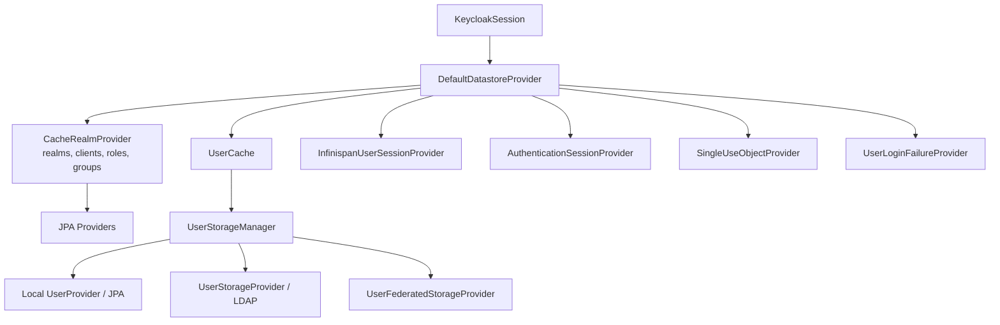

# Chapter 7. Session, Cache, Storage

> SSO는 쿠키 하나가 아니라 session, cache, DB, token TTL이 결합된 상태 관리 전략이다.

---

## 7.1 설계 질문

사용자는 한 번 로그인하면 여러 애플리케이션을 오가며 인증 상태를 유지하길 기대한다. 이 UX를 제공하기 위해 Keycloak은 어떤 상태를 어디에 저장하고, 어떤 consistency 비용을 지불하는가?

## 7.2 storage topology

## 7.3 cache/session 종류와 의미

| 상태 | 의미 | 운영 영향 |
| --- | --- | --- |
| realm/client/user cache | DB persistent data의 cache | invalidation과 stale data 위험 |
| authentication session | 로그인 중간 상태 | browser flow continuity에 중요 |
| user session | SSO session | logout, session TTL, cluster consistency에 중요 |
| client session | user session에 연결된 client별 상태 | client logout과 token refresh에 영향 |
| offline session | offline token 장기 상태 | 보안과 DB/cache 비용 증가 |
| action token/single-use object | reset/verify/code 재사용 방지 | cluster-wide replay 방지 필요 |
| login failure | brute force 상태 | multi-pod consistency 필요 |

## 7.4 DB와 Infinispan의 역할 분담

| 기준 | Relational DB | Infinispan |
| --- | --- | --- |
| 역할 | 정책과 장기 상태의 source of truth | cache, session, invalidation, cluster state |
| 강점 | durability, transaction, backup | low-latency lookup, distributed state |
| 약점 | latency, connection pool, migration | consistency, eviction, topology, memory |
| 장애 영향 | 광범위한 요청 실패 | session loss/stale cache/login flow 실패 |
| 운영 과제 | backup, migration, retention, HA | cache mode, sticky session, remote cache, TTL |

DB와 cache의 경계는 성능 최적화만을 위한 분리가 아니다. Keycloak은 realm/client/user 같은 정책 데이터를 durable store에 두고, 요청 처리 경로에서는 cache와 session provider를 통해 반복 조회 비용을 낮춘다. 반대로 user session, authentication session, action token은 로그인 UX와 보안 replay 방지에 직접 연결되므로 cache eviction이나 cluster topology 변화가 사용자 경험으로 드러난다.

### 7.4.1 상태 배치 matrix

| 상태 | 주 저장 위치 | 보조 저장/캐시 | 손실 또는 stale 시 영향 | 복구 관점 |
| --- | --- | --- | --- | --- |
| realm/client/role/group config | DB | realm cache, client cache | node별 정책 판단 차이, redirect/token mapper drift | cache invalidation 또는 node 재시작으로 재조회 가능 |
| local user profile/credential | DB | user cache | disable/attribute 변경 반영 지연 | DB가 source of truth이므로 cache flush 후 복구 가능 |
| federated user profile | LDAP/external store + federated sidecar | user cache | 외부 저장소 장애가 login/search 장애로 전파 | 외부 store 복구와 mapper/cache 정합성 필요 |
| online user session | Infinispan session cache, persistent mode에서는 DB persister 병행 | owner/backup segment | SSO 끊김, logout propagation 지연 | persistent sessions면 DB에서 일부 복원 가능, volatile이면 재로그인 필요 |
| authenticated client session | Infinispan client session cache, persistent mode에서는 DB entity 병행 | user session에 종속 | 특정 client logout/refresh 흐름 실패 | user session과 함께 복구 또는 제거 |
| authentication session | Infinispan authentication session cache | browser tab/root auth session | 로그인 flow 중단, code 발급 실패 | 재로그인으로 복구 |
| action token/single-use object | Infinispan action token cache | 없음 또는 단기 TTL | reset/verify/code 재사용 방지 실패 가능 | TTL과 cluster-wide visibility가 방어선 |
| login failure state | Infinispan login failure cache | realm brute-force 설정 | brute force 방어 우회 또는 오탐 lockout | cache health와 event 관측 필요 |
| user/admin event | DB event store 또는 event listener | log/SIEM pipeline | audit gap, incident timeline 손실 | retention과 외부 sink 설계 필요 |

이 matrix의 핵심은 “모든 상태를 DB에 넣으면 안전하다”가 아니라 “상태마다 durability, latency, consistency 요구가 다르다”는 점이다. Authentication session처럼 짧고 재시도 가능한 상태는 cache 중심이 합리적이다. Realm key나 client secret처럼 token 검증과 직접 연결되는 상태는 durable store와 backup 전략이 필요하다. Offline session처럼 장기 권한을 의미하는 상태는 durability와 탈취 위험을 동시에 고려해야 한다.

## 7.5 Persistent session과 volatile session의 선택

Keycloak 운영자는 session을 얼마나 durable하게 볼 것인지 결정해야 한다. Volatile session은 restart 후 사용자가 다시 로그인하는 모델이고, persistent session은 user/client session을 DB에 저장해 restart 이후 continuity를 높이는 모델이다.

| 접근 | 선택할 만한 경우 | 피해야 할 경우 | 주요 대가 |
| --- | --- | --- | --- |
| volatile sessions | 짧은 session, 장애 시 재로그인이 허용되는 내부 시스템, DB 부하 최소화가 중요한 환경 | 긴 업무 session, restart가 잦은 cluster, 대규모 offline token 사용 | pod/cache 장애가 UX 장애로 바로 드러남 |
| persistent sessions | 재시작 후 SSO 보존이 중요, offline session과 장기 작업이 많음, rolling update UX를 중시 | DB write capacity가 부족, session 수가 매우 크고 TTL 관리가 느슨함 | DB 저장/cleanup 비용, schema/upgrade 영향 증가 |
| remote Infinispan | multi-site, cache 운영 분리, Keycloak pod와 cache lifecycle 분리가 필요 | 단순 single-cluster, latency 민감, cache 운영 역량 부족 | Hot Rod/TLS/auth/topology 운영 복잡도 |

Persistent session은 “장애가 없어지는 기능”이 아니다. DB가 session continuity의 일부가 되므로 DB connection pool, write latency, cleanup job, backup/restore 검증이 session SLO에 편입된다. 반대로 volatile session은 운영이 단순하지만, node restart와 cache loss가 사용자 재로그인으로 이어질 수 있다.

## 7.6 Sticky session은 필수가 아니지만 중요하다

Infinispan distributed cache는 owner node 개념을 갖는다. 요청이 session owner node에 가까울수록 remote lookup이 줄어든다. 따라서 sticky session은 보안 요구가 아니라 성능과 안정성 최적화다.

| 접근 | 장점 | 단점 |
| --- | --- | --- |
| sticky session 사용 | cache locality, latency 감소 | LB 설정과 pod lifecycle에 의존 |
| sticky session 미사용 | 완전한 request 분산 | remote cache lookup 증가 |
| remote Infinispan | cache 운영 분리, multi-site 가능 | latency, TLS, auth, topology 복잡도 증가 |
| volatile sessions | DB 부하 감소 | 전체 restart 시 session loss, memory 증가 |
| persistent sessions | restart 후 session 보존 | DB write/read 비용 증가 |

운영 판단은 다음 기준으로 나눈다.

| 상황 | 권장 판단 | 이유 |
| --- | --- | --- |
| 단일 cluster, 수평 확장 규모가 작음 | embedded cache + sticky session 우선 | 구조가 단순하고 owner locality로 latency를 줄일 수 있음 |
| rolling update 중 session 유지가 중요 | sticky session + persistent session 검토 | cache owner 이동과 pod restart가 session loss로 이어지는 범위를 줄임 |
| multi-AZ latency가 높음 | owner 수, sticky session, remote cache latency를 함께 측정 | cache miss가 cross-zone 호출로 바뀌면 token/refresh latency가 증가 |
| multi-site 또는 cache 운영 분리 필요 | remote Infinispan 검토 | Keycloak pod lifecycle과 cache lifecycle 분리 가능 |
| logout propagation이 엄격해야 함 | cache health와 backchannel logout 테스트 강화 | session 삭제와 client logout 이벤트가 cluster-wide로 보여야 함 |

## 7.7 Session TTL과 token TTL은 함께 설계해야 한다

| 설정 영역 | 너무 길 때 | 너무 짧을 때 |
| --- | --- | --- |
| access token lifespan | 탈취 피해와 권한 변경 반영 지연 | token refresh 빈도 증가 |
| refresh token lifespan | 장기 탈취 위험 | 사용자 재로그인 증가 |
| SSO session idle | 방치 session 유지 | 업무 중 logout 증가 |
| SSO session max | 장기 session 위험 | 장시간 작업 중 재인증 필요 |
| offline session | 장기 background access 가능 | offline use case 불가 |
| action token lifespan | reset/verify link 악용 가능 | 사용자 이메일 flow 실패 증가 |

Token TTL과 session TTL은 따로 움직이지 않는다. access token이 짧아도 refresh token과 user session이 길면 공격자는 refresh 경로를 노릴 수 있다. 반대로 session을 너무 짧게 잡으면 SSO의 핵심 가치가 줄어든다.

## 7.8 Cache invalidation과 correctness

Keycloak은 realm/client/role/group/user 같은 persistent data를 cache한다. Admin API로 정책이 바뀌면 invalidation이 전파되어야 한다. 이 과정은 단순 performance optimization이 아니라 correctness의 일부다.

| 변경 | invalidation 실패 시 위험 |
| --- | --- |
| role 변경 | 이전 권한이 token/세션에 계속 반영될 수 있음 |
| client redirect URI 변경 | 잘못된 redirect 정책이 유지될 수 있음 |
| user disable | 비활성 사용자 접근이 지연 반영될 수 있음 |
| key rotation | JWKS/cache mismatch로 token validation 실패 가능 |
| authentication flow 변경 | login behavior가 node별로 달라질 수 있음 |

### 7.8.1 대표 실패 모드

| 실패 모드 | 발생 조건 | 사용자 영향 | 운영 대응 |
| --- | --- | --- | --- |
| cache eviction 과다 | memory sizing 부족, TTL/owners 설정 부적절 | login/token refresh latency 증가, session lookup 실패 | cache metrics, heap sizing, owners/eviction 정책 재검토 |
| pod restart storm | rolling update, node drain, OOM | volatile session 손실, authentication flow 중단 | readiness, PodDisruptionBudget, persistent session 또는 sticky 조정 |
| stale realm/client cache | invalidation 전파 실패, node partition | redirect/token/role 판단 불일치 | cache clear, node 격리, admin event와 변경 시점 대조 |
| DB reconnect storm | DB failover 후 pod 동시 재연결 | token/admin/login 전체 지연 | connection pool sizing, readiness delay, DB failover drill |
| remote cache outage | Hot Rod endpoint/TLS/auth 장애 | session/cache 접근 실패 또는 지연 | cache endpoint health, fallback 정책, network policy 검증 |
| login failure cache 불일치 | cluster split, cache loss | brute force 방어 약화 또는 오탐 | brute force event 관측, cluster readiness, cache health 확인 |

## 7.9 소스코드 증거

| 주장 | 근거 파일 |
| --- | --- |
| session model과 provider 계약은 public SPI로 정의된다 | `server-spi/src/main/java/org/keycloak/models/UserSessionProvider.java`, `server-spi/src/main/java/org/keycloak/models/UserSessionModel.java`, `server-spi/src/main/java/org/keycloak/models/AuthenticatedClientSessionModel.java` |
| session API는 datastore로 위임한다 | `services/src/main/java/org/keycloak/services/DefaultKeycloakSession.java` |
| datastore는 cache와 storage manager를 조합한다 | `model/storage-private/src/main/java/org/keycloak/storage/datastore/DefaultDatastoreProvider.java` |
| Keycloak의 canonical cache 이름과 cache group이 정의되어 있다 | `model/infinispan/src/main/java/org/keycloak/connections/infinispan/InfinispanConnectionProvider.java` |
| user session은 Infinispan provider가 담당한다 | `model/infinispan/src/main/java/org/keycloak/models/sessions/infinispan/InfinispanUserSessionProvider.java` |
| persistent session mode는 Infinispan transaction과 DB persister를 함께 사용한다 | `model/infinispan/src/main/java/org/keycloak/models/sessions/infinispan/PersistentUserSessionProvider.java`, `model/infinispan/src/main/java/org/keycloak/models/sessions/infinispan/changes/PersistentSessionsChangelogBasedTransaction.java` |
| remote Infinispan user session provider가 별도 구현으로 존재한다 | `model/infinispan/src/main/java/org/keycloak/models/sessions/infinispan/remote/RemoteUserSessionProvider.java` |
| authentication session은 별도 provider가 담당한다 | `model/infinispan/src/main/java/org/keycloak/models/sessions/infinispan/InfinispanAuthenticationSessionProvider.java` |
| persistent session JPA entity와 persister가 존재한다 | `model/jpa/src/main/java/org/keycloak/models/jpa/session/PersistentUserSessionEntity.java`, `model/jpa/src/main/java/org/keycloak/models/jpa/session/PersistentClientSessionEntity.java`, `model/jpa/src/main/java/org/keycloak/models/jpa/session/JpaUserSessionPersisterProvider.java` |
| session persistence SPI와 adapter가 storage-private에 있다 | `model/storage-private/src/main/java/org/keycloak/models/session/UserSessionPersisterProvider.java`, `model/storage-private/src/main/java/org/keycloak/models/session/PersistentUserSessionAdapter.java` |
| embedded cache config는 persistent/volatile/remote 선택과 cache option을 반영한다 | `model/infinispan/src/main/java/org/keycloak/spi/infinispan/impl/embedded/DefaultCacheEmbeddedConfigProviderFactory.java` |
| session affinity는 distributed cache segment locality를 고려한다 | `model/infinispan/src/main/java/org/keycloak/models/sessions/infinispan/SessionAffinityService.java` |

## 7.10 운영자가 결정할 것

| 결정 | 질문 | 영향 |
| --- | --- | --- |
| Session persistence | persistent sessions를 사용할 것인가 volatile session을 사용할 것인가? | restart resilience와 DB 부하 tradeoff |
| Sticky session | LB affinity를 설정할 것인가? | cache locality와 failover behavior |
| Remote cache | embedded/local cache로 충분한가 remote Infinispan이 필요한가? | 운영 복잡도와 multi-site 가능성 |
| Event retention | user/admin event를 얼마나 보관할 것인가? | audit 완전성과 DB growth |
| Token/session TTL | UX와 보안 사이의 기준은 무엇인가? | 사용자 경험과 탈취 피해 범위 |
| Cache ownership | owners, eviction, memory sizing 기준은 무엇인가? | failover tolerance와 latency |
| Restart policy | rolling update, node drain, OOM 시 session continuity 목표는 무엇인가? | PDB, readiness, persistent session 필요성 |
| Cleanup policy | expired session/event/action token 정리 주기와 DB 영향은 무엇인가? | DB growth, vacuum/maintenance, query latency |

## 7.11 이 챕터의 핵심 인사이트

1. Keycloak의 DB는 정책과 장기 상태의 source of truth이고, Infinispan은 cache이면서 session continuity의 일부다.
2. SSO UX는 session TTL, cache topology, sticky session, logout propagation의 결합 결과다.
3. Persistent session은 restart resilience를 높이지만 DB를 session SLO의 일부로 만든다.
4. cache 설정은 성능 튜닝이 아니라 correctness와 장애 복구에 영향을 주는 운영 결정이다.
5. Token TTL과 session TTL은 하나의 위험 수명 모델로 함께 설계해야 한다.

---

| 방향 | 문서 |
| --- | --- |
| 이전 | [Ch.6 OIDC 인증과 Token 발급 생명주기](ch06-oidc-token-lifecycle.md) |
| 다음 | [Ch.8 Federation과 Identity Brokering](ch08-federation-and-brokering.md) |
| 백서 색인 | [WHITEPAPER.md](../WHITEPAPER.md) |
