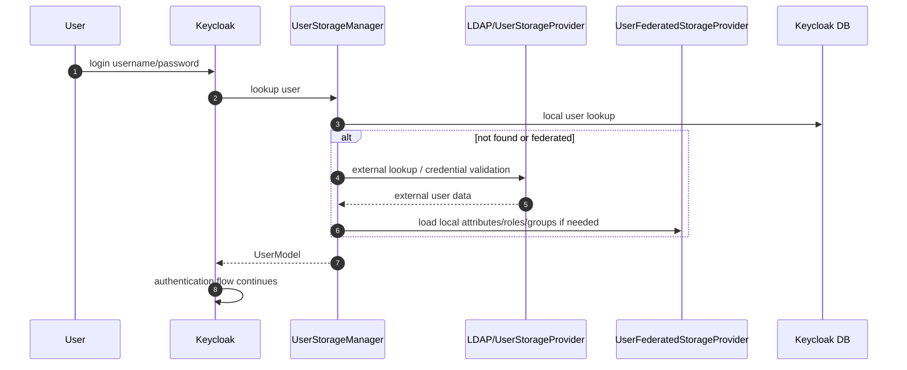

# Chapter 8. Federation과 Identity Brokering

> Federation은 기존 identity source를 재사용하게 하지만, login path를 외부 시스템의 latency와 consistency에 종속시킨다.

---

## 8.1 설계 질문

사용자를 Keycloak 내부 DB에 둘 것인가, LDAP/AD/Kerberos 같은 기존 저장소와 연동할 것인가, 아니면 외부 OIDC/SAML IdP로 broker할 것인가?

## 8.2 세 가지 사용자 출처

| 모델 | 설명 | 장점 | 대가 |
| --- | --- | --- | --- |
| Local user | Keycloak DB에 user/credential 저장 | 단순, 독립적 | 기존 enterprise identity와 중복 |
| User federation | LDAP/AD/external provider에서 user 조회/검증 | 기존 identity source 재사용 | login latency와 sync consistency 문제 |
| Identity brokering | 외부 OIDC/SAML IdP로 인증 위임 | social/enterprise SSO 쉬움 | account linking과 mapper 신뢰 문제 |

## 8.3 Federation flow

## 8.4 Broker flow의 핵심 tension

| 영역 | 질문 | 위험 |
| --- | --- | --- |
| first broker login | 외부 IdP 사용자와 local account를 자동 연결할 것인가 | account takeover |
| email trust | 외부 IdP의 email verified를 신뢰할 것인가 | 잘못된 email 소유권 가정 |
| mapper | 외부 claim을 어떤 local attribute/role/group으로 변환할 것인가 | 과도한 권한 부여 |
| logout | 외부 IdP와 logout을 전파할 것인가 | session mismatch |
| deprovisioning | 외부 계정 비활성화가 Keycloak에 언제 반영되는가 | 퇴사자 접근 잔존 |

Broker flow에서 가장 위험한 순간은 “외부 IdP가 인증했다”는 사실을 “기존 local user와 같은 사람이다” 또는 “local role을 부여해도 된다”로 확장하는 지점이다. 특히 first broker login은 보안 정책이 코드보다 설정에 가까운 형태로 실행되므로, 운영자가 threat model을 문서화해야 한다.

### 8.4.1 Account linking threat model

| 위협 | 발생 조건 | 결과 | 방어 기준 |
| --- | --- | --- | --- |
| email collision | 서로 다른 IdP namespace에서 같은 email 사용 | 잘못된 local account 연결 | issuer/provider alias까지 포함해 identity key 판단 |
| unverified email 신뢰 | 외부 IdP의 `email_verified` 의미가 약함 | 공격자가 이메일 claim만으로 계정 점유 | verified email만 자동 연결, 민감 realm은 수동 승인 |
| IdP namespace 재사용 | 외부 IdP tenant 재생성, domain 재할당 | 과거 사용자와 새 사용자의 subject 충돌 | issuer, subject, tenant lifecycle를 account link 기준에 포함 |
| 악성/오염된 mapper claim | 외부 IdP group/role claim을 local role로 직접 승격 | 권한 과다 부여 | mapper allowlist, client scope 제한, admin event audit |
| first login 자동 생성 남용 | 공개 IdP에서 누구나 realm user 생성 | shadow account 증가, audit 어려움 | domain 제한, required action, approval workflow |
| stale broker link | 외부 계정 삭제/비활성화 후 local link 유지 | deprovisioning 지연 | broker link review, session TTL 제한, 주기적 reconciliation |

## 8.5 대안 비교

| 기준 | Local user | LDAP federation | External IdP broker |
| --- | --- | --- | --- |
| 초기 구성 | 낮음 | 중간 | 중간 |
| 기존 계정 재사용 | 낮음 | 높음 | 높음 |
| 인증 latency | Keycloak/DB 내부 | LDAP에 종속 | 외부 IdP에 종속 |
| credential policy | Keycloak 제어 | LDAP/AD 제어 | 외부 IdP 제어 |
| role/group mapping | Keycloak 내부 | LDAP mapper 필요 | broker mapper 필요 |
| 계정 생명주기 | Keycloak 중심 | 외부 directory 중심 | 외부 IdP 중심 |

## 8.6 Federation 운영의 숨은 비용

| 비용 | 설명 |
| --- | --- |
| latency | login, user search, admin UI user 조회가 외부 저장소 응답 시간에 영향을 받는다. |
| availability | LDAP/AD 장애가 Keycloak login 장애로 전파될 수 있다. |
| consistency | group/attribute 변경이 Keycloak token과 session에 언제 반영되는지 명확해야 한다. |
| deprovisioning | 퇴사자/비활성화가 local session과 token에 남는 시간을 관리해야 한다. |
| attribute ownership | 어떤 attribute가 외부 source of truth인지, Keycloak local 수정이 가능한지 정해야 한다. |

LDAP federation은 특히 “조회하면 된다”보다 많은 운영 결정을 요구한다. Import users를 켜면 login path의 외부 의존성을 낮출 수 있지만 stale local copy를 관리해야 한다. Import를 끄면 최신성을 얻는 대신 LDAP availability와 latency가 login SLO에 직접 들어온다.

| LDAP 운영 결정 | 선택지 | tradeoff |
| --- | --- | --- |
| import users | on, off | on은 lookup 성능과 독립성을 높이지만 stale copy와 sync 정책이 필요하다. off는 최신성이 높지만 LDAP 장애가 login 장애가 된다. |
| edit mode | `READ_ONLY`, `WRITABLE`, `UNSYNCED` | 읽기 전용은 ownership이 명확하지만 self-service 수정이 제한된다. 쓰기 가능은 편리하지만 LDAP 권한과 audit가 중요해진다. |
| sync direction | LDAP to Keycloak, Keycloak to LDAP, local sidecar only | attribute ownership을 명확히 하지 않으면 양방향 drift가 발생한다. |
| group/role mapper | LDAP group을 local group/role로 mapping, 또는 app에서 별도 조회 | 중앙 권한 관리는 쉬워지지만 token bloat와 과권한 위험이 생긴다. |
| sync schedule | periodic full/changed sync, on-demand only | sync는 login latency를 낮추지만 batch 부하와 staleness window를 만든다. |
| timeout/batch size | 짧은 timeout, 긴 timeout, 큰 batch, 작은 batch | timeout이 길면 login thread를 점유하고, 너무 짧으면 정상 사용자가 실패한다. |
| deprovisioning SLA | 즉시 반영, session TTL 내 반영, 일괄 반영 | SLA가 강할수록 session revocation, cache invalidation, external event 연동이 필요하다. |

## 8.7 Brokered identity는 local authorization과 분리해야 한다

외부 IdP가 사용자를 인증했다는 사실은 “이 사용자가 우리 시스템에서 어떤 권한을 가진다”는 결론과 다르다. Broker mapper가 외부 group/role claim을 local role로 직접 매핑할 수 있지만, 이 매핑은 신뢰 경계 확장이다.

| Broker decision | 보안 질문 |
| --- | --- |
| 자동 계정 생성 | 외부 IdP의 identity namespace를 완전히 신뢰하는가? |
| 자동 계정 연결 | email만으로 기존 local user와 연결해도 안전한가? |
| role mapper | 외부 claim이 local 권한으로 승격되는 기준은 무엇인가? |
| required action | first login에서 profile review/MFA 등록을 요구할 것인가? |
| logout propagation | 외부 IdP logout과 local session logout을 어떻게 동기화할 것인가? |

권장 원칙은 brokered identity를 인증 신호로만 받아들이고, local authorization은 Keycloak realm 내부의 client scope, group, role, policy로 다시 결정하는 것이다. 외부 group claim을 그대로 realm role로 승격하는 방식은 migration 초기에는 편하지만, 외부 IdP 관리자 권한이 곧 내부 application 권한으로 이어지는 trust-boundary 확장이 된다.

## 8.8 Keycloak의 답: sidecar state와 mapper 계층

Keycloak은 외부 identity source를 완전히 투명하게 통과시키지 않는다. Federation에서는 `UserStorageProvider`가 외부 lookup/credential validation을 담당하고, `UserFederatedStorageProvider`가 외부 사용자에 대한 local 보조 상태를 저장한다. Brokering에서는 외부 IdP의 subject와 token/claim을 broker context로 받은 뒤, mapper와 first-login flow를 통해 local user, required action, broker link로 변환한다.

이 구조는 현실적인 절충이다. 모든 것을 외부 IdP/LDAP에 맡기면 Keycloak의 정책 엔진과 audit가 약해진다. 모든 것을 local DB로 복제하면 기존 identity source와 drift가 생긴다. Keycloak은 외부 인증/조회와 local authorization/audit 사이에 sidecar state와 mapper 계층을 둠으로써 두 세계를 연결한다.

## 8.9 소스코드 증거

| 주장 | 근거 파일 |
| --- | --- |
| user storage provider SPI가 외부 user store 계약을 정의한다 | `model/storage/src/main/java/org/keycloak/storage/UserStorageProvider.java` |
| external user store factory와 capability interface가 federation 경계를 만든다 | `model/storage/src/main/java/org/keycloak/storage/UserStorageProviderFactory.java`, `server-spi/src/main/java/org/keycloak/storage/user/UserLookupProvider.java`, `server-spi/src/main/java/org/keycloak/storage/user/UserQueryProvider.java` |
| user storage manager가 local/federated/external provider를 통합한다 | `model/storage-private/src/main/java/org/keycloak/storage/UserStorageManager.java` |
| federated storage는 외부 user의 local 보조 상태를 관리한다 | `model/storage/src/main/java/org/keycloak/storage/federated/` |
| broker link는 federated storage의 별도 계약으로 관리된다 | `model/storage/src/main/java/org/keycloak/storage/federated/UserBrokerLinkFederatedStorage.java` |
| LDAP provider는 대표 production federation provider다 | `federation/ldap/src/main/java/org/keycloak/storage/ldap/LDAPStorageProvider.java` |
| LDAP factory와 identity store registry가 LDAP 연결/config lifecycle을 담당한다 | `federation/ldap/src/main/java/org/keycloak/storage/ldap/LDAPStorageProviderFactory.java`, `federation/ldap/src/main/java/org/keycloak/storage/ldap/LDAPIdentityStoreRegistry.java` |
| LDAP mapper manager와 group/role mapper가 외부 group/role mapping 계층을 구현한다 | `federation/ldap/src/main/java/org/keycloak/storage/ldap/mappers/LDAPStorageMapperManager.java`, `federation/ldap/src/main/java/org/keycloak/storage/ldap/mappers/membership/group/GroupLDAPStorageMapper.java`, `federation/ldap/src/main/java/org/keycloak/storage/ldap/mappers/membership/role/RoleLDAPStorageMapper.java` |
| Kerberos/SPNEGO federation provider가 별도 enterprise auth 경로를 제공한다 | `federation/kerberos/src/main/java/org/keycloak/federation/kerberos/KerberosFederationProvider.java`, `federation/kerberos/src/main/java/org/keycloak/federation/kerberos/impl/SPNEGOAuthenticator.java` |
| broker endpoint는 realm resource에서 위임된다 | `services/src/main/java/org/keycloak/services/resources/IdentityBrokerService.java` |
| OIDC/SAML broker implementation이 외부 token/assertion과 logout/token exchange를 처리한다 | `services/src/main/java/org/keycloak/broker/oidc/OIDCIdentityProvider.java`, `services/src/main/java/org/keycloak/broker/saml/SAMLIdentityProvider.java` |
| broker mapper는 외부 claim/assertion을 local attribute/role/group으로 변환한다 | `services/src/main/java/org/keycloak/broker/oidc/mappers/AbstractClaimMapper.java`, `services/src/main/java/org/keycloak/broker/saml/mappers/UserAttributeMapper.java` |

## 8.10 운영자가 결정할 것

| 결정 | 질문 | 영향 |
| --- | --- | --- |
| Source of truth | user profile, credential, group, role 각각의 source는 어디인가? | local/LDAP/broker mapper 정책 결정 |
| Sync 방식 | on-demand lookup, periodic sync, import user 중 무엇을 쓸 것인가? | latency와 staleness tradeoff |
| Timeout 정책 | 외부 저장소를 얼마나 기다릴 것인가? | login availability와 correctness |
| Account linking | 자동 linking을 허용할 것인가? | account takeover risk |
| Deprovisioning | 비활성화가 session/token에 반영되는 최대 시간을 얼마로 볼 것인가? | token/session TTL과 event 정책에 영향 |
| Email trust | 외부 IdP의 email/email_verified를 어떤 수준으로 신뢰할 것인가? | 자동 연결과 계정 탈취 위험 |
| Mapper governance | mapper 변경을 누가 승인하고 어떻게 audit할 것인가? | 외부 claim의 local 권한 승격 통제 |
| Required action | first login에서 MFA/profile review/terms를 요구할 것인가? | UX와 onboarding security |

## 8.11 이 챕터의 핵심 인사이트

1. Federation은 migration 없이 기존 identity source를 재사용하게 하지만 login SLO를 외부 시스템에 종속시킨다.
2. Brokered identity는 “외부 IdP가 인증했다”는 사실과 “우리 시스템의 권한을 준다”는 결정을 분리해야 한다.
3. Mapper와 account linking 정책은 편의 설정이 아니라 account takeover 방어선이다.
4. LDAP import/edit/sync 설정은 user data ownership과 login availability를 동시에 결정한다.
5. Deprovisioning은 user disable만이 아니라 session/token TTL과 cache invalidation 문제다.

---

| 방향 | 문서 |
| --- | --- |
| 이전 | [Ch.7 Session, Cache, Storage](ch07-session-cache-storage.md) |
| 다음 | [Ch.9 Operator, 테스트, 배포 모델](ch09-operator-test-delivery.md) |
| 백서 색인 | [WHITEPAPER.md](../WHITEPAPER.md) |
