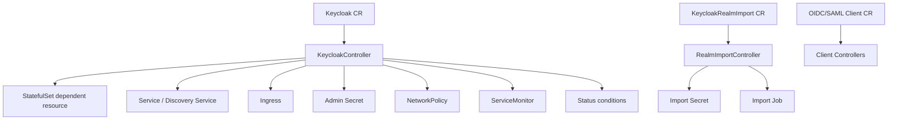
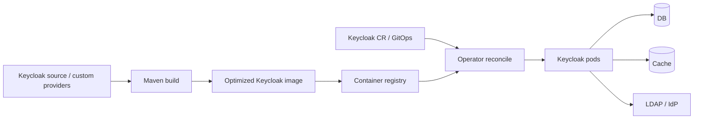

# Chapter 9. Operator, 테스트, 배포 모델

> Operator는 Keycloak 배포의 desired state를 관리하지만, image 내부 build-time state와 외부 DB/cache 상태까지 완전히 통제하지는 못한다.

---

## 9.1 설계 질문

Keycloak을 Kubernetes에서 운영할 때 어떤 상태를 CRD로 선언할 수 있고, 어떤 상태는 여전히 image build pipeline, DB, cache, secrets, external IdP 운영에 남는가?

## 9.2 Operator의 역할

## 9.3 CRD가 표현하는 것과 표현하지 못하는 것

| 영역 | CRD로 표현 가능 | CRD만으로 부족한 것 |
| --- | --- | --- |
| replica/image | instances, image, resources | image 내부 build-time options |
| DB 연결 | DB spec/secret reference | DB HA, backup, migration safety |
| hostname/http | hostname, http, ingress | external DNS/TLS/proxy trust chain |
| cache | cache spec | remote Infinispan 운영, latency, topology |
| telemetry | metrics/tracing flags | 실제 Prometheus/OTEL pipeline |
| realm import | RealmImport CR | 기존 realm overwrite와 drift 정책 |
| client CR | OIDC/SAML client desired state | secret rotation과 application rollout |

CRD는 운영자가 선언할 수 있는 state와 선언 밖에 남는 state를 분리해 준다. 그러나 CRD가 있다고 해서 모든 drift가 사라지는 것은 아니다.

| CRD | 표현하는 것 | drift가 생기는 지점 | 운영 기준 |
| --- | --- | --- | --- |
| `Keycloak` | instances, image, hostname, db/cache/http/telemetry/resource/scheduling | image build-time option, custom provider/theme, DB schema, 외부 DNS/TLS, 수동 StatefulSet 수정 | GitOps에서 CR과 image digest를 함께 review |
| `KeycloakRealmImport` | realm JSON import job | Admin Console 수동 변경, import JSON 재적용, 기존 realm overwrite 기대치 | bootstrap/import 전용인지 지속 reconcile인지 명확히 분리 |
| `KeycloakOIDCClient` | OIDC client desired state | client secret rotation, app rollout, Console 수동 수정, redirect URI 환경 차이 | client owner와 secret manager 절차 연결 |
| `KeycloakSAMLClient` | SAML client desired state | certificate/metadata rotation, ACS URL 변경, Console 수동 수정 | metadata 갱신과 app 배포 window 조율 |

Keycloak Operator의 가치는 “모든 것을 자동화한다”가 아니라 “Kubernetes에 속한 desired state를 controller reconciliation으로 고정한다”에 있다. 외부 DB, remote Infinispan, LDAP/IdP, DNS/TLS, image build pipeline은 여전히 별도 control plane이다.

## 9.4 Delivery pipeline으로 보는 Keycloak

Operator는 CR을 reconcile하지만, image가 어떤 provider와 build-time option으로 만들어졌는지 완전히 알지 못한다. 따라서 production delivery는 CR만의 문제가 아니라 source, Maven build, image registry, secret, DB/cache topology, Operator reconcile이 하나로 연결된 pipeline이다.

### 9.4.1 Rollout과 rollback boundary

| 변경 유형 | 안전성 질문 | rollback boundary |
| --- | --- | --- |
| image tag/digest 변경 | provider ABI, build-time option, feature flag가 기존 DB/cache와 호환되는가? | 이전 image로 되돌릴 수 있지만 DB migration이 진행되면 단순 rollback이 불가능할 수 있음 |
| custom provider 추가 | provider가 login/token/admin hot path에서 예외나 blocking I/O를 만들지 않는가? | image rollback과 provider data/config cleanup 필요 |
| realm/client 설정 변경 | token claim, redirect URI, mapper 변경이 앱 배포와 동기화되는가? | Admin event와 export를 기준으로 되돌리되 이미 발급된 token TTL 고려 |
| DB schema/major upgrade | rolling update가 schema compatibility를 보장하는가? | DB backup/restore가 실제 rollback boundary |
| cache topology 변경 | owner 수, remote cache, TLS/auth 변경이 session continuity와 호환되는가? | cache clear/restart가 session loss로 이어질 수 있음 |
| hostname/proxy/TLS 변경 | discovery issuer, JWKS URI, redirect URI가 모두 같은 외부 URL을 가리키는가? | client metadata와 resource server config까지 되돌려야 함 |

Operator가 update workflow를 제공하더라도, rollback의 실제 경계는 Kubernetes object만이 아니다. DB migration, token issuer, client secret, external IdP metadata, browser cookie domain은 모두 rollback을 어렵게 만드는 상태다.

## 9.5 test-framework의 의미

Keycloak의 correctness는 단일 함수가 아니라 realm, client, user, server, DB, browser, provider 조합에서 발생한다. 그래서 신규 test-framework는 테스트가 원하는 IAM topology를 선언하면 framework가 server/database/resource lifecycle을 구성하는 방향으로 설계되어 있다.

| test-framework 요소 | 의미 |
| --- | --- |
| `@KeycloakIntegrationTest` | JUnit extension 활성화 |
| `@InjectRealm`, `@InjectUser`, `@InjectClient` | 테스트 identity topology 선언 |
| server supplier | distribution/embedded/remote 서버 실행 |
| database supplier | dev-mem/dev-file/postgres/mysql/oracle 등 DB matrix |
| browser supplier | UI/browser test 지원 |
| lifecycle registry | test resource 생성/정리 관리 |

## 9.6 Operator와 test-framework의 공통 철학

Operator와 test-framework는 서로 다른 영역처럼 보이지만, 둘 다 Keycloak의 복잡성을 선언형 모델로 다루려는 시도다.

| 영역 | 선언하는 것 | framework가 수행하는 것 |
| --- | --- | --- |
| Operator | `Keycloak` CR, `RealmImport`, client CR | Kubernetes resource 생성, status reconcile, update workflow |
| test-framework | realm/user/client/server/db/browser annotation/config | test resource lifecycle 구성, injection, cleanup |

이 둘은 Keycloak을 “명령 실행 대상”이 아니라 “desired topology를 선언하고 lifecycle을 controller가 관리하는 시스템”으로 바라본다.

## 9.7 테스트 matrix를 운영 결정과 연결하기

Keycloak 테스트는 단순히 “서버가 뜨는가”를 확인하는 수준에 머물면 production risk를 줄이지 못한다. Operator와 test-framework를 함께 볼 때 중요한 것은 운영 topology를 테스트 topology로 번역하는 것이다.

| 운영 결정 | 테스트로 확인할 것 | 이유 |
| --- | --- | --- |
| PostgreSQL 등 production DB 사용 | 동일 vendor 또는 호환 DB supplier로 login/token/admin smoke test | DB dialect, transaction, pool behavior 차이를 조기 발견 |
| remote Infinispan 사용 | external Infinispan profile/test annotation과 rolling restart 시나리오 | session/cache topology 문제 확인 |
| custom provider 사용 | provider 포함 optimized image로 authentication/token/admin 경로 테스트 | provider classpath/build-time mismatch 방지 |
| Operator 배포 | CR apply, status condition, StatefulSet rollout, service/ingress 생성 검증 | manifest drift와 controller reconcile 오류 확인 |
| federation/broker 사용 | LDAP/IdP timeout, mapper, deprovisioning, account linking 테스트 | 외부 dependency 실패가 login SLO에 미치는 영향 확인 |
| token mapper 변경 | resource server audience/scope/role 검증 테스트 | signature-only 검증 오류 방지 |

## 9.8 운영 checklist

| 단계 | 질문 |
| --- | --- |
| 배포 전 | DB/cache/hostname/TLS/secrets/key rotation/backup 전략이 있는가? |
| image build | custom provider/theme/build option이 image에 어떻게 반영되는가? |
| rollout | rolling update가 DB schema, provider compatibility, session state와 호환되는가? |
| smoke test | login, token, JWKS, admin API, account UI, event, metrics를 검증했는가? |
| 장애 대응 | DB down, cache split, LDAP timeout, IdP down, wrong hostname, key rotation 실패 runbook이 있는가? |
| audit | admin event와 user event retention, SIEM export, break-glass admin 정책이 있는가? |

## 9.9 소스코드 증거

| 주장 | 근거 파일 |
| --- | --- |
| Keycloak CR root와 spec이 Kubernetes desired state의 schema를 정의한다 | `operator/src/main/java/org/keycloak/operator/crds/v2beta1/deployment/Keycloak.java`, `operator/src/main/java/org/keycloak/operator/crds/v2beta1/deployment/KeycloakSpec.java` |
| Operator main controller는 Keycloak CR을 reconcile한다 | `operator/src/main/java/org/keycloak/operator/controllers/KeycloakController.java` |
| Operator는 StatefulSet dependent resource를 생성하고 rollout behavior를 반영한다 | `operator/src/main/java/org/keycloak/operator/controllers/KeycloakDeploymentDependentResource.java` |
| CR spec은 `KC_*` 서버 option으로 변환된다 | `operator/src/main/java/org/keycloak/operator/controllers/KeycloakDistConfigurator.java` |
| service, discovery service, network policy가 dependent resource로 관리된다 | `operator/src/main/java/org/keycloak/operator/controllers/KeycloakServiceDependentResource.java`, `operator/src/main/java/org/keycloak/operator/controllers/KeycloakDiscoveryServiceDependentResource.java`, `operator/src/main/java/org/keycloak/operator/controllers/KeycloakNetworkPolicyDependentResource.java` |
| Realm import는 Job dependent resource로 실행된다 | `operator/src/main/java/org/keycloak/operator/controllers/KeycloakRealmImportController.java` |
| realm import job은 `kc.sh import` 기반 one-shot resource로 구성된다 | `operator/src/main/java/org/keycloak/operator/controllers/KeycloakRealmImportJobDependentResource.java` |
| OIDC/SAML client CR controller가 client desired state를 관리한다 | `operator/src/main/java/org/keycloak/operator/controllers/KeycloakOIDCClientController.java`, `operator/src/main/java/org/keycloak/operator/controllers/KeycloakSAMLClientController.java`, `operator/src/main/java/org/keycloak/operator/controllers/KeycloakClientBaseController.java` |
| update logic은 image/update 전략을 별도 로직으로 다룬다 | `operator/src/main/java/org/keycloak/operator/update/impl/AutoUpdateLogic.java`, `operator/src/main/java/org/keycloak/operator/update/impl/RecreateOnImageChangeUpdateLogic.java`, `operator/src/main/java/org/keycloak/operator/update/UpdateType.java` |
| CRD group/version과 constants가 정의되어 있다 | `operator/src/main/java/org/keycloak/operator/Constants.java` |
| test-framework는 JUnit extension이다 | `test-framework/core/src/main/java/org/keycloak/testframework/KeycloakIntegrationTestExtension.java` |
| 신규 test framework 문서 index가 존재한다 | `test-framework/docs/README.md` |
| Quarkus distribution test harness는 DB, external Infinispan, distribution 실행을 조합한다 | `quarkus/tests/junit5/src/main/java/org/keycloak/it/junit5/extension/CLITestExtension.java`, `quarkus/tests/junit5/src/main/java/org/keycloak/it/junit5/extension/WithDatabase.java`, `quarkus/tests/junit5/src/main/java/org/keycloak/it/junit5/extension/WithExternalInfinispan.java` |

## 9.10 운영자가 결정할 것

| 결정 | 질문 | 영향 |
| --- | --- | --- |
| Operator 채택 | CRD 중심으로 운영할 것인가 raw manifests/Helm을 쓸 것인가? | drift 관리와 upgrade 방식 |
| Image ownership | upstream image를 쓸 것인가 custom optimized image를 만들 것인가? | provider/theme/build-time option 관리 |
| Realm import 정책 | CR 기반 import를 운영 중에도 사용할 것인가? | overwrite, drift, cache consistency 위험 |
| Test mode | distribution, embedded, remote 중 무엇을 CI 기준으로 삼을 것인가? | test fidelity와 속도 tradeoff |
| Rollout strategy | rolling update, recreate, canary 중 무엇을 사용할 것인가? | session continuity와 rollback 가능성 |
| Client CR ownership | application team과 platform team 중 누가 client CR을 소유하는가? | secret rotation, redirect URI 변경 승인 경계 |
| Status monitoring | 어떤 condition/reconcile error를 alert로 볼 것인가? | drift와 update 실패 탐지 |

## 9.11 이 챕터의 핵심 인사이트

1. Operator는 Keycloak Kubernetes resource의 desired state를 관리하지만 외부 DB/cache/IdP와 image build-time state까지 완전히 소유하지 않는다.
2. Production reliability는 CR, image, secret, DB, cache, ingress, observability의 정합성에서 나온다.
3. test-framework는 Keycloak의 본질적 복잡성, 즉 IAM topology 조합을 테스트 자원 모델로 다루기 위한 도구다.
4. Keycloak delivery는 Maven build, optimized image, CR reconcile, DB/cache migration이 연결된 supply chain이다.
5. Rollback boundary는 StatefulSet이 아니라 DB schema, issuer, secret, provider artifact, external trust metadata까지 포함한다.

---

| 방향 | 문서 |
| --- | --- |
| 이전 | [Ch.8 Federation과 Identity Brokering](ch08-federation-and-brokering.md) |
| 다음 | [Ch.10 운영, 보안, 실패 모드](ch10-operations-security-failure-modes.md) |
| 백서 색인 | [WHITEPAPER.md](../WHITEPAPER.md) |
